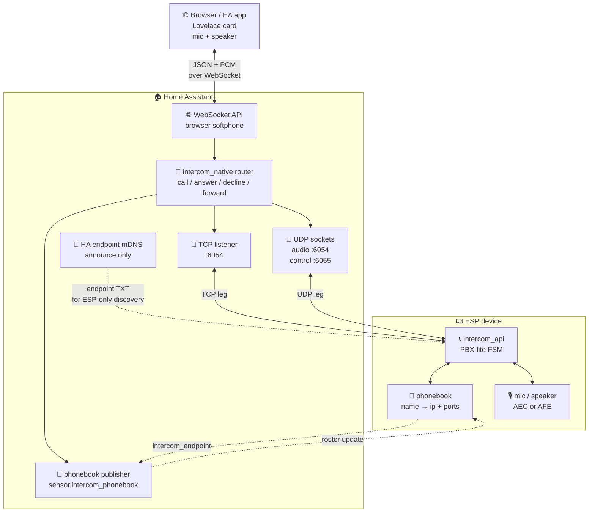
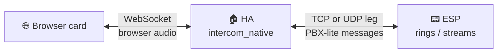
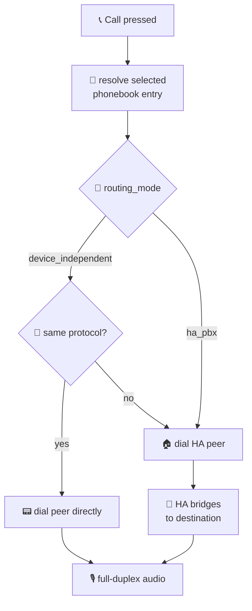
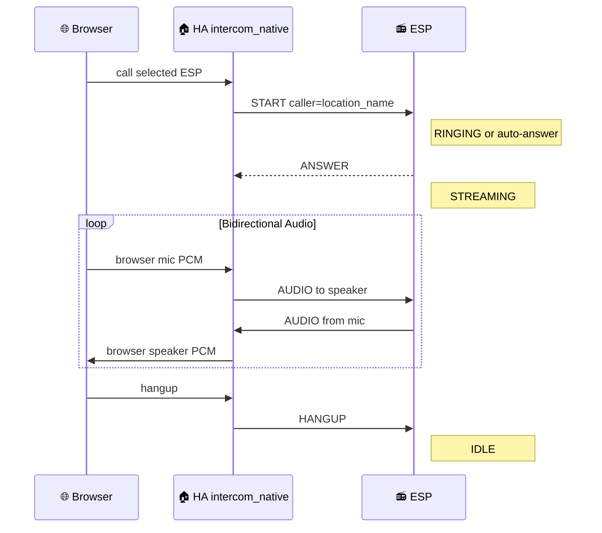
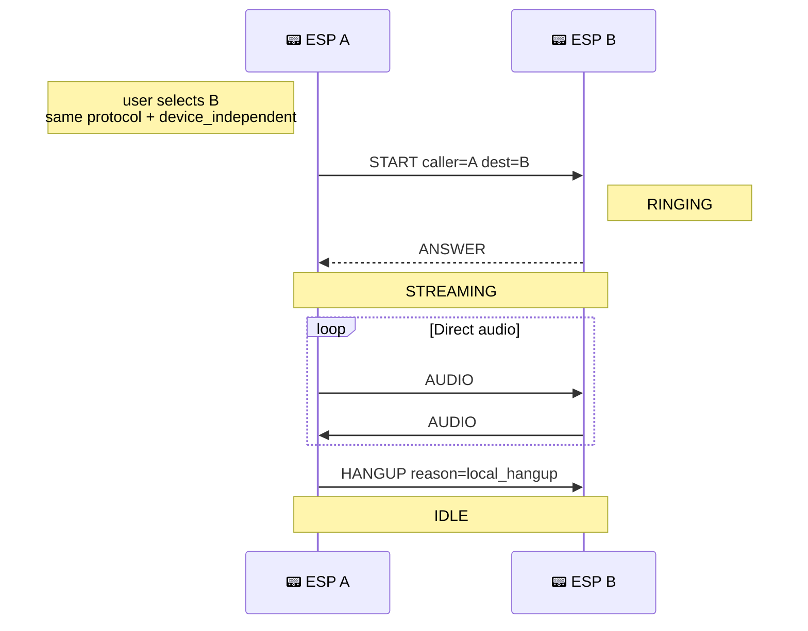
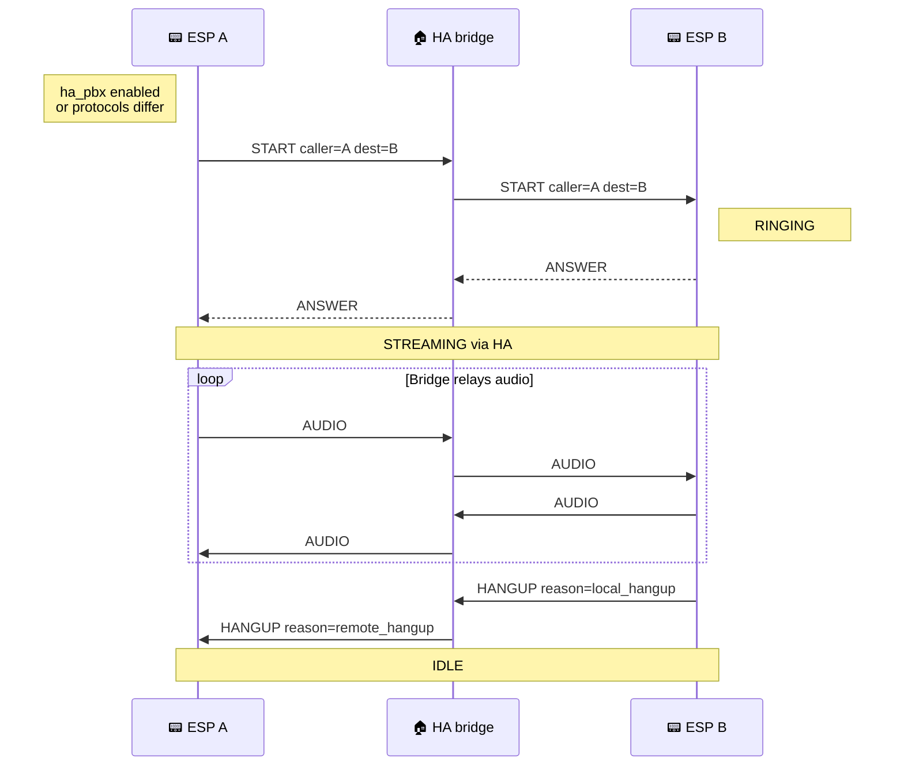

# ESPHome Intercom and Full-Duplex Voice for ESP32

[](#hardware-support)
[](custom_components/intercom_native/manifest.json)
[](https://www.home-assistant.io)
[](LICENSE)

## BREAKING CHANGES for 2026.5.0

Upgrading from `4.x`? Read the dedicated [breaking changes guide](docs/BREAKING_CHANGES.md) before flashing ESP firmware or restarting Home Assistant.

---

From a single ESPHome full-duplex doorbell to a multi-device intercom over Home Assistant, all the way to a complete Voice Assistant setup with wake word detection, echo cancellation and an LVGL touchscreen UI.

If your goal is simply **"I want a full-duplex intercom/citofono with Home Assistant"**, start from the ready YAMLs under [`yamls/intercom-only/`](yamls/intercom-only/). Pick the closest board, adjust pins and hardware options, add the ESP through the ESPHome integration, then install `intercom_native` in Home Assistant. HA is discovered as a destination and the ESP can call or be called from a GPIO button, LVGL button, automation, service call or Lovelace card.

You will see PBX-lite language below. Do not let that scare you: it is the internal model that lets ESPs, Home Assistant and the browser card call each other consistently. You can still use it as a normal one-button intercom. The PBX-lite model matters when you add more rooms, route through HA, bridge TCP and UDP, or want clear ringing, decline, busy and error reasons.

Under the hood: full-duplex I2S support, ESP-SR echo cancellation, optional dual-mic Speech Enhancement, FIR decimation, audio mixing with ducking, native Home Assistant integration and a Lovelace card.


_Home Assistant dashboard view: devices, call controls, phonebook state and diagnostics in one place._


_Runtime demo: browser softphone, ESP call state and audio controls moving together._

<table>
  <tr>
    <td align="center"><br/><b>Intercom Call</b></td>
    <td align="center"><br/><b>Voice UI</b></td>
    <td align="center"><br/><b>TTS Response</b></td>
    <td align="center"><br/><b>Audio Controls</b></td>
    <td align="center"><br/><b>Call Reason</b></td>
  </tr>
</table>

## Table of Contents

- [Breaking changes](docs/BREAKING_CHANGES.md)
- [Overview](#overview)
- [Quick Start Examples](#quick-start-examples)
- [Features](#features)
- [Architecture](#architecture)
- [Installation](#installation)
  - [1. Home Assistant Integration](#1-home-assistant-integration)
  - [2. ESPHome Component](#2-esphome-component)
  - [3. Lovelace Card](#3-lovelace-card)
- [Product model and routing](#product-model-and-routing)
- [Reference](#reference): intercom_api, esp_aec, esp_afe, entities, HA services, automations ([docs/reference.md](docs/reference.md))
- [Call Flow Diagrams](#call-flow-diagrams)
- [Hardware Support](#hardware-support)
- [Audio components](#audio-components): i2s_audio_duplex, esp_aec, esp_afe
- [Voice Assistant + Intercom Experience](#voice-assistant--intercom-experience)
- [What's New](#whats-new)
- [Logging](#logging)
- [Troubleshooting](#troubleshooting) ([docs/troubleshooting.md](docs/troubleshooting.md))
- [Deep dives and architecture](docs/)
- [License](#license)

## What's New

### 2026.5.0 - From PBX-like to PBX-lite

This release turns the intercom layer into a small PBX-lite model: ESPs are independent extensions, Home Assistant can join as a peer, the browser card can act as a softphone, and HA can bridge calls across TCP and UDP when needed.

The simple case still stays simple. For a one-button full-duplex doorbell or intercom, start from `yamls/intercom-only/`, adapt the board configuration, install `intercom_native`, and call Home Assistant or another ESP by name. PBX-lite is the model underneath, not a requirement to design a phone system.

Highlights:

- ESP-to-ESP calls, ESP-to-Home Assistant calls, browser softphone calls and HA-bridged calls share the same state model.
- Ringing, answer, decline, hangup, busy and error reasons are propagated through ESP sensors, the Lovelace card and HA events.
- TCP and UDP variants are both provided. TCP is the safer starting point for routed networks and containers; UDP is useful on simple LANs where latency is the priority.
- Full voice devices can keep media playback, Piper TTS, Micro Wake Word, Voice Assistant, AFE/AEC and intercom on the same ESP.
- The audio engine was reworked around earlier stack and buffer allocation, cleaner I2S lifecycle, better ducking, AEC reference handling and socket accounting.
- Media playback can be paused from Home Assistant and resumed later on the ESP.

Read the full release note here: [2026.5.0 release notes](docs/RELEASE_2026_5_0.md).

---

## Overview

**ESPHome Intercom** is a set of ESPHome components, YAML packages and Home
Assistant tools for full-duplex intercom, wake word devices, media/TTS playback
and display-driven voice devices.

### Pick your starting point

| Goal | Start here | Result |
|---|---|---|
| One ESP as a full-duplex citofono/intercom with Home Assistant | [`yamls/intercom-only/`](yamls/intercom-only/) | The ESP calls HA, HA can call the ESP, and the Lovelace card can answer from browser or mobile app. |
| Room-to-room ESP intercom | One intercom-only YAML per ESP | Devices call each other by phonebook name. HA publishes the standard roster and can bridge when needed. |
| Full voice device | [`yamls/full-experience/`](yamls/full-experience/) | Media player, Piper TTS, Micro Wake Word, Voice Assistant, AFE/AEC and intercom on the same ESP. |
| Audio driver for your own ESPHome Voice Assistant | [`i2s_audio_duplex`](esphome/components/i2s_audio_duplex/README.md) | Shared mic/speaker I2S path, speaker reference handling and audio lifecycle support without requiring intercom. |

For the normal intercom use case, do not start by designing a PBX. Pick the
closest YAML, adapt the board pins and audio hardware, add the ESP through the
ESPHome integration, then install `intercom_native`. Home Assistant is
discovered as a destination and the ESP can call or be called from a GPIO
button, LVGL button, automation, service call or Lovelace card.

### PBX-lite mental model

PBX-lite is the internal call model, not a requirement to build a phone system.
It means each ESP is treated as an **independent extension** with its own call
state and phonebook entry. Devices dial by name, Home Assistant joins as another
peer, and HA can optionally bridge calls, log state and connect the browser
card.

**Home Assistant is not required in the media path for same-transport
ESP-to-ESP calling**. Today HA is the stable phonebook authority in the standard
YAMLs. If HA is on the network, it also joins as one more extension and can act
as a PBX-lite bridge when routing asks for it.

There is one product mode (PBX-lite) on top of two transports (TCP and UDP). HA `intercom_native` is a transport hub: TCP listener, UDP socket manager, HA peer mDNS advertisement, phonebook publisher and voluptuous-validated services.

Use TCP as the default transport when the network path must be predictable:
routed LANs, VLANs, Docker/HA container setups, Wi-Fi segments with filtering,
or any install where retransmission is more important than the lowest possible
latency. Use UDP when the devices live on a simple, well-behaved LAN and you
want the lowest protocol overhead for audio. UDP control is still PBX-lite, but
audio datagrams are not retransmitted, so packet loss or routing/firewall
misconfiguration shows up as audible glitches instead of delayed recovery.
Both transports are first-class and HA can bridge between them.


_TCP and UDP expose the same PBX-lite behavior; the network decides which one is easier to operate._

Routing policy is per-device, runtime-toggleable:

- `routing_mode: device_independent` (default): ESP dials peers directly from its phonebook - true peer-to-peer.
- `routing_mode: ha_pbx`: ESP dials the HA peer named by `hass.config.location_name`; HA bridges to the real destination so every call is logged and `intercom_native.forward` stays usable.

### Topology At A Glance


How to read it:

- **ESP-to-ESP direct**: same protocol peers call each other from the local phonebook when `routing_mode: device_independent`.
- **HA as PBX**: `routing_mode: ha_pbx` or any TCP ↔ UDP call dials the HA peer, then HA bridges to the real destination.
- **Browser/app calls**: the Lovelace card is a softphone behind HA, using WebSocket for browser audio and TCP/UDP legs toward ESPs.

## Quick Start Examples

These examples show the normal user flows. Use the ready-to-flash YAMLs when
your hardware is listed under [Hardware Support](#hardware-support); only copy
the snippets below when you are building a custom target.

### Normal install: ESPs as intercom extensions

1. Install the Home Assistant `intercom_native` integration.
2. Flash one ready YAML per device, for example:
   - [`spotpear-ball-v2-full-afe-tcp.yaml`](yamls/full-experience/single-bus/afe/spotpear-ball-v2-full-afe-tcp.yaml)
   - [`waveshare-s3-full-afe-tcp.yaml`](yamls/full-experience/single-bus/afe/waveshare-s3-full-afe-tcp.yaml)
3. Add each ESP through the ESPHome integration in Home Assistant.
4. Verify that HA exposes `sensor.intercom_phonebook`. That is the authoritative
   roster for the standard packages.
5. Use the ESP buttons, display, Home Assistant service, or Lovelace card to
   call a selected contact.

Same-protocol ESPs in `routing_mode: device_independent` call each other
directly. Cross-protocol calls, browser calls, and `routing_mode: ha_pbx` calls
go through Home Assistant as the PBX bridge.

### Doorbell: one ESP calls Home Assistant

A doorbell is just PBX-lite with one selected contact: the HA peer. The contact
name is **your Home Assistant location name** (`hass.config.location_name`),
not a hardcoded "Home Assistant" string.

```yaml
binary_sensor:
  - platform: gpio
    name: Doorbell Button
    pin:
      number: GPIO4
      mode: INPUT_PULLUP
      inverted: true
    on_press:
      - intercom_api.call_contact:
          id: intercom
          contact: "Home"  # replace with Settings -> System -> General -> Location name
```

When the ESP calls that HA contact, the Lovelace card rings and can answer from
the browser or mobile app. The standard intercom callback package also fires the
`esphome.intercom_call` event for automations.

### Room-to-room intercom: fixed buttons

For an apartment-style panel, bind one GPIO button to each exact phonebook
contact name. `call_contact` is safer than selecting then calling: if the name
does not exist, the call fails instead of falling through to another contact.

```yaml
binary_sensor:
  - platform: gpio
    name: Call Kitchen
    pin:
      number: GPIO5
      mode: INPUT_PULLUP
      inverted: true
    on_press:
      - intercom_api.call_contact:
          id: intercom
          contact: "Kitchen Intercom"

  - platform: gpio
    name: Call Bedroom
    pin:
      number: GPIO6
      mode: INPUT_PULLUP
      inverted: true
    on_press:
      - intercom_api.call_contact:
          id: intercom
          contact: "Bedroom Intercom"
```

Contact names are exact and case-sensitive. Check `sensor.<device>_destination`
or the HA phonebook sensor if a call reports `Contact not found`.

### Load a manual phonebook at boot

The recommended path is HA-managed sync through `sensor.intercom_phonebook`.
Use manual boot loading only for custom YAMLs, offline installs, diagnostics, or
very small fixed systems.

```yaml
esphome:
  on_boot:
    priority: -100
    then:
      - intercom_api.flush_contacts:
          id: intercom
      - intercom_api.set_contacts:
          id: intercom
          contacts_csv: >-
            Home|ha|192.168.1.10|6054|6054|6055,
            Kitchen Intercom|tcp|192.168.1.21|6054,
            Garage Intercom|udp|192.168.1.22|6054|6055
      - intercom_api.set_ha_peer_name:
          id: intercom
          name: "Home"
```

Row format:

```text
Name|tcp|ip|tcp_port
Name|udp|ip|udp_audio_port|udp_control_port
Name|ha|ip|tcp_port|udp_audio_port|udp_control_port
```

If you also include `packages/intercom/phonebook_subscribe.yaml`, HA updates can
merge newer rows into the local phonebook after boot. For a fully static local
phonebook, omit the HA phonebook subscription package.

## Features

- **Full-duplex audio** - Talk and listen simultaneously.
- **One product mode (PBX-lite)** with phonebook / contacts / destination / caller entities always exposed.
- **Per-device routing**: `device_independent` (direct) or `ha_pbx` (HA bridges), runtime-toggleable.
- **Dual transport (TCP + UDP)** with cross-protocol bridges. HA publishes one endpoint-first phonebook and bridges TCP <-> UDP. The Lovelace card is transport-agnostic.
- **Echo Cancellation (AEC)** - Built-in acoustic echo cancellation using ESP-SR. (ES8311 digital feedback mode provides perfect sample-accurate echo cancellation.)
- **Full Audio Front-End (AFE)** - Complete ESP-SR AFE pipeline via `esp_afe`:
  - **Single-mic (MR)**: AEC + Noise Suppression + VAD + AGC.
  - **Dual-mic (MMR)**: AEC + Speech Enhancement + Voice Activity Detector.
  - Runtime switches and diagnostic sensors in Home Assistant.
  - Automatic pipeline switching: Speech Enhancement replaces NS/AGC when spatial separation is active.
- **Voice Assistant compatible** - Coexists with ESPHome Voice Assistant and Micro Wake Word.
- **Ready-to-flash YAML configs** - Optimized configurations for real, tested hardware combining Voice Assistant, Micro Wake Word and Intercom on the same device.
- **Auto Answer** - Configurable automatic call acceptance (ESP-side switch + browser card checkbox).
- **HA Services** - `intercom_native.answer`, `decline` (with optional `reason`), `hangup`, `call`, `forward`, `purge_devices`. All registered with explicit `voluptuous` schemas (`extra=PREVENT_EXTRA`); missing target raises `ServiceValidationError`.
- **Call Forwarding** - Forward active or ringing calls to another device via automation.
- **Ringtone on incoming calls** - Devices play a looping ringtone while ringing.
- **Volume Control** - Adjustable Master Volume and microphone gain.
- **Phonebook** - Dedup by friendly name. HA publishes the protocol-aware `sensor.intercom_phonebook`; ESP packages subscribe to it and locally shape TCP/UDP/HA slots into their dial plan. YAML automations can still call the native `intercom_api` actions/services.
- **Do Not Disturb** - Native `intercom_api` switch. When enabled, incoming calls are rejected with `DECLINE("DND")` so the caller receives a real reason.
- **HA peer name = `hass.config.location_name`** everywhere (NEVER hardcoded).
- **Status LED** - Visual feedback for call states.
- **Persistent Settings** - Volume, gain, AEC state saved to flash.
- **Remote Access** - Works through any HA remote access method (Nabu Casa, reverse proxy, VPN). No WebRTC, no go2rtc, no port forwarding required.

---

## Architecture

### System Overview



This is the whole product in one picture: HA is a transport hub and optional bridge; the ESP owns call state, audio, and the local phonebook.

### Audio format

| Parameter | Value |
|-----------|-------|
| Sample Rate | 16000 Hz |
| Bit Depth | 16-bit signed PCM |
| Channels | Mono |
| Frame size | 1024 bytes (512 samples = 32 ms) |

### TCP protocol (default `tcp_port: 6054`)

The authoritative wire contract lives in [`docs/INTERCOM_PROTOCOL.md`](docs/INTERCOM_PROTOCOL.md). The summary below is kept for orientation.

**Header (3 bytes, little-endian):**

| Byte 0 | Bytes 1-2 |
|--------|-----------|
| `type` (u8) | `length` (u16 LE) |

**Body (PBX-lite control messages):** `call_id_len(u8) | call_id (UTF-8) | per-type tail`. PING/PONG carry `call_id_len = 0`.

**Message Types:**

| Code | Name | Description |
|------|------|-------------|
| 0x01 | AUDIO   | Raw L16 PCM (no call_id prefix) |
| 0x02 | START   | Initiate call; tail = caller_route, caller_name, dest_route, dest_name |
| 0x03 | HANGUP  | Established-call BYE |
| 0x04 | PING    | Keep-alive |
| 0x05 | PONG    | Keep-alive response |
| 0x06 | ERROR   | Technical fault; tail = error_code, detail |
| 0x07 | RING    | Provisional: dest is presenting the call locally |
| 0x08 | ANSWER  | Final: dest accepted |
| 0x09 | DECLINE | Setup-phase reject; tail = reason (empty = silent remote_hangup) |

### UDP transport (default `udp_audio_port: 6054`, `udp_control_port: 6055`)

UDP firmware variants (`*-intercom-udp.yaml`) carry the same `MessageHeader` framing on the control socket, with raw L16 PCM on the audio socket:

| Port | Direction | Payload |
|------|-----------|---------|
| `udp_audio_port` (default 6054, different protocol stack from TCP) | bidirectional | Raw L16 PCM 16 kHz mono, 1 datagram = 1 frame (1024 bytes = 32 ms). No header. Drop-in compatible with go2rtc raw-PCM stream sources. |
| `udp_control_port` (default 6055) | bidirectional | `MessageHeader` (3 B) + payload, identical layout and Message Types to TCP above. |

The audio socket is **lazy**: bound on the ESP only while the FSM is streaming/answering, never while idle. The control socket stays bound from boot so inbound `MSG_START` can wake the FSM (incoming-call ringing).

On the HA side a single UDP socket manager binds `udp_audio_port` / `udp_control_port` once and demultiplexes inbound datagrams by source IP to the right per-host client. Two simultaneous UDP legs share the same socket pair without `EADDRINUSE` collisions.

Transport choice is an installation choice, not a feature split. TCP is the
recommended starting point for routed networks and HA/container deployments
because packet delivery and connection state are easier to reason about. UDP is
best suited to simple local LANs where low latency matters and the network is
known to pass the audio/control ports cleanly.

### Endpoint and mDNS model


_Every callable peer becomes a canonical endpoint row. HA merges rows into the roster consumed by ESPs and the card._

| Side | Service | Carries |
|---|---|---|
| Standard ESP firmware | native ESPHome API | `sensor.<device>_intercom_endpoint` = `Name|protocol|ip|ports` |
| HA phonebook publisher | HA state | `sensor.intercom_phonebook` = canonical CSV roster |
| ESP-only mDNS package | `_intercom-tcp._tcp` / `_intercom-udp._udp` | TXT `endpoint=<Name|protocol|ip|ports>` |
| HA when `use_tcp` / `use_udp` | `_intercom-tcp._tcp` / `_intercom-udp._udp` | TXT `endpoint=<Name|ha|ip|tcp|udp_audio|udp_control>` |

Standard HA-managed firmware does not run ESP-side mDNS announce/discovery.
Include `packages/intercom/mdns_discovery.yaml` only for ESP-only deployments
that must build a local phonebook without HA. Cross-protocol bridging is HA's
job, not mDNS's. In HA-managed mode, `sensor.intercom_phonebook` is the source
of truth; each ESP locally shapes the protocol-aware roster into its own TCP or
UDP dial plan.

---

## Installation

### 1. Home Assistant Integration

#### Option A: Install via HACS (Recommended)

1. In HACS, go to **⋮ → Custom repositories**.
2. Add `https://github.com/n-IA-hane/esphome-intercom` as **Integration**.
3. Find "Intercom Native" and click **Download**.
4. Restart Home Assistant.
5. Go to **Settings → Integrations → Add Integration** → search "Intercom Native" → click **Submit**.
6. In the config flow, tick the transports you want (`use_tcp` on by default, `use_udp` opt-in) and confirm the ports (defaults: `tcp_port` 6054, `udp_audio_port` 6054, `udp_control_port` 6055).


_Add the repository as a HACS integration repository._


_After the repository is added, open Intercom Native in HACS and download it._


_The config flow enables the TCP and UDP listeners used by ESP peers and the HA PBX-lite bridge._

The integration automatically registers the Lovelace card, no manual frontend setup needed.

#### Option B: Manual install

```bash
# From the repository root
cp -r custom_components/intercom_native /config/custom_components/
```

Then add via UI: **Settings → Integrations → Add Integration → Intercom Native**, restart Home Assistant.

The integration will:
- Bind TCP and UDP listener sockets on the configured ports.
- Register the WebSocket API commands for the card.
- Register HA peer `_intercom-tcp._tcp` and/or `_intercom-udp._udp` mDNS services.
- Publish the protocol-aware phonebook (`sensor.intercom_phonebook`) for ESP subscribers.
- Register voluptuous-validated services (`answer`, `decline`, `hangup`, `call`, `forward`, `purge_devices`).
- Auto-register the Lovelace card as a frontend resource.

#### Network requirements

- **Tested on**: Home Assistant OS 17.3 with Home Assistant Core 2026.5.1.
- **HA OS / Supervised**: container is `--network=host` by default. Works.
- **HA Container (Docker)**: must be started with `--network=host` (also recommended by official HA docs). Bridge mode would need manual port forwarding plus an mDNS reflector and a `network: announced_addresses` override (not recommended).
- **HA Core in venv**: listens on host LAN, no extra config.

If `network.async_get_announce_addresses(hass)` returns empty, the integration logs a WARN and `routing_mode: ha_pbx` is unavailable until you configure either `network: announced_addresses:` or an `external_url`. Direct (`device_independent`) routing is unaffected. A port bind failure transitions the config entry to `ConfigEntryError`.

### 2. ESPHome Component

Add the external component to your ESPHome device configuration:

```yaml
# Lightweight (single-mic, echo cancellation only):
external_components:
  - source: github://n-IA-hane/esphome-intercom
    ref: main
    components: [audio_processor, intercom_api, esp_aec]

# Full AFE pipeline (single-mic NS/AGC/VAD or dual-mic Speech Enhancement/VAD):
external_components:
  - source: github://n-IA-hane/esphome-intercom
    ref: main
    components: [audio_processor, intercom_api, esp_afe, i2s_audio_duplex]
```

> **Note**: `audio_processor` must be listed because it provides the shared `AudioProcessor` interface used by both `esp_aec` and `esp_afe`. Use `esp_aec` for lightweight single-mic setups, `esp_afe` for the full pipeline (see [AFE section](#audio-front-end-afe) below).

#### Minimal Configuration

```yaml
esp32:
  board: esp32-s3-devkitc-1
  framework:
    type: esp-idf

# I2S Audio (example with separate mic/speaker)
i2s_audio:
  - id: i2s_mic_bus
    i2s_lrclk_pin: GPIO3
    i2s_bclk_pin: GPIO2
  - id: i2s_spk_bus
    i2s_lrclk_pin: GPIO6
    i2s_bclk_pin: GPIO7

microphone:
  - platform: i2s_audio
    id: mic_component
    i2s_audio_id: i2s_mic_bus
    i2s_din_pin: GPIO4
    adc_type: external
    pdm: false
    bits_per_sample: 32bit
    sample_rate: 16000

speaker:
  - platform: i2s_audio
    id: spk_component
    i2s_audio_id: i2s_spk_bus
    i2s_dout_pin: GPIO8
    dac_type: external
    sample_rate: 16000
    bits_per_sample: 16bit

# Echo Cancellation (recommended)
esp_aec:
  id: aec_processor
  sample_rate: 16000
  filter_length: 4       # 64ms tail length
  mode: voip_low_cost    # Optimized for intercom-only

# Intercom API - PBX-lite (no mode: needed)
intercom_api:
  id: intercom
  microphone: mic_component
  speaker: spk_component
  processor_id: aec_processor
```

#### Complete Configuration (with HA-managed phonebook)

```yaml
intercom_api:
  id: intercom
  # mode: omitted - PBX-lite is the default. routing_mode: device_independent
  # is the default; flip to ha_pbx if you want HA to bridge every call.
  microphone: mic_component
  speaker: spk_component
  processor_id: aec_processor
  ringing_timeout: 30s        # Auto-decline unanswered calls

  # FSM event callbacks
  on_ringing:
    - light.turn_on:
        id: status_led
        effect: "Ringing"

  on_outgoing_call:
    - light.turn_on:
        id: status_led
        effect: "Calling"

  on_streaming:
    - light.turn_on:
        id: status_led
        red: 0%
        green: 100%
        blue: 0%

  on_idle:
    - light.turn_off: status_led

# Switches (with restore from flash)
switch:
  - platform: intercom_api
    intercom_api_id: intercom
    auto_answer:
      name: "Auto Answer"
      restore_mode: RESTORE_DEFAULT_OFF
    aec:
      name: "Echo Cancellation"
      restore_mode: RESTORE_DEFAULT_ON

# Volume controls
number:
  - platform: intercom_api
    intercom_api_id: intercom
    speaker_volume:
      name: "Master Volume"
    mic_gain:
      name: "Mic Gain"

# Buttons for manual control
button:
  - platform: template
    name: "Call"
    on_press:
      - intercom_api.call_toggle: intercom

  - platform: template
    name: "Next Contact"
    on_press:
      - intercom_api.next_contact: intercom

  - platform: template
    name: "Previous Contact"
    on_press:
      - intercom_api.prev_contact: intercom

  - platform: template
    name: "Decline"
    on_press:
      - intercom_api.decline_call: intercom

# Example: call a specific room from a YAML automation
button:
  - platform: template
    name: "Call Kitchen"
    on_press:
      - intercom_api.call_contact:
          id: intercom
          contact: "Kitchen Intercom"
```

Current public YAMLs use shared phonebook subscription packages. HA publishes:

```text
sensor.intercom_phonebook      # protocol-aware logical roster
```

The ESP-side package subscribes to `sensor.intercom_phonebook` and calls `intercom_api.update_contacts` after a debounce. The HA row (`Name|ha|...`) teaches firmware the HA peer name for `routing_mode: ha_pbx` through the HA-published phonebook. For manual/local automations you can still use the remaining call-control ESPHome actions:

```yaml
action: esphome.<slug>_set_ha_peer_name
data:
  name: "Beach House"

action: esphome.<slug>_start_call
data:
  dest: "Kitchen"

action: esphome.<slug>_decline_call
data:
  reason: "DND"
```

Contact mutation is not exposed as HA-callable ESPHome services in the standard packages. Use `sensor.intercom_phonebook` for normal sync, or call the native `intercom_api.set_contacts` / `add_contact` / `remove_contact` / `flush_contacts` actions from YAML scripts when you intentionally need local manual mutation. Dedup is by name only; on endpoint conflict, last writer wins.

Canonical phonebook rows:

```text
Name|tcp|ip|tcp_port
Name|udp|ip|udp_audio_port|udp_control_port
Name|ha|ip|tcp_port|udp_audio_port|udp_control_port
```

See [docs/PHONEBOOK_PROTOCOL.md](docs/PHONEBOOK_PROTOCOL.md) for the full contract.

#### Apartment intercom panel

For multi-room setups, each GPIO button can call a specific room directly. The full recipe (one button per contact, exact name matching rules, `on_call_failed` handling) lives in the [`intercom_api` README](esphome/components/intercom_api/README.md#example-multi-button-intercom-apartment-doorbell).

### 3. Lovelace Card

The Lovelace card is **automatically registered** when the integration loads, no manual file copying or resource registration needed.

#### Add the card to your dashboard

The card is available in the Lovelace card picker - just search for "Intercom":


_The integration registers the Lovelace card automatically; no manual resource URL is needed._

Then configure it with the visual editor:


_Visual editor path for picking the ESPHome intercom entity and display name._

Alternatively, you can add it manually via YAML:

```yaml
type: custom:intercom-card
entity_id: <your_esp_device_id>
name: Kitchen Intercom
show_protocol: true
```

The card automatically discovers ESPHome devices with the `intercom_api` component. Header text uses `name:` if configured, otherwise the ESP friendly name. With `show_protocol: true`, the header appends `- TCP` / `- UDP`; the mode line shows `Home Assistant - ESP`, `ESP - ESP`, or `Inter-protocol TCP-UDP` / `Inter-protocol UDP-TCP`.

`customElements.define` is idempotent so HMR / re-install never throws on second registration. Console chatter is gated behind `localStorage.intercom_debug = "1"` (errors and warnings always emit). Peer names, destination and decline reasons render as text nodes - no XSS surface from phonebook data.

The Lovelace card provides **full-duplex bidirectional audio** with the ESP device: you can talk and listen simultaneously through your browser or the Home Assistant Companion app. The card captures audio from your microphone via `getUserMedia()` and plays incoming audio from the ESP in real-time.

> **Important: HTTPS required.** Browser microphone access (`getUserMedia`) requires a secure context. You need HTTPS to use the card's audio features. Solutions: [Nabu Casa](https://www.nabucasa.com/), Let's Encrypt, reverse proxy with SSL, or self-signed certificate. Exception: `localhost` works without HTTPS.

> **Note**: Devices must be added to Home Assistant via the ESPHome integration before they appear in the card.


_The card uses the ESPHome device registry, so the device must be added to HA before it appears._

---

## Call Routing

There is no simple/full product split. Every ESP runs the same PBX-lite state machine with a local phonebook. If the phonebook contains one HA peer, you have a one-button doorbell/intercom. If it contains multiple ESPs, the same firmware can call them directly or through HA depending on the selected routing policy.


_Browser softphone path: the card talks only to HA; HA opens the TCP or UDP leg toward the ESP._



**Browser/App → ESP:**
1. User clicks "Call" in the card
2. HA opens a TCP or UDP leg to the selected ESP
3. HA sends START with caller=`hass.config.location_name`
4. ESP rings or auto-answers
5. Bidirectional audio streaming begins

**ESP → HA peer:**
1. User selects the HA location name in the ESP phonebook
2. ESP sends START to HA
3. HA notifies connected browser cards
4. User answers from the card, or the card auto-answers
5. Bidirectional audio streaming begins

### ESP ↔ ESP

Same-protocol peers call each other directly when `routing_mode: device_independent`. If `routing_mode: ha_pbx` is enabled, or the two peers use different transports, the source ESP dials the HA peer and HA bridges the legs.


_ESP-to-ESP routing depends on the selected destination and transport compatibility. In this demo a UDP device calls a TCP device through HA PBX-lite._



**Call Flow (ESP #1 calls ESP #2):**
1. User selects "Bedroom" on ESP #1 via display, button, or service.
2. ESP #1 resolves the phonebook entry.
3. Same-protocol + `device_independent`: ESP #1 sends START directly to ESP #2.
4. Cross-protocol or `ha_pbx`: ESP #1 sends START to HA, preserving `dest_name="Bedroom"`, and HA opens the second leg.
5. Either side can hang up; the terminal reason is propagated to the other leg.

**PBX-lite features:**
- Contact list auto-discovery from HA
- Next/Previous contact navigation
- Caller ID display
- Ringing timeout with auto-decline
- Bidirectional hangup propagation

### ESP calling Home Assistant (Doorbell)

When an ESP device has the HA location name selected as destination and initiates a call (via GPIO button press or template button), it fires an `esphome.intercom_call` event for notifications and the Lovelace card goes into ringing state with Answer/Decline buttons:


_Doorbell path: the ESP calls the HA peer name, and the browser card rings with Answer/Decline._

---


## Reference

Full options, actions, conditions, entities, services and automation examples are documented in **[docs/reference.md](docs/reference.md)**.

Quick links:
- [`intercom_api` component options](docs/reference.md#intercom_api-component)
- [Event callbacks](docs/reference.md#event-callbacks)
- [Actions](docs/reference.md#actions) and [conditions](docs/reference.md#conditions)
- [`esp_aec`](docs/reference.md#esp_aec-component) / [`esp_afe`](docs/reference.md#esp_afe-component) components
- [Home Assistant services](docs/reference.md#home-assistant-services)
- [Automation examples](docs/reference.md#automation-examples) (doorbell routing, night mode, forward, bridge)


## Call Flow Diagrams

### Browser Card Calls ESP



### ESP Calls ESP Directly



### ESP Calls ESP Through HA



---

## Hardware Support

### Tested Configurations

| Device | YAML | Microphone | Speaker | I2S Mode | Audio pipeline | Features |
|--------|------|------------|---------|----------|----------------|----------|
| **Spotpear Ball v2 (AFE)** | [`spotpear-ball-v2-full-afe-tcp.yaml`](yamls/full-experience/single-bus/afe/spotpear-ball-v2-full-afe-tcp.yaml) | ES8311 | ES8311 | Single bus | `esp_afe` (AEC + NS + AGC + VAD) | VA + MWW + Intercom + LVGL |
| **Spotpear Ball v2 (AFE UDP)** | [`spotpear-ball-v2-full-afe-udp.yaml`](yamls/full-experience/single-bus/afe/spotpear-ball-v2-full-afe-udp.yaml) | ES8311 | ES8311 | Single bus | `esp_afe` (AEC + NS + AGC + VAD) | Same full experience, UDP intercom transport |
| **Spotpear Ball v2 (intercom)** | [`spotpear-ball-v2-intercom-tcp.yaml`](yamls/intercom-only/single-bus/spotpear-ball-v2-intercom-tcp.yaml) | ES8311 | ES8311 | Single bus | `esp_aec` (SR stereo loopback) | Intercom only |
| **Waveshare S3-Audio (AFE)** | [`waveshare-s3-full-afe-tcp.yaml`](yamls/full-experience/single-bus/afe/waveshare-s3-full-afe-tcp.yaml) | ES7210 4-ch | ES8311 | Single bus TDM | `esp_afe` (AEC + Speech Enhancement + VAD) | VA + MWW + Intercom + LED + AFE switches/sensors |
| **Waveshare S3-Audio (AFE UDP)** | [`waveshare-s3-full-afe-udp.yaml`](yamls/full-experience/single-bus/afe/waveshare-s3-full-afe-udp.yaml) | ES7210 4-ch | ES8311 | Single bus TDM | `esp_afe` (AEC + Speech Enhancement + VAD) | Same full experience, UDP intercom transport |
| **Waveshare P4-Touch (AFE)** _(experimental)_ | [`waveshare-p4-touch-full-afe-tcp.yaml`](yamls/full-experience/single-bus/afe/waveshare-p4-touch-full-afe-tcp.yaml) | ES7210 4-ch | ES8311 | Single bus TDM | `esp_afe` (AEC + Speech Enhancement + VAD) | VA + MWW + Intercom + LVGL touch |
| **Waveshare P4-Touch (AFE UDP)** _(experimental)_ | [`waveshare-p4-touch-full-afe-udp.yaml`](yamls/full-experience/single-bus/afe/waveshare-p4-touch-full-afe-udp.yaml) | ES7210 4-ch | ES8311 | Single bus TDM | `esp_afe` (AEC + Speech Enhancement + VAD) | Same full experience, UDP intercom transport |
| **Generic S3 (full AEC)** | [`generic-s3-full-aec-tcp.yaml`](yamls/full-experience/single-bus/aec/generic-s3-full-aec-tcp.yaml) | Any I2S MEMS | Any I2S amp | Single bus (duplex) | `esp_aec` (TX-side decimated ref, see [What's New](#whats-new)) | VA + MWW + Intercom |
| **Generic S3 (full AEC UDP)** | [`generic-s3-full-aec-udp.yaml`](yamls/full-experience/single-bus/aec/generic-s3-full-aec-udp.yaml) | Any I2S MEMS | Any I2S amp | Single bus (duplex) | `esp_aec` (TX-side decimated ref) | Same full experience, UDP intercom transport |
| **Generic S3 (intercom)** | [`generic-s3-intercom-tcp.yaml`](yamls/intercom-only/single-bus/generic-s3-intercom-tcp.yaml) | Any I2S MEMS | Any I2S amp | Single bus (duplex) | `esp_aec` (TX-side decimated ref) | Intercom only |
| **Generic S3 (dual bus)** _(experimental)_ | [`generic-s3-dual-intercom.yaml`](yamls/experimental/dual-bus/intercom-only/generic-s3-dual-intercom.yaml) | Any I2S MEMS | Any I2S amp | Dual bus | Ring-buffer reference (intercom_api) | Intercom only |

> **Want to help expand this list?** Send me a device to test or consider a [donation](https://github.com/sponsors/n-IA-hane), every bit helps!

### Requirements

- **ESP32-S3** or **ESP32-P4** with PSRAM (required for AEC)
- I2S microphone (INMP441, SPH0645, ES8311, etc.)
- I2S speaker amplifier (MAX98357A, ES8311, etc.)
- ESP-IDF framework (not Arduino)
- **sdkconfig tuning** for PSRAM devices: `DATA_CACHE_64KB` + `DATA_CACHE_LINE_64B` (S3) or `CACHE_L2_CACHE_256KB` (P4), plus `SPIRAM_FETCH_INSTRUCTIONS` + `SPIRAM_RODATA`. See [i2s_audio_duplex README](esphome/components/i2s_audio_duplex/README.md#psram-and-sdkconfig-requirements) for details.

Generic full-experience S3 builds use `esp_aec`, not the full `esp_afe`
framework. The full AEC TCP/UDP generic YAMLs compile on the default 4 MB
ESP32-S3 DevKitC OTA partition, but they are close to the limit
(about 1.69 MB used of a 1.84 MB app slot). For real generic hardware, prefer
8 MB or 16 MB flash if you want room for future models/features. The example
GPIOs are placeholders: on ESP32-S3R8/S3R8V, GPIO33/35/36/37 are PSRAM pins, so
move BCLK/LRCLK/DIN/LED to board-safe pins before flashing.

The P4 YAMLs are experimental hardware targets. They are useful for ongoing
ESP32-P4/LVGL/hosted-Wi-Fi work, but the stable release reference devices are
the ESP32-S3 targets above.

#### Waveshare P4 Touch C6 firmware requirement

The Waveshare ESP32-P4-WIFI6-Touch-LCD boards use an ESP32-C6 co-processor for
Wi-Fi over ESP-Hosted SDIO. If a P4 build boots but then resets, hangs, or loses
Wi-Fi under media/TTS streaming, update the C6 `network_adapter` firmware before
debugging the audio pipeline. Factory/older C6 firmware can expose broken hosted
OTA behavior (`Req_OTABegin` timeout), SDIO mode mismatch failures, or transport
resets under stream load.

The validated recovery path used on the 10.1" Waveshare P4 Touch was:

1. Build a P4 recovery flasher from Espressif
   `esp-serial-flasher/examples/esp32_sdio_example`.
2. Embed the ESP32-C6 ESP-Hosted `network_adapter.bin` plus its C6 bootloader,
   partition table and `ota_data_initial.bin`.
3. Configure the SDIO flasher for the Waveshare P4 pins:
   `D0-D3=GPIO14..GPIO17`, `CLK=GPIO18`, `CMD=GPIO19`, C6 reset `GPIO54`,
   4-bit SDIO.
4. Put the C6, not the P4, into ROM download mode by shorting the exposed
   `C6_IO9` pad to `GND` while the P4 recovery flasher boots. The small C6
   flash pad group is labelled `TXD`, `RXD`, `IO9`, `GND`; for the SDIO ROM
   flasher only `IO9 -> GND` is needed.
5. Keep `IO9` grounded until the P4 flasher logs that it connected to the C6
   target and finishes `Flash verified` for bootloader, partition table, OTA
   data and app. Then release `IO9`.
6. Reflash the normal ESPHome P4 firmware.

After recovery, the tested board reported `ESP32-C6 Coprocessor Firmware`
installed version `2.12.7`, and the P4 stopped crashing under hosted Wi-Fi.

The normal ESPHome P4 YAMLs enable hosted Wi-Fi with:

```yaml
esp32_hosted:
  variant: ESP32C6
  reset_pin: GPIO54
  cmd_pin: GPIO19
  clk_pin: GPIO18
  d0_pin: GPIO14
  d1_pin: GPIO15
  d2_pin: GPIO16
  d3_pin: GPIO17
  active_high: true
```

The shared package [`packages/board/esp32p4_c6_sdio.yaml`](packages/board/esp32p4_c6_sdio.yaml)
also forces the host to SDIO streaming mode to match the C6 slave:

```yaml
CONFIG_ESP_HOSTED_SDIO_OPTIMIZATION_RX_STREAMING_MODE: "y"
```

It exposes ESPHome's native coprocessor update entity:

```yaml
http_request:

update:
  - platform: esp32_hosted
    name: ESP32-C6 Coprocessor Firmware
    type: http
    source: https://esphome.github.io/esp-hosted-firmware/manifest/esp32c6.json
```

Do not force-install an older advertised version. ESPHome only offers firmware
versions compatible with the compiled host `esp_hosted` library; for example, a
host pinned to `2.12.1` may show latest `2.12.1` while the C6 is already on
`2.12.7`. In that case leave the C6 alone until the host library is updated.

---

## Audio components

Three ESPHome components sit between your codec and the intercom / voice assistant pipelines. Each has its own README with the full option list and tuning notes; the highlights below exist just to help you pick.


_The same audio stack can serve intercom, Voice Assistant, TTS and media workloads on full voice devices._

Plain intercom does **not** require `i2s_audio_duplex`: `intercom_api` can run
on ESPHome's normal `microphone` + `speaker` components and use `esp_aec`
through `processor_id`.

Use `i2s_audio_duplex` when a board has one shared I2S bus, when you need a
phase-coherent speaker reference for AEC, or when the same ESP also runs media
player, Piper TTS, Micro Wake Word and Voice Assistant. It can also be useful
outside intercom projects: an ESPHome Voice Assistant device can use it as the
shared mic/speaker transport and AEC reference path.

For a composite device, put the microphone and speaker on the same I2S bus and
use [`i2s_audio_duplex`](esphome/components/i2s_audio_duplex/README.md). The
duplex driver hands a phase-coherent speaker reference to the AEC each frame;
standalone `intercom_api` with separate mic and speaker components falls back
to a 80 ms ring buffer with looser phase coherence. See
[intercom_api AEC quality](esphome/components/intercom_api/README.md#aec-quality-standalone-vs-i2s_audio_duplex)
for the trade-off in detail.

### [`i2s_audio_duplex`](esphome/components/i2s_audio_duplex/README.md)

Full-duplex I2S driver that lets mic and speaker share one I2S bus (ES8311, ES8388, WM8960, or MEMS + I2S amp). Runs the codec bus at 48 kHz and decimates the mic to 16 kHz via a 31-tap Kaiser FIR. Three zero-config AEC reference modes (direct TX, ES8311 stereo loopback, ES7210 TDM), dual mic outputs (pre-AEC for MWW, post-AEC for VA/STT), runtime AEC mode switching from Home Assistant, and optional PSRAM buffer placement.

### [`esp_aec`](esphome/components/esp_aec/README.md)

Standalone ESP-SR echo cancellation (~80 KB internal RAM). Four modes (`sr_low_cost` recommended for VA+MWW, `voip_*` for pure VoIP). See the mode table in [docs/reference.md](docs/reference.md#esp_aec-component) before changing defaults.

### [`esp_afe`](esphome/components/esp_afe/README.md)

Full ESP-SR audio front-end. Chains AEC, optional spatial source separation, noise suppression, voice activity detection and automatic gain control behind `i2s_audio_duplex`. Runs on Core 0 (~22-23% load on S3 in `low_cost` mode) and the pipeline shape adapts at runtime to `mic_num` and the per-stage switches exposed in Home Assistant.

**What each stage does**

- **AEC** (Acoustic Echo Cancellation) - removes the speaker signal from the mic input. Same engine as `esp_aec`. Required by everything downstream and by wake word detection during a call.
- **Speech Enhancement** (dual-mic only; ESP-SR BSS internally) - uses the spatial difference between two microphones to isolate the speaker's voice and suppress directional noise (TV, kitchen fan, neighbour talking). Active when `se_enabled: true` and `mic_num: 2`. While Speech Enhancement is on, esp-sr replaces NS and AGC in the pipeline; their toggles become noops until Speech Enhancement is turned off.
- **NS** (Noise Suppression, single-mic mode) - WebRTC-style spectral noise reduction for stationary background (HVAC hum, fan whir). Less surgical than dual-mic Speech Enhancement but the only option on single-mic boards where spatial separation is impossible.
- **VAD** (Voice Activity Detection) - marks frames as speech vs noise when the upstream esp-sr VAD state machine is active. In current esp-sr 2.4.x builds the reading is reliable only when WakeNet/micro-wake-word is also initialized against the same AFE. Treat the `voice_present` sensor and `vad_enabled` switch as experimental on VAD-only pipelines.
- **AGC** (Automatic Gain Control, single-mic mode) - WebRTC-style level normalization that pulls quiet speech up and limits loud peaks. Useful on boards where mic distance varies (room scale).

**Configuration shape**

YAML keys cover type (`sr` for speech recognition or `vc` for voice communication), mode (`low_cost` or `high_perf`), per-stage enable switches, AEC filter length, AGC compression and target, plus diagnostic sensors (input volume dB, output RMS dB, voice presence) and runtime switches in Home Assistant for each stage. See the [AFE README](esphome/components/esp_afe/README.md) for the full option matrix and exact memory/CPU numbers per mode.

**When to use it**

Pick `esp_afe` if you actually need NS, AGC or Speech Enhancement, or if you want runtime control of those stages from Home Assistant. For plain intercom-only setups `esp_aec` is lighter and lacks the AFE switches you would not use anyway. `esp_afe` requires `i2s_audio_duplex` in front of it; it cannot replace `esp_aec` in standalone `intercom_api` configurations (no duplex driver = no steady frame producer for the AFE feed/fetch tasks).

---

## Voice Assistant + Intercom Experience

<table>
  <tr>
    <td align="center"><br/><b>Animated assistant</b></td>
    <td align="center"><br/><b>Assistant response</b></td>
    <td align="center"><br/><b>Runtime audio controls</b></td>
    <td align="center"><br/><b>Call end reason</b></td>
  </tr>
  <tr>
    <td align="center"><br/><b>Positive mood</b></td>
    <td align="center"><br/><b>Neutral mood</b></td>
    <td align="center"><br/><b>Negative mood</b></td>
    <td align="center"><br/><b>HA audio controls</b></td>
  </tr>
</table>

<table>
  <tr>
    <td align="center"><br/><b>P4 intercom panel</b></td>
    <td align="center"><br/><b>P4 audio settings</b></td>
    <td align="center"><br/><b>Ducking and barge-in</b></td>
  </tr>
</table>

The Voice Assistant, Micro Wake Word, and Intercom coexist seamlessly on the same hardware: shared microphone, shared speaker (via 3-source audio mixer with ducking), always-on wake word detection. No display required (works on headless devices like the Waveshare S3 Audio); on devices with a screen, you also get a full touch UI:

- **Always listening**: Micro Wake Word runs continuously on **post-AEC** audio (`stop_after_detection: false`). SR linear AEC preserves the spectral features that the neural wake word model relies on (10/10 detection vs 2/10 with VOIP AEC modes). MWW detects the wake word even while TTS is playing, during music, or during an intercom call
- **Audio ducking**: When the wake word is detected, background music automatically ducks (-20dB). Volume restores when the VA cycle ends. During intercom calls, music is also ducked. The 3-source mixer (media + TTS + intercom) enables independent volume control per source
- **Barge-in**: Say the wake word during a TTS response to interrupt and ask a new question. The barge-in state machine (`restart_intent` flag + `va_end_handler` script with `mode: restart`) ensures clean pipeline teardown and restart, waiting for VA to reach IDLE before restarting (`voice_assistant.start` is silently ignored if not IDLE)
- **Touch or voice**: Start the assistant by saying the wake word or tapping the screen (on touch displays)
- **Intercom calls**: Call other devices or Home Assistant with one tap; incoming calls ring with audio + visual feedback. Ringtone plays over music (via announcement pipeline)
- **Runtime AEC mode switching**: An `AEC Mode` select entity in Home Assistant lets you switch between SR and VOIP AEC modes at runtime without reflashing
- **Weather at a glance**: Current conditions, temperature, and 5-day forecast updated automatically (touch displays)
- **Mood-aware responses**: The assistant shows different expressions (happy, neutral, angry) based on the tone of its reply. Requires instructing your LLM to prepend an ASCII emoticon (`:-)` `:-(` `:-|`) to each response based on its tone
- **Custom AI avatars**: On devices with a display, you can create your own assistant avatar by providing a set of PNG images in a standard folder structure. Set the `ai_avatar` substitution in your YAML to pick which avatar to use:

  ```yaml
  substitutions:
    ai_avatar: my_assistant    # uses images/assistant/my_assistant/
  ```

  Each avatar folder must contain the following files:

  | File | Purpose |
  |------|---------|
  | `idle_00.png` ... `idle_19.png` | Idle animation frames (20 frames, looped) |
  | `listening.png` | Displayed while the assistant is listening |
  | `thinking.png` | Displayed while the assistant is processing |
  | `loading.png` | Displayed during initialization |
  | `error.png` | Displayed on assistant error |
  | `timer_finished.png` | Displayed when a timer completes |
  | `happy.png` | Mood background for positive responses |
  | `neutral.png` | Mood background for neutral responses |
  | `angry.png` | Mood background for negative responses |
  | `error_no_wifi.png` | WiFi disconnected overlay |
  | `error_no_ha.png` | Home Assistant disconnected overlay |

  The folder name matches the avatar identity (e.g. `images/assistant/default/`). To switch avatar, just change the substitution. Images are resized automatically at compile time (240x240 for Spotpear Ball v2, 400x400 for P4 Touch LCD).

### AEC Best Practices

AEC uses Espressif's closed-source ESP-SR library. All modes have similar CPU cost per frame (~7ms out of 16ms budget). The difference is primarily in memory allocation and adaptive filter quality.

**Recommended: `sr_low_cost`** for VA + MWW setups (i2s_audio_duplex devices). Linear-only AEC preserves spectral features for neural wake word detection (10/10 vs 2/10 with VOIP modes). Also uses ~60% less CPU. Requires `buffers_in_psram: true` on ESP32-S3. For dual-bus devices without i2s_audio_duplex, use `voip_high_perf` (AEC runs inside intercom_api).

For devices that benefit from noise suppression and auto gain control (noisy environments, variable mic distance), use `esp_afe` instead of `esp_aec`. The AFE wraps the same AEC engine plus WebRTC NS and AGC, with runtime switches in Home Assistant.

```yaml
# Option A: esp_aec (AEC only, lighter)
esp_aec:
  sample_rate: 16000
  filter_length: 4       # 64ms tail, sufficient for integrated codecs
  mode: sr_low_cost      # Linear AEC, best for MWW + VA, lowest CPU

# Option B: esp_afe (AEC + NS + VAD + AGC, full pipeline)
# esp_afe:
#   type: sr
#   mode: low_cost
#   ns_enabled: true
#   agc_enabled: true

i2s_audio_duplex:
  # ... pins ...
  processor_id: aec_component   # works with either esp_aec or esp_afe
  buffers_in_psram: true  # Required for sr_low_cost (512-sample frames)
```

Use `voip_low_cost` only if you don't need wake word detection and want more aggressive echo suppression for VoIP-only use cases.

**Avoid `sr_high_perf`**: It allocates very large DMA buffers that can exhaust memory on ESP32-S3, causing SPI errors and instability.

### AEC Timeout Gating

AEC processing is automatically gated: it only runs when the speaker had real audio within the last 250ms. When the speaker is silent (idle, no TTS, no intercom audio), AEC is bypassed and mic audio passes through unchanged.

This prevents the adaptive filter from drifting during silence, which would otherwise suppress the mic signal and kill wake word detection. The gating is transparent, no configuration needed.

### Custom Wake Words

Two custom Micro Wake Word models trained by the author are included in the `wakewords/` directory:

- **Hey Bender** (`hey_bender.json`): inspired by the Futurama character
- **Hey Trowyayoh** (`hey_trowyayoh.json`): experimental custom wake word model included as a second sample option.

These are standard `.json` + `.tflite` files compatible with ESPHome's `micro_wake_word`. To use them:

```yaml
micro_wake_word:
  models:
    - model: "wakewords/hey_trowyayoh.json"
```

### LVGL Display

Running a display alongside Voice Assistant, Micro Wake Word, AEC/AFE, and
intercom on one ESP is challenging due to RAM and CPU constraints.
`spotpear-ball-v2-full-afe-tcp.yaml` is the stable LVGL reference. The P4
LVGL YAMLs use the same design direction but remain experimental while hosted
Wi-Fi, MIPI/LVGL/PPA and runtime contention are investigated.

| Before (ili9xxx manual) | After (LVGL) |
|---|---|
| 14 C++ page lambdas | Declarative YAML widgets |
| 26 `component.update` calls | Automatic dirty-region refresh |
| `animate_display` script (40 lines) | `animimg` widget (built-in) |
| `text_pagination_timer` script | `long_mode: SCROLL_CIRCULAR` |
| Precomputed geometry (chord widths, x/y metrics) | LVGL layout engine |
| Manual ping-pong frame logic | Duplicated frame list in `animimg src:` |

Key benefits: lower CPU (dirty-region only), no `component.update` contention, native animation (`animimg`), mood-based backgrounds via `lv_img_set_src()`, and automatic text scrolling (`SCROLL_CIRCULAR`).

Timer overlays use `top_layer` with `LV_OBJ_FLAG_HIDDEN`, visible on any page. Media files are auto-resampled by the `platform: resampler` speaker in the mixer pipeline.

### Experiment and Tune

Every setup is different: room acoustics, mic sensitivity, speaker placement, codec characteristics. We encourage you to:

- **Try different `filter_length` values** (4 vs 8), longer isn't always better if your acoustic path is short
- **Toggle AEC on/off during calls** to hear the difference; the `aec` switch is available in HA
- **Adjust `mic_gain`** (-20 to +30 dB): higher gain helps voice detection but can introduce noise
- **Test MWW during TTS** with your specific wake word, some words are more robust than others
- **Compare `voip_low_cost` vs `voip_high_perf`**: the difference may be subtle in your environment
- **Monitor ESP logs**: shipped YAMLs default to `level: INFO`, which keeps
  user-visible PBX-lite signaling and AEC/AFE/I2S lifecycle milestones visible
  without flooding the console. See [Logging](#logging) before switching a
  target to `DEBUG`; flip `telemetry: true` only when you need per-frame timing
  diagnostics.

---

## Logging

The shipped YAMLs configure `logger:` with `level: INFO`. INFO is the public
contract: startup errors, warnings and normal call/audio lifecycle milestones
are visible. Use `level: DEBUG` only while developing or collecting a trace.
Under ESPHome's compile-time `level:` flag, `logger.logs:` per-tag entries can
mute components but cannot reveal messages that were compiled out.

**Default contract**

| Function | Level | Why |
|---|---|---|
| Component init / config errors that block startup | `ERROR` | failure surfaces immediately |
| Protocol race / busy / glare / send drop / `MSG_ERROR` from peer | `WARN` | unexpected but recoverable |
| Call lifecycle (`calling`, `answered`, `hung up`), bridge start/stop, mic consumer attach/detach, AFE active/idle | `INFO` | user-visible operational milestones |
| FSM internal transitions, idempotent re-acks, transport setter logs (`_streaming false→true cause=...`), retransmits | `DEBUG` | developer-level detail |
| Per-frame telemetry (compiled in only when `i2s_audio_duplex.telemetry: true` *and* `level: DEBUG`) | `DEBUG` | gated behind both YAML and compile-time flag |

**Development DEBUG profile**

When you intentionally set the global level to `DEBUG`, you can quiet specific
project tags via `logger.logs:`:

```yaml
logger:
  level: DEBUG
  logs:
    sensor: WARN
    text_sensor: WARN
    binary_sensor: WARN
    switch: WARN
    number: WARN
    button: WARN
    api: WARN
    api.connection: WARN
    component: WARN
    # Project components - uncomment to mute individually:
    # intercom_api: INFO        # main API + setup
    # intercom_api.fsm: INFO    # PBX-lite FSM transitions
    # intercom_api.audio: INFO  # mic/spk audio task
    # intercom_api.tcp: INFO    # framed TCP transport
    # intercom_api.udp: INFO    # UDP audio + control
    # intercom_api.settings: INFO
    # i2s_duplex: INFO          # I2S duplex driver
    # esp_aec: INFO             # standalone AEC
    # esp_afe: INFO             # full audio front-end
    # audio_processor: INFO     # AEC reference mixer
```

**Stay on INFO for normal use**

For normal devices, keep `level: INFO` globally. You only lose internal-state
DEBUG logs, which are not needed unless you are debugging this project.

**HA-side log level toggle**

The Home Assistant integration declares its package logger in `manifest.json`, so HA's *Settings → System → Logs → Configure* surfaces `custom_components.intercom_native` as a per-component level switch. Use it to flip the integration to DEBUG live without touching `configuration.yaml`.

---

## Troubleshooting

Common symptoms and fixes are documented in **[docs/troubleshooting.md](docs/troubleshooting.md)**:

- [Card shows "No devices found"](docs/troubleshooting.md#card-shows-no-devices-found)
- [No audio from ESP speaker](docs/troubleshooting.md#no-audio-from-esp-speaker)
- [No audio from browser](docs/troubleshooting.md#no-audio-from-browser)
- [Echo or feedback](docs/troubleshooting.md#echo-or-feedback)
- [High latency](docs/troubleshooting.md#high-latency)
- [ESP shows "Ringing" but browser doesn't connect](docs/troubleshooting.md#esp-shows-ringing-but-browser-doesnt-connect)
- [ESP doesn't see other devices](docs/troubleshooting.md#esp-doesnt-see-other-devices)


## Home Assistant Automation

When an ESP device calls the HA location name, it fires an
`esphome.intercom_call` event. Use this to trigger push notifications, flash
lights, play chimes, or any other automation.

In the current `2026.5.0` release, the safe mobile pattern is to send a
notification that opens the dashboard containing the `intercom-card`, then
answer from the card. Direct **Answer** from the notification itself requires
card-side deep-link support and is already implemented and tested on `dev`; it
will be available in the next release. Please be patient for that upcoming
version instead of trying to force it on `2026.5.0`.

The upcoming tested pattern is:

- **Answer** is a `URI` action that opens the dashboard view containing
  `intercom-card` with `?intercom_answer=1`. The card must handle Answer because
  it is the only part that can request microphone permission and start the
  full-duplex browser or Home Assistant app audio stream.
- **Decline** stays in Home Assistant automation logic. The mobile app emits
  `mobile_app_notification_action`, then HA calls `intercom_native.decline` and
  sends a PBX-lite decline reason back to the ESP.

Replace `/lovelace/intercom` below with your real dashboard view, for example
`/your-dashboard/your-view`. The word `intercom` is not special. If Home
Assistant generated a URL ending in `/0`, that just means the first Lovelace
view has no custom path.

```yaml
alias: Doorbell Notification
description: Send push notification when an ESP calls Home Assistant
triggers:
  - trigger: event
    event_type: esphome.intercom_call
conditions: []
actions:
  - action: notify.mobile_app_your_phone
    data:
      title: "Incoming Call"
      message: "{{ trigger.event.data.caller }} is calling..."
      data:
        tag: intercom_call
        url: /lovelace/intercom
        clickAction: /lovelace/intercom
        channel: doorbell
        importance: high
        ttl: 0
        priority: high
        actions:
          - action: URI
            title: "Answer"
            uri: /lovelace/intercom?intercom_answer=1
          - action: DECLINE_INTERCOM
            title: "Decline"
  - action: persistent_notification.create
    data:
      title: "Incoming Call"
      message: "{{ trigger.event.data.caller }} is calling..."
      notification_id: intercom_call
  - wait_for_trigger:
      - trigger: event
        event_type: mobile_app_notification_action
        event_data:
          action: DECLINE_INTERCOM
    timeout: "00:00:30"
  - if:
      - condition: template
        value_template: "{{ wait.trigger is not none }}"
    then:
      - action: intercom_native.decline
        target:
          device_id: "{{ trigger.event.data.device_id }}"
        data:
          reason: declined
      - action: notify.mobile_app_your_phone
        data:
          message: clear_notification
          data:
            tag: intercom_call
    else:
      - action: notify.mobile_app_your_phone
        data:
          message: clear_notification
          data:
            tag: intercom_call
mode: single
```

---

## Example Dashboard

See [examples/dashboard.yaml](examples/dashboard.yaml) for a complete Lovelace dashboard with intercom card, volume controls, AEC mode select, auto answer, wake word, and mute switches.

---

## Example YAML Files

Working configs tested on real hardware, organized by use case. Not sure which one to pick? See the [Deployment Guide](docs/DEPLOYMENT_GUIDE.md) for a decision tree.

### Full Experience with `esp_aec` (VA + MWW + Intercom, lighter)

| File | Device | Audio |
|------|--------|-------|
| [`generic-s3-full-aec-tcp.yaml`](yamls/full-experience/single-bus/aec/generic-s3-full-aec-tcp.yaml) | Generic ESP32-S3 (MEMS+amp) | Single-bus mono, TX-side decimated reference |
| [`generic-s3-full-aec-udp.yaml`](yamls/full-experience/single-bus/aec/generic-s3-full-aec-udp.yaml) | Generic ESP32-S3 (MEMS+amp) | Same full experience, UDP intercom transport |
Device-specific AEC full builds are kept under `yamls/experimental/` as development references. The stable Spotpear and Waveshare S3 full-experience presets use `esp_afe`; P4 full-experience presets also use `esp_afe` but remain experimental.

### Full Experience with `esp_afe` (VA + MWW + Intercom + NS/AGC/VAD, heavier)

| File | Device | Audio |
|------|--------|-------|
| [`spotpear-ball-v2-full-afe-tcp.yaml`](yamls/full-experience/single-bus/afe/spotpear-ball-v2-full-afe-tcp.yaml) | Spotpear Ball v2 (ES8311, LVGL) | Single-bus, AFE (AEC + NS + AGC + VAD) |
| [`spotpear-ball-v2-full-afe-udp.yaml`](yamls/full-experience/single-bus/afe/spotpear-ball-v2-full-afe-udp.yaml) | Spotpear Ball v2 (ES8311, LVGL) | Same as TCP full AFE, UDP intercom transport |
| [`waveshare-s3-full-afe-tcp.yaml`](yamls/full-experience/single-bus/afe/waveshare-s3-full-afe-tcp.yaml) | Waveshare S3-AUDIO (ES8311+ES7210) | TDM dual-mic, AFE + Speech Enhancement |
| [`waveshare-s3-full-afe-udp.yaml`](yamls/full-experience/single-bus/afe/waveshare-s3-full-afe-udp.yaml) | Waveshare S3-AUDIO (ES8311+ES7210) | Same as TCP full AFE, UDP intercom transport |
| [`waveshare-p4-touch-full-afe-tcp.yaml`](yamls/full-experience/single-bus/afe/waveshare-p4-touch-full-afe-tcp.yaml) _(experimental)_ | Waveshare P4-Touch-LCD (ES8311+ES7210) | TDM dual-mic, AFE + Speech Enhancement, LVGL touch |
| [`waveshare-p4-touch-full-afe-udp.yaml`](yamls/full-experience/single-bus/afe/waveshare-p4-touch-full-afe-udp.yaml) _(experimental)_ | Waveshare P4-Touch-LCD (ES8311+ES7210) | Same as TCP full AFE, UDP intercom transport |

### Intercom Only (no VA, no MWW)

| File | Device | Audio |
|------|--------|-------|
| [`spotpear-ball-v2-intercom-tcp.yaml`](yamls/intercom-only/single-bus/spotpear-ball-v2-intercom-tcp.yaml) | Spotpear Ball v2 (ES8311, LVGL) | Single-bus, `esp_aec`, intercom display |
| [`generic-s3-intercom-tcp.yaml`](yamls/intercom-only/single-bus/generic-s3-intercom-tcp.yaml) | Generic ESP32-S3 (MEMS+amp, single bus) | Single-bus, `esp_aec` |
| [`generic-s3-dual-intercom.yaml`](yamls/experimental/dual-bus/intercom-only/generic-s3-dual-intercom.yaml) _(experimental)_ | Generic ESP32-S3 (dual I2S) | Dual-bus, ring-buffer reference |

---

## Support the Project

If this project was helpful and you'd like to see more useful ESPHome/Home Assistant integrations, please consider supporting my work:

[](https://github.com/sponsors/n-IA-hane)

Your support helps me dedicate more time to open source development. Thank you! 🙏

---

## License

MIT License - See [LICENSE](LICENSE) for details.

---

## Contributing

Contributions are welcome! Please open an issue or pull request on GitHub.

## Credits

Developed with the help of the ESPHome and Home Assistant communities.
