# ESPHome Intercom and Full-Duplex Voice for ESP32

[](#hardware-support)
[](https://www.home-assistant.io)

## BREAKING CHANGES for 2026.7.0-dev

`2026.7.0-dev` is a prerelease for the SIP/VoIP migration, the new
full-experience media path and the first high-rate native intercom presets.
These notes cover only changes from `2026.6.3`.

Action required:

- **This is the VoIP breaking release.** ESP devices are SIP phones. Home
  Assistant is a SIP softphone, SIP router/B2BUA, RTP bridge/resampler and
  optional trunk client. The retired project-specific intercom call-control path
  is not a fallback.
- `intercom_api` remains the ESPHome component name, but `protocol: udp|tcp`
  now means SIP/UDP or SIP/TCP signaling. RTP media remains UDP.
- `intercom_native` can optionally register a provider/PBX trunk and can also
  host local SIP accounts for standard softphones. Trunk support is off unless
  configured.
- ESP devices do not REGISTER to a provider/PBX and do not require SIP auth.
  Direct ESP calls use explicit SIP URI/IP/transport phonebook rows; unresolved
  names and numbers route through HA when HA is present.
- Maintained full-experience YAMLs now use the `speaker_source` media path:
  media, announcements, timers, local files and optional Sendspin enter one
  media player, then the mixer arbitrates them against intercom and Voice
  Assistant.
- Maintained full-experience YAMLs now use `runtime_fsm`, a generic
  YAML-programmed reducer that owns LED/display/ducking/ringtone/timer
  arbitration from one state snapshot instead of scattered callback scripts.
- Custom full-experience YAMLs copied from older `platform: speaker` media
  player blocks should be refreshed against the maintained 2026.7.0-dev
  packages.
- Sendspin / Music Assistant is included in maintained full profiles through
  the shared `speaker_source` media path. WS3, Spotpear and P4 field tests
  validated grouped 48 kHz mono PCM playback with the hardware-clocked timing
  path.
- Native ESPHome intercom-only presets advertise 48 kHz PCM where the real
  native I2S path supports it. AFE/AEC microphone branches remain
  16 kHz/s16/mono because that is the Espressif AFE/AEC output format.
- UDP audio is validated against `udp_max_payload` and still defaults to a
  conservative 1200-byte PCM-frame ceiling. Use TCP or opt in explicitly for
  larger LAN datagrams.
- Incoming SIP calls no longer require the caller to exist in the callee's
  local phonebook. The phonebook is for outbound dialing; inbound SIP INVITE carries
  the caller/destination identity.

Minimum versions for this release:

- **ESPHome**: `2026.5.x` or newer. The maintained YAMLs use ESPHome 2026.5
  audio/media APIs and IDF component resolution behavior.
- **Home Assistant Core**: `2026.5.0` or newer for the bundled
  `intercom_native` integration and Lovelace card.

---

From a single ESPHome full-duplex doorbell to a multi-device intercom over Home Assistant, all the way to a complete Voice Assistant setup with wake word detection, echo cancellation and an LVGL touchscreen UI.

If your goal is simply **"I want a full-duplex intercom/citofono with Home Assistant"**, start from the ready YAMLs under [`yamls/intercom-only/`](yamls/intercom-only/). Pick the closest board, adjust pins and hardware options, add the ESP through the ESPHome integration, then install `intercom_native` in Home Assistant. HA is discovered as a destination and the ESP can call or be called from a GPIO button, LVGL button, automation, service call or Lovelace card.

You will see SIP router/B2BUA language below. Do not let that scare you: it is the internal model that lets ESPs, Home Assistant and the browser card call each other consistently. You can still use it as a normal one-button intercom. The SIP router/B2BUA model matters when you add more rooms, route through HA, bridge SIP TCP and SIP UDP, or want clear ringing, decline, busy and error reasons.

Under the hood: full-duplex I2S support, ESP-SR echo cancellation, optional dual-mic Speech Enhancement, Espressif rate conversion, audio mixing with ducking, native Home Assistant integration and a Lovelace card.

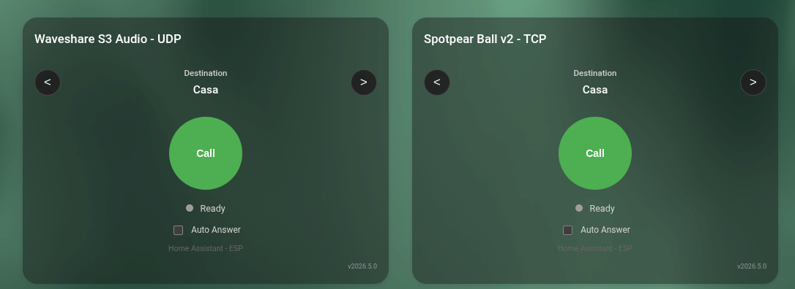

_Home Assistant dashboard view: devices, call controls, phonebook state and diagnostics in one place._


_Runtime demo: browser softphone, ESP call state and audio controls moving together._

<table>
  <tr>
    <td align="center"><br/><b>Intercom Call</b></td>
    <td align="center"><br/><b>Voice UI</b></td>
    <td align="center"><br/><b>TTS Response</b></td>
    <td align="center"><br/><b>Audio Controls</b></td>
    <td align="center"><br/><b>Call Reason</b></td>
  </tr>
</table>

<table>
  <tr>
    <td>
      <strong>Support this project</strong><br/>
      If this work is useful to you, please consider a donation. It helps cover
      development tools, services and test hardware, which means better
      compatibility and fewer regressions for everyone.<br/><br/>
      <a href="https://github.com/sponsors/n-IA-hane">
        
      </a>
    </td>
  </tr>
</table>

## Table of Contents

- [Breaking changes](docs/BREAKING_CHANGES.md)
- [What's New](#whats-new)
- [Overview](#overview)
- [Quick Start Examples](#quick-start-examples)
- [Features](#features)
- [Architecture](#architecture)
- [Installation](#installation)
  - [1. Home Assistant Integration](#1-home-assistant-integration)
  - [2. ESPHome Component](#2-esphome-component)
  - [3. Lovelace Card](#3-lovelace-card)
- [Product model and routing](#product-model-and-routing)
- [Reference](#reference): intercom_api, esp_aec, esp_afe, entities, HA services, automations ([docs/reference.md](docs/reference.md))
- [Call Flow Diagrams](#call-flow-diagrams)
- [Hardware Support](#hardware-support)
- [Audio components](#audio-components): esp_audio_stack, esp_aec, esp_afe
- [Voice Assistant + Intercom Experience](#voice-assistant--intercom-experience)
- [Logging](#logging)
- [Troubleshooting](#troubleshooting) ([docs/troubleshooting.md](docs/troubleshooting.md))
- [Deep dives and architecture](docs/)
- [License](#license)

## What's New

### 2026.7.0-dev - From PBX-lite to real PBX

`2026.7.0-dev` is a prerelease intended for field testing before the next
stable release. The headline is not just a media-path update: it is the real
VoIP migration.

Yes, you read that correctly: ESP devices and Home Assistant have been migrated
to SIP/SDP/RTP. ESPs are SIP phones. Home Assistant is a SIP softphone, SIP
router/B2BUA, RTP bridge/resampler and optional trunk client. Intercom Native
has been migrated too, so the HA integration can route and bridge real SIP call
legs instead of wrapping a project-specific intercom protocol.

What this makes possible:

- ESP devices can call each other from the shared SIP phonebook.
- ESP devices can call Home Assistant, now treated as an independent softphone.
- Home Assistant can call ESP devices from the Lovelace softphone card,
  automations, Assist intents or services.
- Standard softphones such as Zoiper, Linphone, baresip or pjsua can register
  to Home Assistant with local SIP accounts and appear as phonebook contacts.
- Home Assistant can register one optional provider/PBX trunk for inbound and
  outbound external calls.
- With a trunk configured, ESPs and Home Assistant can make and receive external
  calls without deploying Asterisk beside the integration.
- HA can bridge ESP, HA softphone, registered softphone and trunk legs while
  preserving SIP state, RTP counters, negotiated media formats and terminal
  reasons.
- Busy, DND, decline, cancel, BYE, timeout, media-incompatible and route errors
  are exposed as call reasons from SIP behavior, not as a duplicated frontend
  state machine.

Changes since `2026.6.3`:

- Full-experience YAMLs now use the `speaker_source` media player path. Normal
  HA media, announcements, timer sounds, local audio files and optional
  Sendspin all enter the same media player, then the mixer arbitrates them
  against intercom and Voice Assistant audio.
- Full-experience YAMLs now use the generic [`runtime_fsm`](esphome/components/runtime_fsm/README.md)
  reducer for runtime state arbitration. Voice Assistant, media, timers,
  mute/connectivity and optional intercom events feed activities; policies then
  derive LED, display, ducking and alarm outputs from a single committed state.
- Voice Assistant TTS state now follows the real media-player announcement
  lifecycle. Slow local TTS backends keep the reply LED/state active while the
  audio URL is pending, start playback as an announcement, and restore ducking
  when the announcement ends.
- The project-local `voice_assistant` fork temporarily exposes
  `tts_playback_start_timeout`. Maintained full profiles set it to `10s` so
  slower local XTTS backends do not trip ESPHome's historical 2-second TTS
  playback-start watchdog before the announcement source begins.
- Wake-word barge-in during a VA TTS response stops the VA announcement path
  and restarts the assistant from real component states, without stopping normal
  background media.
- Intercom Native can now register optional Home Assistant Assist intent
  handlers. Voice satellites can say commands such as `call kitchen speaker`,
  `hang up`, `answer` and `decline`; the handler uses the Assist `device_id` of
  the satellite that heard the sentence, resolves the spoken contact
  dynamically against the live intercom phonebook, and calls the existing
  intercom services. If no contact matches, it can resolve a Home Assistant
  area name when that area contains exactly one intercom device. The feature is
  gated by the Intercom Native setup option and is off by default.
- Maintained full-experience YAMLs include an explicit optional local voice
  command package for assistant silence. Users can say "shut up" to stop only
  the current VA/TTS announcement without stopping background media.
- Sendspin / Music Assistant is available in maintained full-experience
  profiles. It is integrated as one source in the media pipeline, not as a
  second parallel media player. Current defaults use 48 kHz mono PCM and PSRAM
  decode buffers, with speaker playback timing driven by I2S/DMA completion
  feedback.
- Sendspin artwork is now supported on display profiles that opt in to the
  artwork package. Spotpear and Waveshare P4 render Music Assistant album art
  when Sendspin exposes it, falling back to the neutral media screen when no
  artwork is available. This uses ESPHome's development `generic_image` /
  `sendspin` image support from
  [esphome/esphome#16057](https://github.com/esphome/esphome/pull/16057).
  Thanks to
  [the FYI report in issue #58](https://github.com/n-IA-hane/esphome-intercom/issues/58)
  for pointing out that Sendspin can expose artwork.

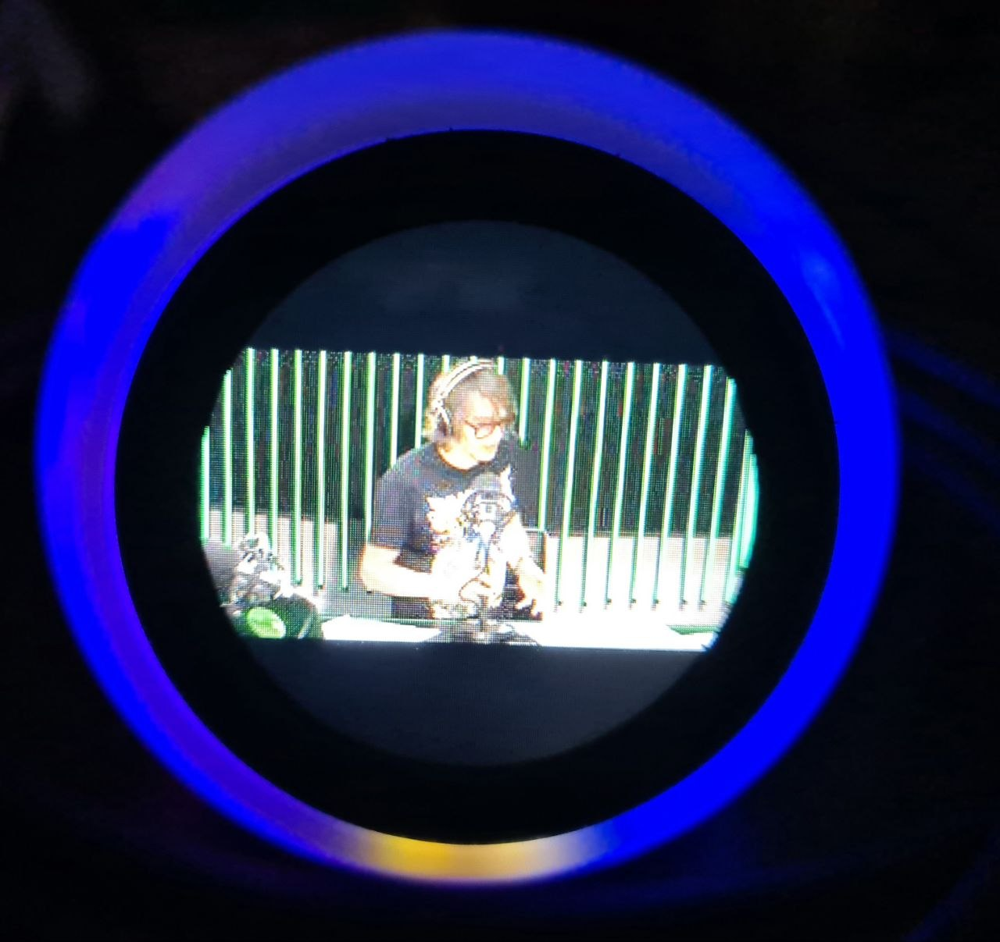

- Waveshare P4 full profiles now use the same source-based media path as the
  S3/Spotpear/generic full profiles while preserving their LVGL callbacks.
- Native ESPHome intercom-only profiles now run their native I2S microphone and
  speaker paths at 48 kHz. TCP uses 20 ms frames; UDP uses 10 ms frames so the
  48 kHz/s16/mono payload stays under the default 1200-byte UDP limit.
- AFE/AEC-backed intercom-only profiles intentionally keep 16 kHz TX. That is
  the format emitted by the Espressif AFE/AEC branch. Use Home Assistant SIP router
  bridging when mixing those endpoints with higher-rate native endpoints.
- ESP endpoint publication now waits for a real IPv4 address from ESPHome's
  network API and republishes on Wi-Fi or Ethernet IP events. This avoids
  publishing unusable endpoint rows such as `0.0.0.0`, independent of whether
  the board uses Wi-Fi or Ethernet.
- Home Assistant bridge conversion between different negotiated PCM formats now
  uses a vectorized NumPy converter with anti-aliased sample-rate conversion.
- Browser/card reload during an active HA softphone call can rebind to the
  server session within a short grace window instead of immediately losing the
  call state.
- ESP -> HA calls answered from the browser now build the AudioWorklet after
  the server `200 OK` reply has selected the effective TX/RX formats. This
  keeps HA-originated and ESP-originated softphone calls on the same negotiated
  audio contract and prevents stale-format browser audio.
- ESP caller devices also update their local speaker stream info from the
  negotiated RX format before and after `200 OK`, so HA browser audio answered
  from an ESP-originated call is played at the selected rate instead of a stale
  default rate.
- The Lovelace frontend derives ringtone/worklet cache keys from the loaded
  card module version, removing the old manually bumped audio asset constant
  from the browser audio test path.
- Hybrid Lovelace cards retain the original mirror model: they represent one
  ESP endpoint and show that ESP's ringing/streaming controls. A separate
  `ha_softphone` card represents Home Assistant itself.
- Inbound SIP calls are accepted from valid external/routed callers even if
  the caller is not in the callee's local phonebook. This keeps VPN, routed LAN
  and HA SIP bridge flows natural: SIP INVITE carries the caller/destination identity,
  while the phonebook remains the outbound dial plan.
- Terminal call screens now keep the real incoming caller through the hangup /
  failure callback, so a callee that has another contact selected does not show
  the selected contact as the peer that just hung up.
- UDP audio still defaults to a conservative 1200-byte payload limit, but
  advanced LAN installs can opt in to a larger `udp_max_payload` on both ESPHome
  and the HA integration.

Known prerelease status:

- Sendspin works through the shared media path. WS3, Spotpear and P4 were
  validated with Music Assistant grouped playback on the 2026.7.0-dev firmware.
- Sendspin artwork support depends on ESPHome development image support from
  `esphome/esphome#16057`; the local package pins that external component until
  the feature lands in an ESPHome release.
- Maintained full-experience YAMLs keep optional user-facing features as
  explicit package lines next to the core package. Comment out the local voice
  commands, timers, HA API, call settings or artwork package line when you do
  not want that feature in a custom build.
- UDP remains intentionally conservative by default. Raise `udp_max_payload`
  only after verifying the whole LAN path, or use TCP for larger PCM frames.
- The HA softphone card now has an idle-only Options panel for Auto Answer,
  DND and browser ringtone. Ringtone is stored in browser localStorage; DND is
  stored in HA softphone state.

## Overview

**ESPHome Intercom** is a set of ESPHome components, YAML packages and Home
Assistant tools for full-duplex intercom, wake word devices, media/TTS playback
and display-driven voice devices.

### Pick your starting point

| Goal | Start here | Result |
|---|---|---|
| One ESP as a full-duplex citofono/intercom with Home Assistant | [`yamls/intercom-only/`](yamls/intercom-only/) | The ESP calls HA, HA can call the ESP, and the Lovelace card can answer from browser or mobile app. |
| Room-to-room ESP intercom | One intercom-only YAML per ESP | Devices call each other by phonebook name. HA publishes the standard roster and can bridge when needed. |
| Full voice device | [`yamls/full-experience/`](yamls/full-experience/) | Media player, Piper TTS, Micro Wake Word, Voice Assistant, AFE/AEC and intercom on the same ESP. |
| Full voice device with hardware/DSP echo cancellation or separated native audio paths | [`generic-s3-full-esphome-native.yaml`](yamls/full-experience/esphome-native/generic-s3-full-esphome-native.yaml) | Full experience on native ESPHome microphone/speaker components. Good starting point for XMOS-style front-ends that already remove echo in hardware, or for boards with independent mic/speaker I2S paths. |
| Standalone native ESPHome intercom | [`yamls/intercom-only/esphome-native/`](yamls/intercom-only/esphome-native/) | Native mic-only, speaker-only and separated-path full-duplex examples using standard ESPHome audio components, without `esp_audio_stack`. Do not use this path for shared single-bus software-AEC builds. |
| Audio driver for your own ESPHome Voice Assistant | [`esp_audio_stack`](esphome/components/esp_audio_stack/README.md) | Shared mic/speaker I2S path, speaker reference handling and a clean post-AEC microphone facade for MWW, Voice Assistant and intercom while media/TTS keeps playing. |
| Media, announcements and optional Music Assistant / Sendspin for full voice profiles | [`speaker_source` media path](docs/reference.md#full-experience-media-path) | One media player feeds the mixer with HA media, announcements, local files and optional Sendspin streams; intercom keeps its own higher-priority mixer source. |
| Runtime state arbitration for full profiles | [`runtime_fsm`](esphome/components/runtime_fsm/README.md) | A configurable reducer maps events and activities to LED/display/ducking/timer policies, reducing YAML callback races when media, TTS, intercom and timers overlap. |

For the normal intercom use case, do not start by designing a SIP router. Pick the
closest YAML, adapt the board pins and audio hardware, add the ESP through the
ESPHome integration, then install `intercom_native`. Home Assistant is
discovered as a destination and the ESP can call or be called from a GPIO
button, LVGL button, automation, service call or Lovelace card.

### Phonebook Rule

If Home Assistant is part of the setup, use the standard HA-managed phonebook.
Each ESP publishes `intercom_endpoint` through the native ESPHome API, HA builds
`sensor.intercom_phonebook`, and standard ESP packages subscribe to that roster.
ESP-side network scanning is not a SIP routing primitive. If HA is present, it
is the phonebook authority.

### SIP router/B2BUA mental model

SIP router/B2BUA is the internal call model, not a requirement to build a phone system.
It means each ESP is treated as an **independent extension** with its own call
state and phonebook entry. Devices dial by name, Home Assistant joins as another
peer, and HA can optionally bridge calls, log state and connect the browser
card.

**Home Assistant is not required in the media path for same-transport
ESP-to-ESP calling**. Today HA is the stable phonebook authority in the standard
YAMLs. If HA is on the network, it also joins as one more extension and can act
as a SIP router/B2BUA bridge when routing asks for it.

There is one product mode on top of two SIP signaling transports. HA
`intercom_native` is a SIP softphone, SIP TCP/UDP listener, RTP bridge/resampler,
phonebook publisher, optional registrar for local softphones and optional trunk
client.

Use TCP as the default transport when the network path must be predictable:
routed LANs, VLANs, Docker/HA container setups, Wi-Fi segments with filtering,
or any install where retransmission is more important than the lowest possible
latency. Use UDP when the devices live on a simple, well-behaved LAN and you
want the lowest protocol overhead for audio. UDP control is still SIP router/B2BUA, but
audio datagrams are not retransmitted, so packet loss or routing/firewall
misconfiguration shows up as audible glitches instead of delayed recovery.
Both transports are first-class and HA can bridge between them.

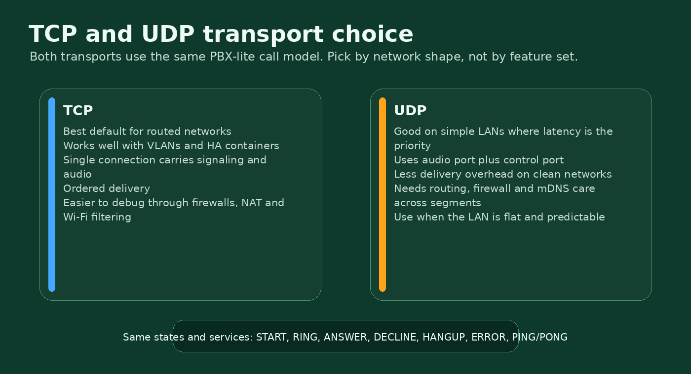

_SIP TCP and SIP UDP expose the same SIP router/B2BUA behavior; the network decides which one is easier to operate._

Routing is deterministic:

- ESP dials direct only when the central phonebook contains a complete direct
  SIP URI/IP/transport and media is compatible.
- ESP numeric targets and unresolved names go to HA; HA decides whether they are
  internal contacts, bridge routes or trunk calls.
- HA inbound trunk calls with no explicit hint ring the HA softphone; explicit
  hints must resolve or terminate with a route error.

### Topology At A Glance

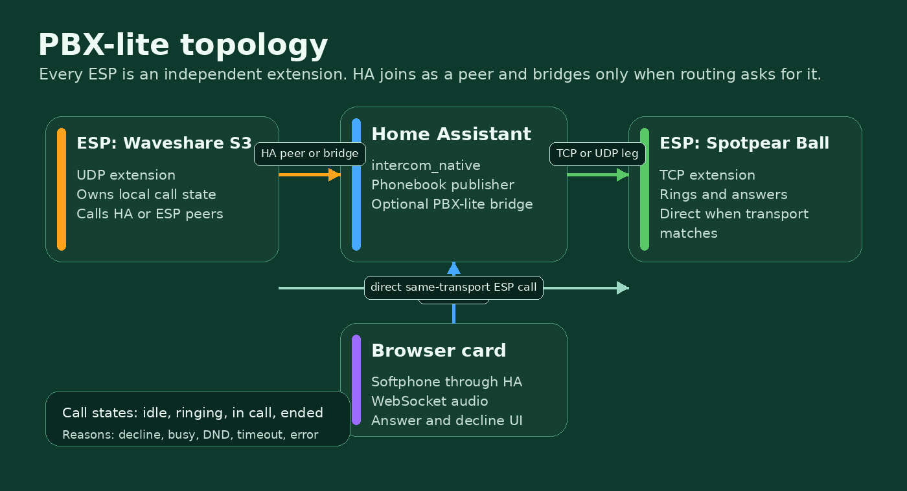

How to read it:

- **ESP-to-ESP direct**: peers call each other from the phonebook when a direct SIP endpoint is complete.
- **HA as SIP router**: unresolved names, numeric targets, protocol/media bridges and trunk routes go through HA.
- **Browser/app calls**: the Lovelace card is the HA softphone UI, using WebSocket for browser audio and SIP/RTP legs toward peers.

## Quick Start Examples

These examples show the normal user flows. Use the ready-to-flash YAMLs when
your hardware is listed under [Hardware Support](#hardware-support); only copy
the snippets below when you are building a custom target.

### Normal install: ESPs as intercom extensions

1. Install the Home Assistant `intercom_native` integration.
2. Flash one ready YAML per device, for example:
   - [`spotpear-ball-v2-full-afe.yaml`](yamls/full-experience/single-bus/spotpear-ball-v2-full-afe.yaml)
   - [`waveshare-s3-full-afe.yaml`](yamls/full-experience/single-bus/waveshare-s3-full-afe.yaml)
3. Add each ESP through the ESPHome integration in Home Assistant.
4. Verify that HA exposes `sensor.intercom_phonebook`. That is the authoritative
   roster for the standard packages.
5. Use the ESP buttons, display, Home Assistant service, or Lovelace card to
   call a selected contact.

ESPs call each other directly only when the phonebook provides a complete direct
SIP endpoint. Numeric targets, unresolved names, browser calls and trunk calls
go through Home Assistant as the SIP bridge/B2BUA.

### Doorbell: one ESP calls Home Assistant

A doorbell is just SIP router/B2BUA with one selected contact: the HA peer. The contact
name is **your Home Assistant location name** (`hass.config.location_name`),
not a hardcoded "Home Assistant" string.

```yaml
binary_sensor:
  - platform: gpio
    name: Doorbell Button
    pin:
      number: GPIO4
      mode: INPUT_PULLUP
      inverted: true
    on_press:
      - intercom_api.call_contact:
          id: intercom
          contact: "Home"  # replace with Settings -> System -> General -> Location name
```

When the ESP calls that HA contact, the Lovelace card rings and can answer from
the browser or mobile app. The standard intercom callback package also fires the
`esphome.intercom_call` event for automations.

For mobile doorbells, the Companion app notification can expose two useful
actions: **Answer** and **Decline**. Answer deep-links to the Lovelace card with
`?intercom_answer=1`, so the card can request microphone access and start the
full-duplex audio stream. Decline stays in the automation path and calls
`intercom_native.sip_decline`, which sends the decline reason back to the ESP.

### Room-to-room intercom: fixed buttons

For an apartment-style panel, bind one GPIO button to each exact phonebook
contact name. `call_contact` is safer than selecting then calling: if the name
does not exist, the call fails instead of falling through to another contact.

```yaml
binary_sensor:
  - platform: gpio
    name: Call Kitchen
    pin:
      number: GPIO5
      mode: INPUT_PULLUP
      inverted: true
    on_press:
      - intercom_api.call_contact:
          id: intercom
          contact: "Kitchen Intercom"

  - platform: gpio
    name: Call Bedroom
    pin:
      number: GPIO6
      mode: INPUT_PULLUP
      inverted: true
    on_press:
      - intercom_api.call_contact:
          id: intercom
          contact: "Bedroom Intercom"
```

Contact names are exact and case-sensitive. Check `sensor.<device>_destination`
or the HA phonebook sensor if a call reports `Contact not found`.

### Load a manual phonebook at boot

The recommended path is HA-managed sync through `sensor.intercom_phonebook`.
Use manual boot loading only for custom YAMLs, offline installs, diagnostics, or
very small fixed systems.

```yaml
esphome:
  on_boot:
    priority: -100
    then:
      - intercom_api.flush_contacts:
          id: intercom
      - intercom_api.add_contact:
          id: intercom
          name: "Home"
          ip: "192.168.1.10"
          port: 5060
          sip_transport: tcp
      - intercom_api.add_contact:
          id: intercom
          name: "Kitchen Intercom"
          ip: "192.168.1.21"
          port: 5060
          sip_transport: udp
```

Contact fields:

```text
name|required display/dial name
address|optional host/IP for direct SIP endpoints
sip_port|optional SIP signaling port, default 5060
sip_transport|tcp or udp when direct SIP is allowed
```

If you include the maintained HA phonebook subscription package, HA pushes the
canonical roster JSON after boot. For a fully static local phonebook, omit that
package and define contacts manually.

## Features

- **Full-duplex audio** - Talk and listen simultaneously.
- **SIP router/B2BUA model** with phonebook, contacts, destination, caller and terminal reason exposed.
- **Deterministic routing**: direct only with complete SIP endpoint data; unresolved names and numbers go to HA.
- **SIP TCP + SIP UDP signaling** with RTP media and HA bridge/resampling when needed.
- **Negotiated PCM audio** - peers advertise per-direction `tx_formats`/`rx_formats` up to 48 kHz where the actual microphone/speaker path supports them.
- **Dedicated browser audio socket** - The Lovelace softphone uses authenticated binary WebSocket audio on `/api/intercom_native/ws`; it no longer pushes base64 audio over HA's shared frontend WebSocket.
- **Echo Cancellation (AEC)** - Built-in acoustic echo cancellation using ESP-SR. (ES8311 digital feedback mode provides perfect sample-accurate echo cancellation.)
- **Full Audio Front-End (AFE)** - Complete ESP-SR AFE pipeline via `esp_afe`:
  - **Single-mic (MR)**: AEC + Noise Suppression + VAD + AGC.
  - **Dual-mic (MMR)**: AEC + Speech Enhancement + Voice Activity Detector.
  - Runtime switches and diagnostic sensors in Home Assistant.
  - Automatic pipeline switching: Speech Enhancement replaces NS/AGC when spatial separation is active.
- **Voice Assistant compatible** - Full profiles expose one post-AEC microphone
  surface, so Micro Wake Word, Voice Assistant and intercom receive cleaned
  user speech while music, TTS or ringtone audio is playing from the speaker.
- **Ready-to-flash YAML configs** - Optimized configurations for real, tested hardware combining Voice Assistant, Micro Wake Word and Intercom on the same device.
- **Auto Answer** - Configurable automatic call acceptance (ESP-side switch + browser card checkbox).
- **HA Services** - `intercom_native.sip_answer`, `decline` (with optional `reason`), `hangup`, `call`, `forward`, `purge_devices`. All registered with explicit `voluptuous` schemas (`extra=PREVENT_EXTRA`); empty target-bearing calls fail schema validation before handlers run.
- **Call Forwarding** - Forward active or ringing calls to another device via automation.
- **Ringtone on incoming calls** - Devices play a looping ringtone while ringing.
- **Volume Control** - Adjustable Master Volume and microphone gain.
- **Phonebook** - Dedup by friendly name. HA publishes the SIP-aware `sensor.intercom_phonebook`; ESP packages subscribe to it and locally shape endpoint rows into direct SIP or HA-bridged routes. YAML automations can still call the native `intercom_api` actions/services.
- **Do Not Disturb** - Native `intercom_api` switch. When enabled, incoming calls are rejected with `SIP reject("DND")` so the caller receives a real reason.
- **HA peer name = `hass.config.location_name`** everywhere (NEVER hardcoded).
- **Status LED** - Visual feedback for call states.
- **Persistent Settings** - Volume, gain, AEC state saved to flash.
- **Remote Access** - Works through any HA remote access method (Nabu Casa, reverse proxy, VPN). No WebRTC, no go2rtc, no port forwarding required.

---

## Architecture

### System Overview

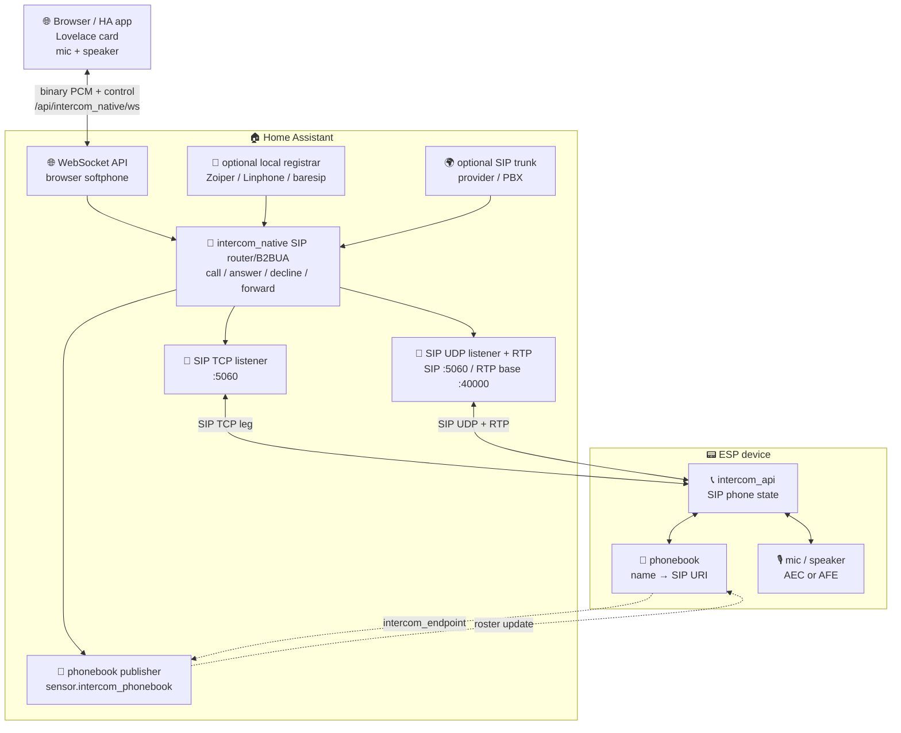

This is the whole product in one picture: HA is a transport hub and optional bridge; the ESP owns call state, audio, and the local phonebook.

### Audio format

The default SIP PCM format is `16000:s16le:1:32`, but current
SIP router/B2BUA peers negotiate audio per direction. AFE/AEC-backed branches still
publish 16 kHz/s16/mono because Espressif esp-sr exposes that format; native
ESPHome microphone/speaker paths and the HA browser softphone can advertise
their actual PCM format up to 48 kHz and 32-bit containers.

An audio format token is:

```text
sample_rate:pcm_format:channels:frame_ms
```

Supported PCM containers are `s16le`, `s24le`, `s24le_in_s32` and `s32le`.
Supported rates are 8, 12, 16, 24, 32, 44.1 and 48 kHz, with 10/20/32 ms
frames when the frame contains an integer number of samples.

Home Assistant may bridge different formats by explicit PCM conversion; direct
ESP-to-ESP calls require a common format and fail clearly when none exists. UDP
audio still carries exactly one complete PCM frame per datagram. Formats whose
frame payload is above the safe datagram threshold are rejected for UDP; use TCP
for high-rate, stereo or 32-bit frames.

Intercom intentionally transports negotiated PCM, not MP3/FLAC/Opus. ESPHome's
codec decoders are useful for media-player and announcement pipelines, but
intercom is a bidirectional low-latency protocol: compressed codecs would add
realtime encode/decode, jitter behavior and extra CPU/PSRAM budget on every
hop. Keep compressed media on ESPHome media-source pipelines; keep intercom on
PCM unless a future measured Opus mode proves worth the cost.

### SIP, SDP and RTP contract

The functional wire contract is standard SIP/2.0 signaling, SDP offer/answer
and RTP media. ESP devices are SIP user agents; Home Assistant is a SIP
softphone plus SIP router/B2BUA. There is no project-specific call-control
compatibility path.

Supported SIP methods in the local profile are `INVITE`, `ACK`, `CANCEL`,
`BYE`, `OPTIONS`, `INFO` for DTMF interop where used, and `REGISTER` only for
optional local softphone accounts on Home Assistant. ESP firmware does not
register to a PBX and does not require SIP auth.

SDP negotiates PCM RTP media. ESP firmware accepts compatible L16/L24 PCM only;
Home Assistant may accept common softphone/trunk codecs and convert them at the
B2BUA boundary before sending PCM to ESPs. Generic direct SIP calls select one
common RTP format per dialog. HA bridge/trunk calls may use different formats
on each leg because HA owns both dialogs and the RTP relay/resampler.

SIP signaling can listen on TCP, UDP or both. RTP remains UDP. UDP RTP payloads
are kept under the safe payload budget for typical home LANs; high-rate ESP
profiles use short packet times such as 10 ms so 48 kHz mono L16 fits without
IP fragmentation.

Transport choice is an installation choice, not a feature split. TCP is the
recommended starting point for routed networks and HA/container deployments
because connection state is easier to reason about. UDP is best suited to
simple local LANs where low latency matters and the network is known to pass
SIP/RTP cleanly.

### Endpoint and phonebook model


_Every callable peer becomes a canonical endpoint row. HA merges rows into the roster consumed by ESPs and the card._

Standard HA-managed firmware uses the native ESPHome API endpoint sensor plus
`sensor.intercom_phonebook`. HA is the phonebook authority whenever it is part
of the installation. ESP-side network scanning is not part of the SIP routing
contract. The canonical roster JSON, SIP URI fields and audio capability fields
are documented in [`docs/PHONEBOOK_PROTOCOL.md`](docs/PHONEBOOK_PROTOCOL.md).

### Local softphone accounts

Intercom Native can optionally act as a local SIP registrar for standard
softphones. Create an account with `intercom_native.sip_account_create`, then
configure Zoiper, Linphone, baresip or pjsua with:

```text
server: <Home Assistant advertised IP or host>
username: MobileOffice
password: <password generated by HA>
transport: SIP TCP or SIP UDP, matching the enabled HA listener
```

The username is also the central phonebook ID. When `MobileOffice` registers,
HA adds a dynamic SIP contact with that name to the roster and pushes it to ESP
devices. Deregistering, disabling the account or letting the REGISTER expire
removes the dynamic contact. Passwords are never logged; generated passwords
are emitted once in the Intercom Native call event stream.

---

## Installation

### 1. Home Assistant Integration

#### Option A: Install via HACS (Recommended)

1. In HACS, go to **⋮ → Custom repositories**.
2. Add `https://github.com/n-IA-hane/esphome-intercom` as **Integration**.
3. Find "Intercom Native" and click **Download**.
4. Restart Home Assistant.
5. Go to **Settings → Integrations → Add Integration** → search "Intercom Native" → click **Submit**.
6. In the config flow, tick the SIP signaling transports you want. SIP TCP is on
   by default, SIP UDP is opt-in. Default ports are SIP `5060` and RTP base
   `40000`.

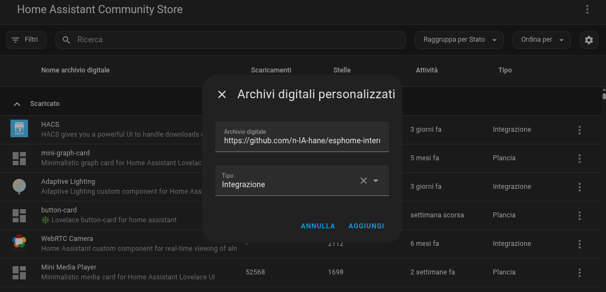

_Add the repository as a HACS integration repository._

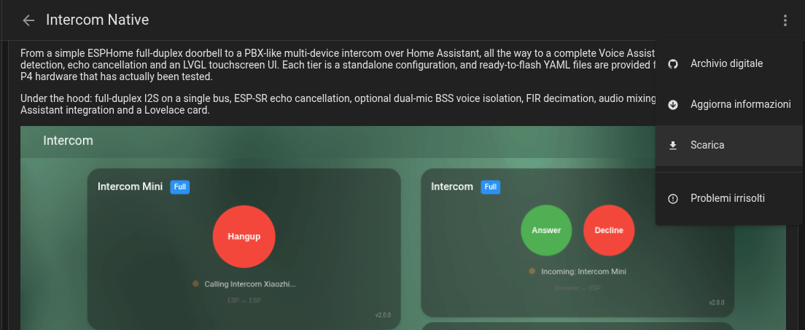

_After the repository is added, open Intercom Native in HACS and download it._

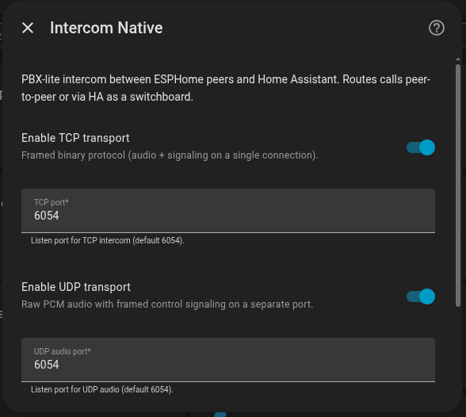

_The config flow enables the SIP TCP and SIP UDP listeners used by ESP peers and the HA SIP router/B2BUA bridge._

The integration automatically registers the Lovelace card, no manual frontend setup needed.

#### After Every Intercom Native Upgrade: Hard Refresh The Card Page

After upgrading `intercom_native`, hard refresh every Home Assistant dashboard
view that contains an `intercom-card`.

Several reported "broken card" or "intercom not working" issues were eventually
traced back to the browser or mobile app still running an old cached copy of the
card JavaScript after the integration had already been upgraded. The card URL is
versioned from the installed Intercom Native component, but some clients can
still keep stale frontend state until their cache is cleared.

On desktop Chrome or Chromium:

1. Open the dashboard page that contains the intercom card.
2. Press `F12` to open Developer Tools.
3. Right-click the browser refresh button.
4. Choose **Empty cache and hard reload**.
5. Check the version shown at the bottom-right of the card. It must match the
   Intercom Native version you just installed.

On the Home Assistant Companion app for Android:

1. Open the Home Assistant app.
2. Go to **Settings** -> **Companion App** -> **Troubleshooting**.
3. Tap **Reset frontend cache**.
4. Close and reopen the app.
5. Check the version shown at the bottom-right of the card. It must match the
   Intercom Native version you just installed.

If that option is not available on your Companion App build, or the stale card
still remains after the frontend-cache reset, use Android's fallback app-cache
cleanup:

1. Close the Home Assistant app.
2. Open Android **Settings**.
3. Open **Apps** -> **Home Assistant** -> **Storage and cache**.
4. Tap **Clear cache**. Do not clear app storage unless you intentionally want
   to log in again and reset the app.
5. Reopen the app and check the card version shown at the bottom-right.

Home Assistant can update/reload Lovelace resources, and this integration
already registers the card with a versioned URL. The remaining stale-cache case
is client-side: the browser or companion app may keep an already loaded
JavaScript module alive until the page/app is refreshed. Until the card gets its
own version-mismatch warning, do this after every Intercom Native upgrade,
especially after major releases.

#### Option B: Manual install

```bash
# From the repository root
cp -r custom_components/intercom_native /config/custom_components/
```

Then add via UI: **Settings → Integrations → Add Integration → Intercom Native**, restart Home Assistant.

The integration will:
- Bind SIP TCP and SIP UDP listener sockets on the configured ports.
- Register the WebSocket API commands for the card.
- Publish the SIP phonebook (`sensor.intercom_phonebook`) for ESP subscribers.
- Optionally register a provider/PBX trunk.
- Optionally accept REGISTER from local softphones with generated accounts.
- Register SIP-first services (`sip_answer`, `sip_decline`, `sip_hangup`, `sip_call`, `sip_forward`, `sip_route`, phonebook and SIP account services).
- Auto-register the Lovelace card as a frontend resource.

#### Network requirements

- **Minimum Home Assistant Core**: 2026.5.0.
- **Tested on**: Home Assistant OS 17.3 with Home Assistant Core 2026.5.1.
- **HA OS / Supervised**: container is `--network=host` by default. Works.
- **HA Container (Docker)**: must be started with `--network=host` (also recommended by official HA docs). Bridge mode would need manual port forwarding plus an mDNS reflector and a `network: announced_addresses` override (not recommended).
- **HA Core in venv**: listens on host LAN, no extra config.

If `network.async_get_announce_addresses(hass)` returns empty, the integration logs a WARN and HA cannot publish itself in the SIP phonebook until you configure either `network: announced_addresses:` or an `external_url`. A port bind failure transitions the config entry to `ConfigEntryError`.

### 2. ESPHome Component

Add the external component to your ESPHome device configuration:

Minimum ESPHome version: **2026.5.x**. Older ESPHome releases are not supported
by the maintained `esp_audio_stack` YAMLs.

```yaml
# Lightweight (single-mic, echo cancellation only):
external_components:
  - source: github://n-IA-hane/esphome-intercom
    ref: main
    components: [audio_processor, intercom_api, esp_audio_stack, esp_aec]

# Full AFE pipeline (single-mic NS/AGC/VAD or dual-mic Speech Enhancement/VAD):
external_components:
  - source: github://n-IA-hane/esphome-intercom
    ref: main
    components: [audio_processor, intercom_api, esp_afe, esp_audio_stack]
```

> **Note**: `audio_processor` is still listed because it provides shared task
> and buffer helpers used by the audio components. Use `esp_aec` for
> lightweight single-mic processing and `esp_afe` for the full pipeline (see
> [AFE section](#audio-front-end-afe) below). `intercom_api` no longer owns
> software AEC; standalone intercom binds to native ESPHome
> `microphone`/`speaker`, while software AEC/AFE belongs behind
> `esp_audio_stack`. Maintained full voice YAMLs use the source-based
> `speaker_source` media path; the project-local
> [`speaker`](esphome/components/speaker/README.md) fork remains documented for
> older custom YAMLs that still use ESPHome's `platform: speaker` media player.

#### After ESP Firmware Package Upgrades: Clear ESPHome Build Cache

When you upgrade this project and flash ESP firmware built from the new YAMLs,
force ESPHome to rebuild from a clean cache at least once. This is especially
important after major releases, package reshuffles, external component changes
or ESPHome version upgrades.

If you compile from the ESPHome dashboard, use the build-cache cleanup action
for the device or the global **Clear all** action if your dashboard exposes it,
then compile/upload again.

If you compile from the ESPHome CLI, delete the `.esphome` build cache
directories from your ESPHome YAML compilation paths before compiling again. For
example, from the directory that contains your YAML files:

```bash
find . -type d -name .esphome -prune -exec rm -rf {} +
```

If your YAMLs live in multiple folders, repeat the cleanup for each folder or
run it from the common parent that contains only your ESPHome build files.

#### Minimal Configuration

```yaml
esp32:
  board: esp32-s3-devkitc-1
  framework:
    type: esp-idf

# Echo Cancellation
esp_aec:
  id: aec_processor
  sample_rate: 16000
  filter_length: 8
  mode: voip_high_perf   # Intercom-only no-codec default

# ESP audio stack: one owner for I2S, rate conversion, AEC reference and buffers
esp_audio_stack:
  id: audio_stack
  i2s_lrclk_pin: GPIO37
  i2s_bclk_pin: GPIO36
  i2s_din_pin: GPIO35
  i2s_dout_pin: GPIO7
  sample_rate: 48000
  output_sample_rate: 16000
  slot_bit_width: 32
  correct_dc_offset: true
  processor_id: aec_processor
  aec_reference: previous_frame
  buffers_in_psram: true

microphone:
  - platform: esp_audio_stack
    id: mic_component
    esp_audio_stack_id: audio_stack

speaker:
  - platform: esp_audio_stack
    id: hw_speaker
    esp_audio_stack_id: audio_stack
    sample_rate: 48000

  - platform: resampler
    id: spk_component
    output_speaker: hw_speaker
    bits_per_sample: 16

# Intercom API - SIP router/B2BUA (no mode: needed)
intercom_api:
  id: intercom
  microphone: mic_component
  speaker: spk_component
  buffers_in_psram: true
```

#### Complete Configuration (with HA-managed phonebook)

```yaml
intercom_api:
  id: intercom
  # protocol chooses SIP signaling transport: tcp or udp. RTP remains UDP.
  protocol: udp
  microphone: mic_component
  speaker: spk_component
  buffers_in_psram: true
  ringing_timeout: 30s        # Auto-decline unanswered calls

  # FSM event callbacks
  on_ringing:
    - light.turn_on:
        id: status_led
        effect: "Ringing"

  on_outgoing_call:
    - light.turn_on:
        id: status_led
        effect: "Calling"

  on_streaming:
    - light.turn_on:
        id: status_led
        red: 0%
        green: 100%
        blue: 0%

  on_idle:
    - light.turn_off: status_led

# Switches (with restore from flash)
switch:
  - platform: intercom_api
    intercom_api_id: intercom
    auto_answer:
      name: "Auto Answer"
      restore_mode: RESTORE_DEFAULT_OFF

  - platform: esp_audio_stack
    esp_audio_stack_id: audio_stack
    aec:
      name: "Echo Cancellation"
      restore_mode: RESTORE_DEFAULT_ON

# Volume controls
number:
  - platform: esp_audio_stack
    esp_audio_stack_id: audio_stack
    master_volume:
      name: "Master Volume"
      speaker_id: hw_speaker
    mic_gain:
      name: "Mic Gain"

# Buttons for manual control
button:
  - platform: template
    name: "Call"
    on_press:
      - intercom_api.call_toggle: intercom

  - platform: template
    name: "Next Contact"
    on_press:
      - intercom_api.next_contact: intercom

  - platform: template
    name: "Previous Contact"
    on_press:
      - intercom_api.prev_contact: intercom

  - platform: template
    name: "Decline"
    on_press:
      - intercom_api.decline_call: intercom

# Example: call a specific room from a YAML automation
button:
  - platform: template
    name: "Call Kitchen"
    on_press:
      - intercom_api.call_contact:
          id: intercom
          contact: "Kitchen Intercom"
```

Current public YAMLs use shared phonebook subscription packages. HA publishes:

```text
sensor.intercom_phonebook                       # short state: "N entries"
sensor.intercom_phonebook.attributes.roster_json # canonical SIP roster
```

The ESP-side package subscribes to the roster JSON and calls
`intercom_api.set_roster_json` after a debounce. HA rows, ESP rows, manual SIP
contacts and registered local softphones share the same route vocabulary.
Canonical row formats live in
[`docs/PHONEBOOK_PROTOCOL.md`](docs/PHONEBOOK_PROTOCOL.md). For manual/local
automations you can still use the remaining call-control ESPHome actions:

```yaml
action: esphome.<slug>_set_ha_peer_name
data:
  name: "Beach House"

action: esphome.<slug>_start_call
data:
  dest: "Kitchen"

action: esphome.<slug>_decline_call
data:
  reason: "DND"
```

Contact mutation is not exposed as HA-callable ESPHome services in the standard
packages. Use `sensor.intercom_phonebook` for normal sync, or call the native
`intercom_api.set_contacts` / `add_contact` / `remove_contact` /
`flush_contacts` actions from YAML scripts when you intentionally need local
manual mutation.

See [docs/PHONEBOOK_PROTOCOL.md](docs/PHONEBOOK_PROTOCOL.md) for the full contract.

#### Apartment intercom panel

For multi-room setups, each GPIO button can call a specific room directly. The full recipe (one button per contact, exact name matching rules, `on_call_failed` handling) lives in the [`intercom_api` README](esphome/components/intercom_api/README.md#example-multi-button-intercom-apartment-doorbell).

### 3. Lovelace Card

The Lovelace card is **automatically registered** when the integration loads, no manual file copying or resource registration needed.

#### Add the card to your dashboard

The card is available in the Lovelace card picker - just search for "Intercom":


_The integration registers the Lovelace card automatically; no manual resource URL is needed._

Then configure it with the visual editor:


_Visual editor path for picking the ESPHome intercom device and display name._

Alternatively, you can add it manually via YAML:

```yaml
type: custom:intercom-card
device_id: <your_esp_device_id_or_friendly_name>
name: Kitchen Intercom
show_extended_info: true
```

The default card mode is `hybrid`: the card mirrors one ESP endpoint. If that
ESP selects another ESP, the card mirrors the ESP controls; if that ESP selects
Home Assistant, the browser acts as the HA softphone leg for that ESP. To use
Home Assistant as one independent softphone endpoint, add a separate card:

```yaml
type: custom:intercom-card
mode: ha_softphone
name: Home Assistant Intercom
show_extended_info: true
```

In `ha_softphone` mode the card has its own destination selector, Auto Answer and
Do Not Disturb controls. It rings only for calls addressed to Home Assistant and
does not mirror an ESP card state. Only `hybrid` cards must be bound to an ESP
with `device_id`.

The two modes intentionally display calls differently. A `hybrid` card shows
Answer/Decline when its mirrored ESP is ringing, including the case where that
ESP is being called by Home Assistant. A `ha_softphone` card shows Hangup while
HA is the caller and Answer/Decline only when HA is the callee. In both
directions the browser audio pipeline is configured from the negotiated call
formats returned by the server before microphone or playback worklets start.


_Independent Home Assistant softphone mode: one card represents HA itself and
calls any ESP endpoint from the in-card selector._

The card automatically discovers ESPHome devices with the `intercom_api` component through their `intercom_endpoint` sensor. The visual editor stores the HA `device_id`, while manual YAML can use the ESP friendly name, for example `device_id: Kitchen Panel`. Header text uses `name:` if configured, otherwise the ESP friendly name. With `show_extended_info: true`, the card shows extended routing details: the header appends `- SIP TCP` / `- SIP UDP`; the mode line shows `HA - ESP`, `Home Assistant - ESP`, `ESP - ESP`, or `SIP TCP - SIP UDP bridge` / `SIP UDP - SIP TCP bridge`.

`customElements.define` is idempotent so HMR / re-install never throws on second registration. Console chatter is gated behind `localStorage.intercom_debug = "1"` (errors and warnings always emit). Peer names, destination and decline reasons render as text nodes - no XSS surface from phonebook data.

After every Intercom Native upgrade, hard refresh this dashboard view and verify
that the version printed at the bottom-right of the card matches the installed
integration version. See
[After Every Intercom Native Upgrade: Hard Refresh The Card Page](#after-every-intercom-native-upgrade-hard-refresh-the-card-page).

The Lovelace card provides **full-duplex bidirectional audio** with the ESP device: you can talk and listen simultaneously through your browser or the Home Assistant Companion app. The card captures audio from your microphone via `getUserMedia()` and plays incoming audio from the ESP in real-time.

> **Important: HTTPS required.** Browser microphone access (`getUserMedia`) requires a secure context. You need HTTPS to use the card's audio features. Solutions: [Nabu Casa](https://www.nabucasa.com/), Let's Encrypt, reverse proxy with SSL, or self-signed certificate. Exception: `localhost` works without HTTPS.

> **Note**: Devices must be added to Home Assistant via the ESPHome integration before they appear in the card.


_The card uses the ESPHome device registry, so the device must be added to HA before it appears._

---

## Call Routing

There is no simple/full product split. Every ESP runs the same SIP router/B2BUA state machine with a local phonebook. If the phonebook contains one HA peer, you have a one-button doorbell/intercom. If it contains multiple ESPs, the same firmware can call them directly or through HA depending on the selected routing policy.


_Browser softphone path: the card talks only to HA; HA opens the SIP TCP or SIP UDP leg toward the ESP._

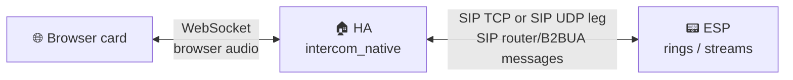

**Browser/App → ESP:**
1. User clicks "Call" in the card
2. HA opens a SIP TCP or SIP UDP leg to the selected ESP
3. HA sends INVITE with caller=`hass.config.location_name`
4. ESP rings or auto-answers
5. Bidirectional audio streaming begins

**ESP → HA peer:**
1. User selects the HA location name in the ESP phonebook
2. ESP sends INVITE to HA
3. HA notifies connected browser cards
4. User answers from the card, or the card auto-answers
5. Bidirectional audio streaming begins

### ESP ↔ ESP

ESP peers call each other directly only when the phonebook entry contains a
complete direct SIP endpoint and compatible media. Numeric targets, unresolved
names, trunk calls and bridge-required routes go to HA.


_ESP-to-ESP routing depends on the selected destination and transport compatibility. In this demo a UDP device calls a TCP device through HA SIP router/B2BUA._

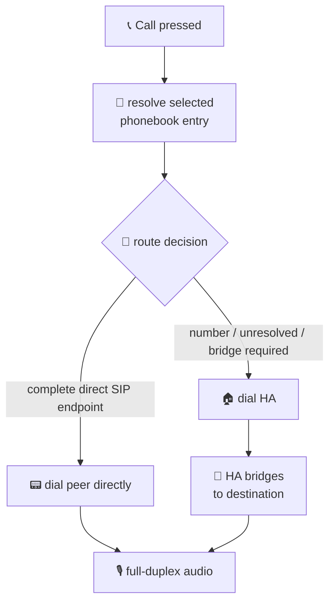

**Call Flow (ESP #1 calls ESP #2):**
1. User selects "Bedroom" on ESP #1 via display, button, or service.
2. ESP #1 resolves the phonebook entry.
3. Complete direct SIP endpoint: ESP #1 sends INVITE directly to ESP #2.
4. Bridge-required route: ESP #1 sends INVITE to HA, preserving `dest_name="Bedroom"`, and HA opens the second leg.
5. Either side can hang up; the terminal reason is propagated to the other leg.

**SIP router/B2BUA features:**
- Contact roster publication from HA
- Next/Previous contact navigation
- Caller ID display
- Ringing timeout with auto-decline
- Bidirectional hangup propagation

### ESP calling Home Assistant (Doorbell)

When an ESP device has the HA location name selected as destination and initiates a call (via GPIO button press or template button), it fires an `esphome.intercom_call` event for notifications and the Lovelace card goes into ringing state with Answer/Decline buttons:


_Doorbell path: the ESP calls the HA peer name, and the browser card rings with Answer/Decline._

---


## Reference

Full options, actions, conditions, entities, services and automation examples are documented in **[docs/reference.md](docs/reference.md)**.

Quick links:
- [`intercom_api` component options](docs/reference.md#intercom_api-component)
- [Event callbacks](docs/reference.md#event-callbacks)
- [Actions](docs/reference.md#actions) and [conditions](docs/reference.md#conditions)
- [`esp_aec`](docs/reference.md#esp_aec-component) / [`esp_afe`](docs/reference.md#esp_afe-component) components
- [Home Assistant services](docs/reference.md#home-assistant-services)
- [Automation examples](docs/reference.md#automation-examples) (doorbell routing, night mode, forward, bridge)


## Call Flow Diagrams

### Browser Card Calls ESP

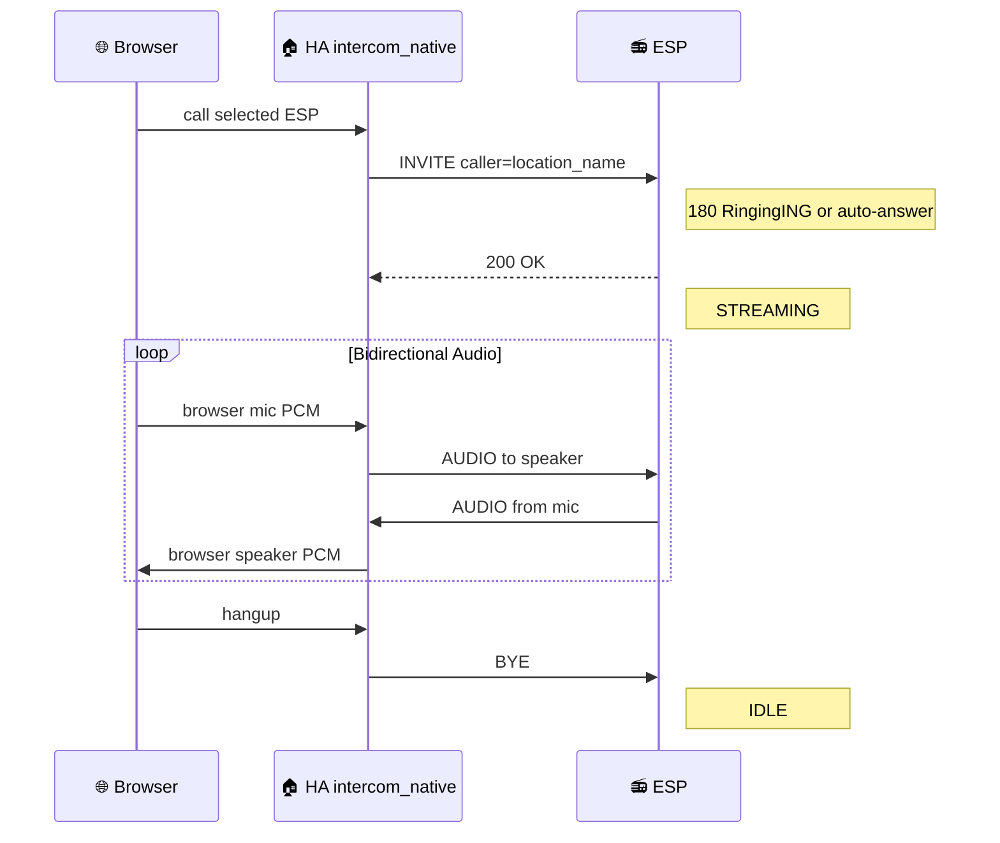

### ESP Calls ESP Directly

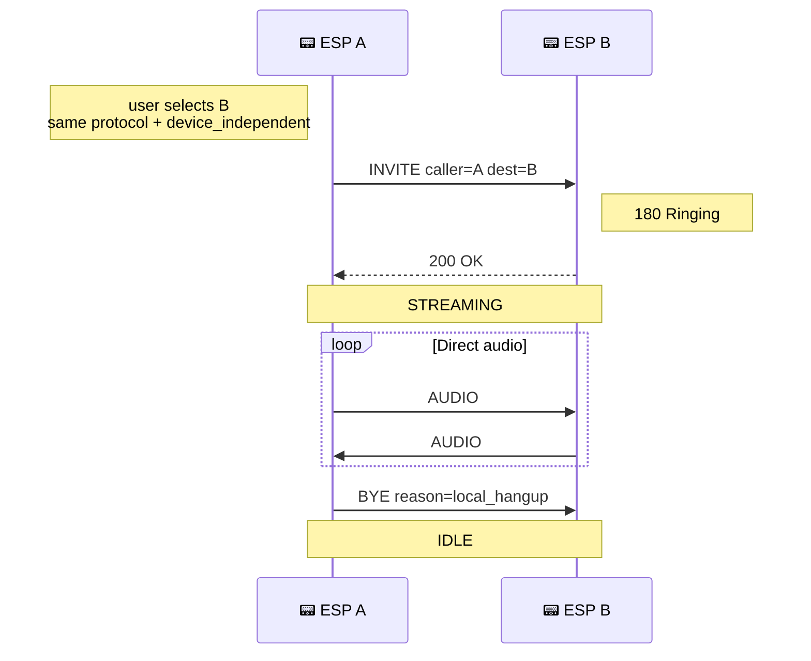

### ESP Calls ESP Through HA

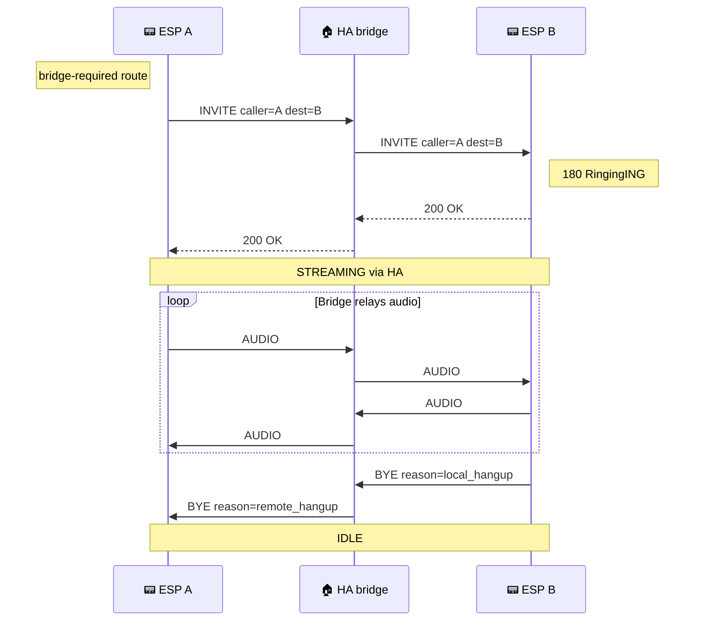

---

## Hardware Support

### Tested Configurations

| Device | YAML | Microphone | Speaker | I2S Mode | Audio pipeline | Features |
|--------|------|------------|---------|----------|----------------|----------|
| **Spotpear Ball v2 (AFE)** | [`spotpear-ball-v2-full-afe.yaml`](yamls/full-experience/single-bus/spotpear-ball-v2-full-afe.yaml) | ES8311 | ES8311 | Single bus | `esp_afe` (AEC + NS + AGC + VAD) | VA + MWW + Intercom + LVGL |
| **Spotpear Ball v2 (intercom)** | [`spotpear-ball-v2-intercom.yaml`](yamls/intercom-only/single-bus/spotpear-ball-v2-intercom.yaml) | ES8311 | ES8311 | Single bus | `esp_aec` (SR stereo loopback) | Intercom only |
| **Waveshare S3-Audio (AFE)** | [`waveshare-s3-full-afe.yaml`](yamls/full-experience/single-bus/waveshare-s3-full-afe.yaml) | ES7210 4-ch | ES8311 | Single bus TDM | `esp_afe` (AEC + Speech Enhancement + VAD) | VA + MWW + Intercom + LED + AFE switches/sensors |
| **Waveshare P4-Touch portrait (AFE)** _(experimental)_ | [`waveshare-p4-touch-full-afe-portrait.yaml`](yamls/full-experience/single-bus/waveshare-p4-touch-full-afe-portrait.yaml) | ES7210 4-ch | ES8311 | Single bus TDM | `esp_afe` (AEC + Speech Enhancement + VAD) | VA + MWW + Intercom + LVGL touch |
| **Waveshare P4-Touch landscape (AFE)** _(experimental)_ | [`waveshare-p4-touch-full-afe-landscape.yaml`](yamls/full-experience/single-bus/waveshare-p4-touch-full-afe-landscape.yaml) | ES7210 4-ch | ES8311 | Single bus TDM | `esp_afe` (AEC + Speech Enhancement + VAD) | Landscape LVGL dashboard, VA + MWW + Intercom |
| **Generic S3 (full AEC light)** | [`generic-s3-full-aec.yaml`](yamls/full-experience/single-bus/generic-s3-full-aec.yaml) | Any I2S MEMS | Any I2S amp | Single bus (duplex) | `esp_aec` SR + `previous_frame` ref | VA + MWW + Intercom, lighter 4 MB-oriented preset |
| **Generic S3 (full AEC light, dual bus)** | [`generic-s3-full-aec.yaml`](yamls/full-experience/dual-bus/generic-s3-full-aec.yaml) | Any I2S MEMS | Any I2S amp | Dual bus | `esp_aec` SR + `previous_frame` ref | VA + MWW + Intercom on separated I2S buses |
| **Generic S3 (full AFE, untested)** | [`generic-s3-full-afe.yaml`](yamls/untested/generic-s3-full-afe.yaml) | Any I2S MEMS | Any I2S amp | Single bus (duplex) | `esp_afe` (AEC + NS + AGC + VAD) + TYPE2 ring ref | VA + MWW + Intercom, requires >4 MB app slot |
| **Generic S3 (full native)** | [`generic-s3-full-esphome-native.yaml`](yamls/full-experience/esphome-native/generic-s3-full-esphome-native.yaml) | Native ESPHome mic or processed front-end | Native ESPHome speaker | Native ESPHome audio | Native ESPHome `microphone`/`speaker`, no software AEC | Full experience for XMOS/hardware-AEC front-ends, separated I2S mic/speaker paths, or native audio testing |
| **Generic S3 (native intercom full-duplex)** | [`generic-s3-intercom-esphome-native-full-duplex.yaml`](yamls/intercom-only/esphome-native/generic-s3-intercom-esphome-native-full-duplex.yaml) | Native ESPHome mic or processed front-end | Native ESPHome speaker | Separated native ESPHome audio paths | None in firmware; use hardware/DSP AEC if needed | Intercom-only native ESPHome audio for two independent I2S paths, not a shared single-bus AEC backend |
| **Generic S3 (native intercom mic-only)** | [`generic-s3-intercom-esphome-native-mic-only.yaml`](yamls/intercom-only/esphome-native/generic-s3-intercom-esphome-native-mic-only.yaml) | Native ESPHome mic or processed front-end | None | Native ESPHome audio | None in firmware; use hardware/DSP AEC if needed | One-way microphone endpoint |
| **Generic S3 (native intercom speaker-only)** | [`generic-s3-intercom-esphome-native-speaker-only.yaml`](yamls/intercom-only/esphome-native/generic-s3-intercom-esphome-native-speaker-only.yaml) | None | Native ESPHome speaker | Native ESPHome audio | Not applicable | One-way speaker endpoint |
| **Generic S3 single bus (intercom)** | [`generic-s3-intercom.yaml`](yamls/intercom-only/single-bus/generic-s3-intercom.yaml) | Any I2S MEMS | Any I2S amp | Single bus (duplex) | `esp_aec` + `previous_frame` ref | Intercom only |
| **Generic S3 dual bus (intercom)** | [`generic-s3-intercom.yaml`](yamls/intercom-only/dual-bus/generic-s3-intercom.yaml) | Any I2S MEMS | Any I2S amp | Dual bus | `esp_aec` + `previous_frame` ref | Intercom only |

> **Want to help expand this list?** Send me a device to test or consider a [donation](https://github.com/sponsors/n-IA-hane), every bit helps!

### Requirements

- **ESP32-S3** or **ESP32-P4** with PSRAM (required for AEC)
- I2S microphone (INMP441, SPH0645, ES8311, etc.)
- I2S speaker amplifier (MAX98357A, ES8311, etc.)
- ESP-IDF framework (not Arduino)
- **sdkconfig tuning** for PSRAM devices: S3 profiles use cache/PSRAM
  instruction/rodata options to recover internal heap; P4 profiles keep a
  smaller validated baseline with L2 cache plus PSRAM XIP and avoid aggressive
  Wi-Fi/LWIP IRAM overrides. See the board packages and
  [esp_afe README](esphome/components/esp_afe/README.md#iram-optimization-critical-for-esp32-s3)
  for details.

Generic full-experience S3 now has two maintained presets. Use
`generic-s3-full-aec-*` for the lighter 4 MB-oriented build: it keeps VA, MWW,
media, mixer and intercom but omits the timer alarm sound asset and uses
standalone `esp_aec` with the lightweight `previous_frame` reference. Use
`generic-s3-full-afe-*` when you want the full Espressif AFE pipeline with
NS/AGC/VAD, the canonical TYPE2-style software reference and the full timer
alarm behavior; that profile needs an app slot larger than the default 4 MB OTA
slot, so 8 MB or 16 MB flash is recommended. The example GPIOs are placeholders:
on ESP32-S3R8/S3R8V, GPIO33/35/36/37 are PSRAM pins, so move
BCLK/LRCLK/DIN/LED to board-safe pins before flashing.

The P4 YAMLs are experimental hardware targets. They are useful for ongoing
ESP32-P4/LVGL/hosted-Wi-Fi work, but the stable release reference devices are
the ESP32-S3 targets above.

#### Waveshare P4 Touch C6 firmware requirement

The Waveshare ESP32-P4-WIFI6-Touch-LCD boards use an ESP32-C6 co-processor for
Wi-Fi over ESP-Hosted SDIO. If a P4 build boots but then resets, hangs, or loses
Wi-Fi under media/TTS streaming, update the C6 `network_adapter` firmware before
debugging the audio pipeline. Factory/older C6 firmware can expose broken hosted
OTA behavior (`Req_OTABegin` timeout), SDIO mode mismatch failures, or transport
resets under stream load.

The validated recovery path used on the 10.1" Waveshare P4 Touch was:

1. Build a P4 recovery flasher from Espressif
   `esp-serial-flasher/examples/esp32_sdio_example`.
2. Embed the ESP32-C6 ESP-Hosted `network_adapter.bin` plus its C6 bootloader,
   partition table and `ota_data_initial.bin`.
3. Configure the SDIO flasher for the Waveshare P4 pins:
   `D0-D3=GPIO14..GPIO17`, `CLK=GPIO18`, `CMD=GPIO19`, C6 reset `GPIO54`,
   4-bit SDIO.
4. Put the C6, not the P4, into ROM download mode by shorting the exposed
   `C6_IO9` pad to `GND` while the P4 recovery flasher boots. The small C6
   flash pad group is labelled `TXD`, `RXD`, `IO9`, `GND`; for the SDIO ROM
   flasher only `IO9 -> GND` is needed.
5. Keep `IO9` grounded until the P4 flasher logs that it connected to the C6
   target and finishes `Flash verified` for bootloader, partition table, OTA
   data and app. Then release `IO9`.
6. Reflash the normal ESPHome P4 firmware.

After recovery, the tested board reported `ESP32-C6 Coprocessor Firmware`
installed version `2.12.7`, and the P4 stopped crashing under hosted Wi-Fi.

The normal ESPHome P4 YAMLs enable hosted Wi-Fi with:

```yaml
esp32_hosted:
  variant: ESP32C6
  reset_pin: GPIO54
  cmd_pin: GPIO19
  clk_pin: GPIO18
  d0_pin: GPIO14
  d1_pin: GPIO15
  d2_pin: GPIO16
  d3_pin: GPIO17
  active_high: true
```

The shared package [`packages/board/esp32p4_c6_sdio.yaml`](packages/board/esp32p4_c6_sdio.yaml)
also forces the host to SDIO streaming mode to match the C6 slave:

```yaml
CONFIG_ESP_HOSTED_SDIO_OPTIMIZATION_RX_STREAMING_MODE: "y"
```

It exposes ESPHome's native coprocessor update entity:

```yaml
http_request:

update:
  - platform: esp32_hosted
    name: ESP32-C6 Coprocessor Firmware
    type: http
    source: https://esphome.github.io/esp-hosted-firmware/manifest/esp32c6.json
```

Do not force-install an older advertised version. ESPHome only offers firmware
versions compatible with the compiled host `esp_hosted` library; for example, a
host pinned to `2.12.1` may show latest `2.12.1` while the C6 is already on
`2.12.7`. In that case leave the C6 alone until the host library is updated.

---

## Audio components

Three ESPHome components sit between your codec and the intercom / voice assistant pipelines. Each has its own README with the full option list and tuning notes; the highlights below exist just to help you pick.


_The same audio stack can serve intercom, Voice Assistant, TTS and media workloads on full voice devices._

Plain intercom does **not** always require `esp_audio_stack`: `intercom_api`
can run on ESPHome's normal `microphone` and/or `speaker` components. This is
the right fit for hardware/DSP-processed audio such as XMOS front-ends, for
mic-only or speaker-only endpoints, and for full-duplex tests where microphone
and speaker are exposed as independent native ESPHome paths.

Native ESPHome audio is **not** the shared single-bus software-AEC backend. If
your board is a plain MEMS mic plus I2S amplifier sharing timing or needing a
software reference, use an `esp_audio_stack` AEC/AFE profile. `esp_audio_stack`
is intentionally heavier because it owns the coordinated mic/speaker lifecycle,
reference capture and mixer arbitration needed by full audio devices.

The full native examples under `yamls/full-experience/esphome-native/` extend
that idea to VA, MWW, media player and intercom on native ESPHome audio
components. The intercom-only native examples under
`yamls/intercom-only/esphome-native/` provide dedicated separated-path
full-duplex, mic-only and speaker-only starting points without carrying
unrelated full-experience blocks.

Native ESPHome audio does not add software echo cancellation by itself. If your
microphone path is already processed by hardware or firmware, for example an
XMOS front-end that outputs echo-cancelled PCM, the native full profiles are a
good starting point and avoid unnecessary `esp_audio_stack` complexity. If your
hardware is a plain INMP441 plus MAX98357A, or any other normal mic/amp pair
without its own AEC, use an `esp_audio_stack` AEC/AFE profile instead.

Use `esp_audio_stack` when a board has one shared I2S bus, when you need a
phase-coherent speaker reference for software AEC, or when the same ESP also
runs media player, Piper TTS, Micro Wake Word and Voice Assistant on raw
mic/speaker hardware without hardware echo cancellation. It can also be useful
outside intercom projects: an ESPHome Voice Assistant device can use it as the
shared mic/speaker transport and AEC reference path.

On AEC/AFE profiles the public ESPHome microphone exposed by `esp_audio_stack`
is the processed surface. Music, TTS, timers, Sendspin and intercom playback
feed the speaker path and the AEC/AFE reference, while Micro Wake Word, Voice
Assistant and intercom TX receive the cleaned microphone stream. That is why a
full device can keep playing media and still wake reliably on the user's voice
instead of on its own speaker output.

Full voice profiles that expose media playback use `speaker_source`: HA media,
announcements, local files and optional Sendspin streams are sources of one
media player, and the mixer remains the single arbitration point before the
hardware speaker. Older custom YAMLs that still use ESPHome's
`platform: speaker` media player can keep using the local
[`speaker`](esphome/components/speaker/README.md) fork for its pause-release
compatibility mode.

Full-experience profiles also use [`runtime_fsm`](esphome/components/runtime_fsm/README.md)
as the control-plane reducer. It does not touch PCM audio. YAML callbacks send
events such as `media_playing`, `wake_word`, `timer_finished` or
`ha_disconnected`; the reducer keeps composable activities and resolves named
policies such as `led_status`, `display_status`, `audio_policy`, `ringtone`
and `timer_alarm`. This is what keeps a slow TTS response blue while media is
playing underneath, lets intercom override the LED without forgetting media,
and prevents timer/ringtone/mute callbacks from racing display and ducking.

The maintained reducer package is deliberately readable YAML:

```yaml
runtime_fsm:
  id: runtime_controller
  activities:
    media:
      priority: 100
      policies: { led_status: media, audio_policy: normal }
    va_responding:
      priority: 800
      policies: { led_status: responding, audio_policy: duck }
  events:
    media_playing: { activate: media }
    media_idle: { deactivate: [media, va_responding] }
    wake_word:
      activate: va_starting
      cases:
        - any: [va_responding, announcement]
          deactivate: announcement
          action: voice_restart_response
```

For a composite device, put the microphone and speaker on the same I2S bus and
use [`esp_audio_stack`](esphome/components/esp_audio_stack/README.md). The
audio stack driver hands a phase-coherent speaker reference to the AEC each frame;
standalone `intercom_api` deliberately does not provide software AEC. If your
hardware does not already process echo, use an `esp_audio_stack` profile.

### [`esp_audio_stack`](esphome/components/esp_audio_stack/README.md)

Full-duplex audio backend for shared codec buses and no-codec MEMS/amp boards.
It owns I2S/codec IO, rate conversion, channel layout, software/hardware AEC
reference capture, speaker buffering and mic consumer fan-out, then exposes
normal ESPHome `microphone` and `speaker` platforms above that.

With `esp_aec` or `esp_afe` attached, that `microphone` platform is the cleaned
post-processor stream. MWW, Voice Assistant and `intercom_api` all consume the
same echo-cancelled audio while media/TTS/ringtones continue through the shared
speaker and mixer path.

The stack can be used without intercom. For custom devices it covers:
single-bus codecs, dual I2S RX/TX, 32-bit MEMS microphones, stereo RX slot
selection, ES8311 digital feedback, ES7210 TDM reference, stereo speaker output,
48 kHz speaker bus with 16 kHz mic/AEC output, PSRAM buffer placement and
direct `esp_codec_dev` codec IO. See the component README for the option table and
topology examples.

### [`esp_aec`](esphome/components/esp_aec/README.md)

Standalone ESP-SR echo cancellation (~80 KB internal RAM). Four modes (`sr_low_cost` recommended for VA+MWW, `voip_*` for pure VoIP). See the mode table in [docs/reference.md](docs/reference.md#esp_aec-component) before changing defaults.

### [`esp_afe`](esphome/components/esp_afe/README.md)

Full ESP-SR audio front-end. Chains AEC, optional spatial source separation, noise suppression, voice activity detection and automatic gain control behind `esp_audio_stack`. Runs on Core 0 (~22-23% load on S3 in `low_cost` mode) and the pipeline shape adapts at runtime to `mic_num` and the per-stage switches exposed in Home Assistant.

**What each stage does**

- **AEC** (Acoustic Echo Cancellation) - removes the speaker signal from the mic input. Same engine as `esp_aec`. Required by everything downstream and by wake word detection during a call.
- **Speech Enhancement** (dual-mic only; ESP-SR BSS internally) - uses the spatial difference between two microphones to isolate the speaker's voice and suppress directional noise (TV, kitchen fan, neighbour talking). Active when `se_enabled: true` and `mic_num: 2`. While Speech Enhancement is on, esp-sr replaces NS and AGC in the pipeline; their toggles become noops until Speech Enhancement is turned off.
- **NS** (Noise Suppression, single-mic mode) - WebRTC-style spectral noise reduction for stationary background (HVAC hum, fan whir). Less surgical than dual-mic Speech Enhancement but the only option on single-mic boards where spatial separation is impossible.
- **VAD** (Voice Activity Detection) - marks frames as speech vs noise when the upstream ESP-SR VAD state machine is active. Treat the `voice_present` sensor and `vad_enabled` switch as experimental until validated on your target AFE profile; Micro Wake Word remains ESPHome/TFLite and separate from ESP-SR app-level wake handling.
- **AGC** (Automatic Gain Control, single-mic mode) - WebRTC-style level normalization that pulls quiet speech up and limits loud peaks. Useful on boards where mic distance varies (room scale).

**Configuration shape**

YAML keys cover type (`sr` for speech recognition or `vc` for voice communication), mode (`low_cost` or `high_perf`), per-stage enable switches, AEC filter length, AGC compression and target, plus diagnostic sensors (input volume dB, output RMS dB, voice presence) and runtime switches in Home Assistant for each stage. See the [AFE README](esphome/components/esp_afe/README.md) for the full option matrix and exact memory/CPU numbers per mode.

**When to use it**

Pick `esp_afe` if you actually need NS, AGC or Speech Enhancement, or if you want runtime control of those stages from Home Assistant. For plain intercom-only setups `esp_aec` is lighter and lacks the AFE switches you would not use anyway. `esp_afe` requires `esp_audio_stack` in front of it; it cannot replace `esp_aec` in standalone `intercom_api` configurations (no audio stack driver = no steady frame producer for the AFE feed/fetch tasks).

---

## Voice Assistant + Intercom Experience

<table>
  <tr>
    <td align="center"><br/><b>Animated assistant</b></td>
    <td align="center"><br/><b>Assistant response</b></td>
    <td align="center"><br/><b>Runtime audio controls</b></td>
    <td align="center"><br/><b>Call end reason</b></td>
  </tr>
  <tr>
    <td align="center"><br/><b>Positive mood</b></td>
    <td align="center"><br/><b>Neutral mood</b></td>
    <td align="center"><br/><b>Negative mood</b></td>
    <td align="center"><br/><b>HA audio controls</b></td>
  </tr>
</table>

<table>
  <tr>
    <td align="center"><br/><b>P4 intercom panel</b></td>
    <td align="center"><br/><b>P4 audio settings</b></td>
    <td align="center"><br/><b>Ducking and barge-in</b></td>
  </tr>
</table>

The Voice Assistant, Micro Wake Word, and Intercom coexist seamlessly on the same hardware: shared cleaned microphone, shared speaker (via mixer/source arbitration), always-on wake word detection. No display required (works on headless devices like the Waveshare S3 Audio); on devices with a screen, you also get a full touch UI:

- **Always listening**: Micro Wake Word runs continuously on **post-AEC** audio (`stop_after_detection: false`). SR linear AEC preserves the spectral features that the neural wake word model relies on (10/10 detection vs 2/10 with VOIP AEC modes). MWW detects the wake word even while TTS is playing, during music, or during an intercom call
- **Audio ducking**: When the wake word is detected, background music automatically ducks (-20dB). Volume restores when the VA/TTS cycle ends. During intercom calls, music is also ducked. The source mixer keeps media, announcements and intercom as separately arbitrated inputs.
- **Barge-in**: Say the wake word during a TTS response to interrupt and ask a new question. The state machine tracks VA response pending/active phases from real ESPHome `voice_assistant` and media-player announcement callbacks, so slow TTS engines keep the reply LED state until playback actually starts and finishes.
- **Touch or voice**: Start the assistant by saying the wake word or tapping the screen (on touch displays)
- **Intercom calls**: Call other devices or Home Assistant with one tap; incoming calls ring with audio + visual feedback. Ringtone plays over music (via announcement pipeline)
- **Local voice commands**: Intercom Native can optionally register Home
  Assistant Assist intents for calling, hangup, answer and decline from the
  satellite that heard the sentence. Maintained full YAMLs also expose an
  optional ESPHome `voice_quiet` action for "shut up" style assistant silence.
- **Runtime AEC mode switching**: An `AEC Mode` select entity in Home Assistant lets you switch between SR and VOIP AEC modes at runtime without reflashing
- **Weather at a glance**: Current conditions, temperature, and 5-day forecast updated automatically (touch displays)
- **Mood-aware responses**: The assistant shows different expressions (happy, neutral, angry) based on the tone of its reply. Requires instructing your LLM to prepend an ASCII emoticon (`:-)` `:-(` `:-|`) to each response based on its tone
- **Custom AI avatars**: On devices with a display, you can create your own assistant avatar by providing a set of PNG images in a standard folder structure. Set the `ai_avatar` substitution in your YAML to pick which avatar to use:

  ```yaml
  substitutions:
    ai_avatar: my_assistant    # uses images/assistant/my_assistant/
  ```

  Each avatar folder must contain the following files:

  | File | Purpose |
  |------|---------|
  | `idle_00.png` ... `idle_19.png` | Idle animation frames (20 frames, looped) |
  | `listening.png` | Displayed while the assistant is listening |
  | `thinking.png` | Displayed while the assistant is processing |
  | `loading.png` | Displayed during initialization |
  | `error.png` | Displayed on assistant error |
  | `timer_finished.png` | Displayed when a timer completes |
  | `happy.png` | Mood background for positive responses |
  | `neutral.png` | Mood background for neutral responses |
  | `angry.png` | Mood background for negative responses |
  | `error_no_wifi.png` | WiFi disconnected overlay |
  | `error_no_ha.png` | Home Assistant disconnected overlay |

  The folder name matches the avatar identity (e.g. `images/assistant/default/`). To switch avatar, just change the substitution. Images are resized automatically at compile time (240x240 for Spotpear Ball v2, 400x400 for P4 Touch LCD).

### Voice Commands for Intercom and Assistant Quiet

Intercom call control is handled by an optional Home Assistant-side Assist
adapter in the `intercom_native` integration. Enable **Assist intercom
intents** in the Intercom Native integration setup/reconfigure dialog, then add
the matching custom sentences from:

- [`examples/home-assistant/custom_sentences/en/intercom_native.yaml`](examples/home-assistant/custom_sentences/en/intercom_native.yaml)
- [`examples/home-assistant/custom_sentences/it/intercom_native.yaml`](examples/home-assistant/custom_sentences/it/intercom_native.yaml)

The custom sentence uses a wildcard `target`; Intercom Native resolves the
spoken text dynamically against the live phonebook. For example, if Assist
hears `call kitchen speaker`, the handler resolves it to the canonical
`Kitchen Speaker` contact and uses the satellite `device_id` that heard the
command as the call source. It
does not change the SIP protocol or make low-level phonebook matching
fuzzy.

If no phonebook contact matches the spoken target, the adapter also tries a
Home Assistant area-name resolution. This prerelease supports only one intercom
device per area for voice dialing: `call kitchen` can call the single intercom
device assigned to the `Kitchen` area, but if the area has zero or multiple
intercom devices the command fails instead of guessing. Group calls are planned
for a later release.

Supported intercom intents:

- `call {target}` / `chiama {target}` -> call a live phonebook contact from the
  satellite that heard the command;
- `hang up` / `riaggancia` -> hang up the current call for that satellite;
- `answer` / `rispondi` -> answer the call on that satellite;
- `decline` / `rifiuta` -> decline the call on that satellite.

Maintained full-experience presets also include a local assistant-silence
package as an explicit, optional package line:

```yaml
packages:
  voice_assistant_local_commands: github://n-IA-hane/esphome-intercom/packages/voice_assistant/local_commands_cpp.yaml@dev
```

Runtime-FSM profiles use `local_commands_cpp.yaml`; default/native profiles use
`local_commands.yaml`. Both expose a `voice_quiet` ESPHome API action. It stops
only the current media-player announcement and the active Voice Assistant
session, so a Sendspin or normal media stream underneath is not stopped.

Home Assistant Assist sentence triggers can call the satellite-local quiet
service. The example automation covers:

- `shut up`, `be quiet`, `stop talking` -> silence only the assistant response.

Use exact, speakable phonebook contact names. For best results, name ESP peers
with natural words such as `Kitchen Speaker`, `Office Display`,
`Living Room Display` or `Front Door`. Avoid relying on slug names such as
`living_room_display`, and avoid fuzzy
matching: if Assist hears a different contact name, the call
should fail instead of silently calling the wrong peer.

See the Home Assistant `voice_quiet` automation example:
[`examples/assist-voice-intercom-commands.yaml`](examples/assist-voice-intercom-commands.yaml).

### AEC Best Practices

AEC uses Espressif's closed-source ESP-SR library. All modes have similar CPU cost per frame (~7ms out of 16ms budget). The difference is primarily in memory allocation and adaptive filter quality.

Maintained full-experience YAMLs now route AEC/AFE through `esp_audio_stack`.
`generic-s3-full-aec-*` is the lighter software-AEC profile, and
`*-full-afe-*` is the heavier AFE profile with NS/AGC/VAD.

For custom VA + MWW builds, `sr_low_cost` is the recommended `esp_aec` mode.
Linear-only AEC preserves spectral features for neural wake word detection and
uses less CPU than VOIP modes. Requires `buffers_in_psram: true` on ESP32-S3.

For devices that benefit from noise suppression and auto gain control (noisy environments, variable mic distance), use `esp_afe` instead of `esp_aec`. The AFE wraps the same AEC engine plus WebRTC NS and AGC, with runtime switches in Home Assistant.

```yaml
# Option A: esp_aec (AEC only, lighter)
esp_aec:
  sample_rate: 16000
  filter_length: 4       # 64ms tail, sufficient for integrated codecs
  mode: sr_low_cost      # Linear AEC, best for MWW + VA, lowest CPU

# Option B: esp_afe (AEC + NS + VAD + AGC, full pipeline)
# esp_afe:
#   type: sr
#   mode: low_cost
#   ns_enabled: true
#   agc_enabled: true

esp_audio_stack:
  # ... pins ...
  processor_id: aec_component   # works with either esp_aec or esp_afe
  buffers_in_psram: true  # Required for sr_low_cost (512-sample frames)
```

Use `voip_low_cost` only if you don't need wake word detection and want more aggressive echo suppression for VoIP-only use cases.

**Avoid `sr_high_perf`**: It allocates very large DMA buffers that can exhaust memory on ESP32-S3, causing SPI errors and instability.

### AEC Timeout Gating

AEC processing is automatically gated: it only runs when the speaker had real audio within the last 250ms. When the speaker is silent (idle, no TTS, no intercom audio), AEC is bypassed and mic audio passes through unchanged.

This prevents the adaptive filter from drifting during silence, which would otherwise suppress the mic signal and kill wake word detection. The gating is transparent, no configuration needed.

### LVGL Display

Running a display alongside Voice Assistant, Micro Wake Word, AEC/AFE, media
playback and intercom on one ESP is challenging due to RAM and CPU constraints.
`spotpear-ball-v2-full-afe.yaml` is the compact LVGL reference. The P4 LVGL
YAMLs use the same state model on a larger MIPI panel and now have a cleaner
runtime profile, but remain hardware-specific targets because hosted Wi-Fi,
MIPI/LVGL/PPA and SDIO traffic make their tuning different from normal S3
boards.

| Before (ili9xxx manual) | After (LVGL) |
|---|---|
| 14 C++ page lambdas | Declarative YAML widgets |
| 26 `component.update` calls | Automatic dirty-region refresh |
| `animate_display` script (40 lines) | `animimg` widget (built-in) |
| `text_pagination_timer` script | `long_mode: SCROLL_CIRCULAR` |
| Precomputed geometry (chord widths, x/y metrics) | LVGL layout engine |
| Manual ping-pong frame logic | Duplicated frame list in `animimg src:` |

Key benefits: lower CPU (dirty-region only), no `component.update` contention, native animation (`animimg`), mood-based backgrounds via `lv_img_set_src()`, and automatic text scrolling (`SCROLL_CIRCULAR`).

Timer overlays use `top_layer` with `LV_OBJ_FLAG_HIDDEN`, visible on any page. Media files are auto-resampled by the `platform: resampler` speaker in the mixer pipeline.

### Experiment and Tune

Every setup is different: room acoustics, mic sensitivity, speaker placement, codec characteristics. We encourage you to:

- **Try different `filter_length` values** (4 vs 8), longer isn't always better if your acoustic path is short
- **Toggle AEC on/off during calls** to hear the difference; the `aec` switch is available in HA
- **Adjust `mic_gain`**: most targets expose -20 to +30 dB; P4 AFE presets expose -20 to 0 dB because their control is post-AFE trim, with capture gain handled by ES7210 input gain plus AFE AGC
- **Test MWW during TTS** with your specific wake word, some words are more robust than others
- **Compare `voip_low_cost` vs `voip_high_perf`**: the difference may be subtle in your environment
- **Monitor ESP logs**: shipped YAMLs default to `level: INFO`, which keeps
  user-visible SIP router/B2BUA signaling and AEC/AFE/I2S lifecycle milestones visible
  without flooding the console. See [Logging](#logging) before switching a
  target to `DEBUG`; flip `telemetry: true` only when you need per-frame timing
  diagnostics.

---

## Logging

The shipped YAMLs configure `logger:` with `level: INFO`. INFO is the public
contract: startup errors, warnings and normal call/audio lifecycle milestones
are visible. Use `level: DEBUG` only while developing or collecting a trace.
Under ESPHome's compile-time `level:` flag, `logger.logs:` per-tag entries can
mute components but cannot reveal messages that were compiled out.

**Default contract**

| Function | Level | Why |
|---|---|---|
| Component init / config errors that block startup | `ERROR` | failure surfaces immediately |
| SIP race / busy / glare / RTP send drop / peer protocol error | `WARN` | unexpected but recoverable |
| Call lifecycle (`calling`, `answered`, `hung up`), bridge start/stop, mic consumer attach/detach, AFE active/idle | `INFO` | user-visible operational milestones |
| FSM internal transitions, idempotent re-acks, transport setter logs (`_streaming false→true cause=...`), retransmits | `DEBUG` | developer-level detail |
| Per-frame telemetry (compiled in only when `esp_audio_stack.telemetry: true` *and* `level: DEBUG`) | `DEBUG` | gated behind both YAML and compile-time flag |

**Development DEBUG profile**

When you intentionally set the global level to `DEBUG`, you can quiet specific
project tags via `logger.logs:`:

```yaml
logger:
  level: DEBUG
  logs:
    sensor: WARN
    text_sensor: WARN
    binary_sensor: WARN
    switch: WARN
    number: WARN
    button: WARN
    api: WARN
    api.connection: WARN
    component: WARN
    # Project components - uncomment to mute individually:
    # intercom_api: INFO        # main API + setup
    # intercom_api.fsm: INFO    # SIP router/B2BUA FSM transitions
    # intercom_api.audio: INFO  # mic/spk audio task
    # intercom_api.tcp: INFO    # framed TCP transport
    # intercom_api.udp: INFO    # UDP audio + control
    # intercom_api.settings: INFO
    # audio_stack: INFO          # I2S audio stack driver
    # esp_aec: INFO             # lightweight AEC processor
    # esp_afe: INFO             # full audio front-end
    # audio_processor: INFO     # shared task/buffer helpers
```

**Stay on INFO for normal use**

For normal devices, keep `level: INFO` globally. You only lose internal-state
DEBUG logs, which are not needed unless you are debugging this project.

**HA-side log level toggle**

The Home Assistant integration declares its package logger in `manifest.json`, so HA's *Settings → System → Logs → Configure* surfaces `custom_components.intercom_native` as a per-component level switch. Use it to flip the integration to DEBUG live without touching `configuration.yaml`.

---

## Troubleshooting

Common symptoms and fixes are documented in **[docs/troubleshooting.md](docs/troubleshooting.md)**:

- [Card shows "No devices found"](docs/troubleshooting.md#card-shows-no-devices-found)
- [No audio from ESP speaker](docs/troubleshooting.md#no-audio-from-esp-speaker)
- [No audio from browser](docs/troubleshooting.md#no-audio-from-browser)
- [Echo or feedback](docs/troubleshooting.md#echo-or-feedback)
- [High latency](docs/troubleshooting.md#high-latency)
- [ESP shows "Ringing" but browser doesn't connect](docs/troubleshooting.md#esp-shows-ringing-but-browser-doesnt-connect)
- [ESP doesn't see other devices](docs/troubleshooting.md#esp-doesnt-see-other-devices)


## Home Assistant Automation

When an ESP device calls the HA location name, it fires an
`esphome.intercom_call` event. Use this to trigger push notifications, flash
lights, play chimes, or any other automation.

The mobile notification can expose real **Answer** and **Decline** actions:

- Replace `/dashboard-intercom/0` below with the real dashboard view that
  contains your `intercom-card`, for example `/your-dashboard/your-view`. The
  word `intercom` is not special. If Home Assistant generated a URL ending in
  `/0`, that just means the first Lovelace view has no custom path.
- **Answer** must be a `URI` action that opens the dashboard with
  `?intercom_answer=1`. The card is the only place that can request microphone
  permission and create the full-duplex browser or app audio stream.
- **Decline** can stay in Home Assistant automation logic. The mobile app emits
  `mobile_app_notification_action`, then HA calls `intercom_native.sip_decline` and
  sends the SIP router/B2BUA decline reason back to the ESP.


The GIF above shows the tested Android Companion app flow: the ESP calls Home
Assistant, the notification opens the intercom dashboard with
`intercom_answer=1`, then the card starts the real full-duplex audio path.

```yaml
alias: Doorbell Notification
description: Send push notification when an ESP calls Home Assistant
triggers:
  - trigger: event
    event_type: esphome.intercom_call
conditions: []
actions:
  - action: notify.mobile_app_your_phone
    data:
      title: "🔔 Incoming Call"
      message: "📞 {{ trigger.event.data.caller }} is calling..."
      data:
        tag: intercom_call
        clickAction: /dashboard-intercom/0
        url: /dashboard-intercom/0
        channel: doorbell
        importance: high
        ttl: 0
        priority: high
        actions:
          - action: URI
            title: "✅ Answer"
            uri: /dashboard-intercom/0?intercom_answer=1
          - action: SIP reject_INTERCOM
            title: "❌ Decline"
  - action: persistent_notification.create
    data:
      title: "🔔 Incoming Call"
      message: "📞 {{ trigger.event.data.caller }} is calling..."
      notification_id: intercom_call
  - wait_for_trigger:
      - trigger: event
        event_type: mobile_app_notification_action
        event_data:
          action: SIP reject_INTERCOM
    timeout: "00:00:30"
  - if:
      - condition: template
        value_template: "{{ wait.trigger is not none }}"
    then:
      - action: intercom_native.sip_decline
        target:
          device_id: "{{ trigger.event.data.device_id }}"
        data:
          reason: declined
      - action: notify.mobile_app_your_phone
        data:
          message: clear_notification
          data:
            tag: intercom_call
    else:
      - action: notify.mobile_app_your_phone
        data:
          message: clear_notification
          data:
            tag: intercom_call
mode: single
```

See [examples/doorbell-automation.yaml](examples/doorbell-automation.yaml) for
the same pattern as a standalone file.

---

## Example Dashboard

See [examples/dashboard.yaml](examples/dashboard.yaml) for a complete Lovelace dashboard with intercom card, volume controls, AEC mode select, auto answer, wake word, and mute switches.

---

## Example YAML Files

Working configs tested on real hardware, organized by use case. Not sure which one to pick? See the [Deployment Guide](docs/DEPLOYMENT_GUIDE.md) for a decision tree.

### Full Experience with `esp_aec` (VA + MWW + Intercom, lighter)

| File | Device | Audio |
|------|--------|-------|
| [`generic-s3-full-aec.yaml`](yamls/full-experience/single-bus/generic-s3-full-aec.yaml) | Generic ESP32-S3 (MEMS+amp) | Single-mic `esp_audio_stack` AEC, single-bus mono, previous-frame reference |
| [`generic-s3-full-aec.yaml`](yamls/full-experience/dual-bus/generic-s3-full-aec.yaml) | Generic ESP32-S3 (MEMS+amp, dual bus) | Same full AEC light profile on separated I2S buses |

### Full Experience with `esp_afe` (VA + MWW + Intercom + NS/AGC/VAD, heavier)

| File | Device | Audio |
|------|--------|-------|
| [`generic-s3-full-afe.yaml`](yamls/untested/generic-s3-full-afe.yaml) | Generic ESP32-S3 (MEMS+amp) | Untested single-mic AFE, single-bus mono, TYPE2-style software reference, requires >4 MB app slot |
| [`spotpear-ball-v2-full-afe.yaml`](yamls/full-experience/single-bus/spotpear-ball-v2-full-afe.yaml) | Spotpear Ball v2 (ES8311, LVGL) | Single-bus, AFE (AEC + NS + AGC + VAD) |
| [`waveshare-s3-full-afe.yaml`](yamls/full-experience/single-bus/waveshare-s3-full-afe.yaml) | Waveshare S3-AUDIO (ES8311+ES7210) | TDM dual-mic, AFE + Speech Enhancement |
| [`waveshare-p4-touch-full-afe-portrait.yaml`](yamls/full-experience/single-bus/waveshare-p4-touch-full-afe-portrait.yaml) _(experimental)_ | Waveshare P4-Touch-LCD (ES8311+ES7210) | Portrait LVGL, TDM dual-mic, AFE + Speech Enhancement |
| [`waveshare-p4-touch-full-afe-landscape.yaml`](yamls/full-experience/single-bus/waveshare-p4-touch-full-afe-landscape.yaml) _(experimental)_ | Waveshare P4-Touch-LCD (ES8311+ES7210) | Landscape LVGL, TDM dual-mic, AFE + Speech Enhancement |

### Intercom Only (no VA, no MWW)

| File | Device | Audio |
|------|--------|-------|
| [`spotpear-ball-v2-intercom.yaml`](yamls/intercom-only/single-bus/spotpear-ball-v2-intercom.yaml) | Spotpear Ball v2 (ES8311, LVGL) | Single-bus, `esp_aec`, intercom display |
| [`generic-s3-intercom.yaml`](yamls/intercom-only/single-bus/generic-s3-intercom.yaml) | Generic ESP32-S3 (MEMS+amp, single bus) | Single-bus, `esp_aec` |
| [`generic-s3-intercom.yaml`](yamls/intercom-only/dual-bus/generic-s3-intercom.yaml) | Generic ESP32-S3 (dual I2S) | Dual-bus, `esp_aec`, previous-frame reference |
| [`generic-s3-intercom-esphome-native-full-duplex.yaml`](yamls/intercom-only/esphome-native/generic-s3-intercom-esphome-native-full-duplex.yaml) | Generic ESP32-S3 native full-duplex | Native ESPHome mic and speaker |
| [`generic-s3-intercom-esphome-native-mic-only.yaml`](yamls/intercom-only/esphome-native/generic-s3-intercom-esphome-native-mic-only.yaml) | Generic ESP32-S3 native mic-only | One-way microphone endpoint |
| [`generic-s3-intercom-esphome-native-speaker-only.yaml`](yamls/intercom-only/esphome-native/generic-s3-intercom-esphome-native-speaker-only.yaml) | Generic ESP32-S3 native speaker-only | One-way speaker endpoint |

---

## Support the Project

If this project was helpful and you'd like to see more useful ESPHome/Home Assistant integrations, please consider supporting my work:

[](https://github.com/sponsors/n-IA-hane)

Your support helps me dedicate more time to open source development. Thank you! 🙏

---

## License

MIT License - See [LICENSE](LICENSE) for details.

Audio builds may resolve Espressif components such as `esp-sr`,
`gmf_ai_audio`, `gmf_core` and `esp_codec_dev` through ESPHome's IDF Component
Manager. See [Espressif Components And Licenses](docs/ESPRESSIF_COMPONENTS.md)
for the component-level license notes and usage restrictions.

---

## Contributing

Contributions are welcome! Please open an issue or pull request on GitHub.

## Credits

Developed with the help of the ESPHome and Home Assistant communities.
