# VoIP Stack for ESPHome and Home Assistant

[](#hardware-support)
[](https://www.home-assistant.io)

Turn ESPHome audio devices and Home Assistant into a real local VoIP system.

This is no longer just an intercom. ESP devices are SIP phones, Home Assistant
is a SIP endpoint, call router, bridge, local registrar and optional trunk
endpoint. You can build a door intercom, room phones, HA-routed calls,
local SIP endpoint accounts and external SIP trunk calls without running Asterisk next
to Home Assistant.

Flash a YAML, add the ESP to Home Assistant, install the card, and you already
have a working full-duplex VoIP endpoint. Add the phonebook, local SIP endpoint accounts
or a trunk when you want the system to grow.

Under the hood: full-duplex I2S support, ESP-SR echo cancellation, optional dual-mic Speech Enhancement, Espressif rate conversion, audio mixing with ducking, native Home Assistant integration and a Lovelace card.

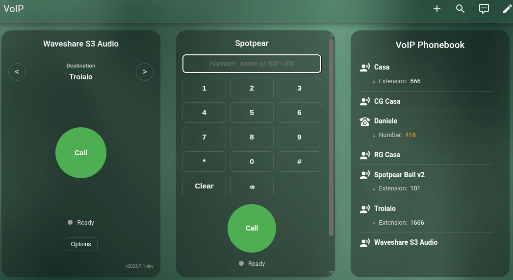

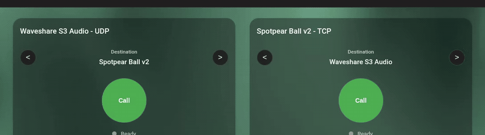

_Runtime demo: browser softphone, ESP call state and audio controls moving together._

<table>
  <tr>
    <td align="center"><br/><b>VoIP Call</b></td>
    <td align="center"><br/><b>Voice UI</b></td>
    <td align="center">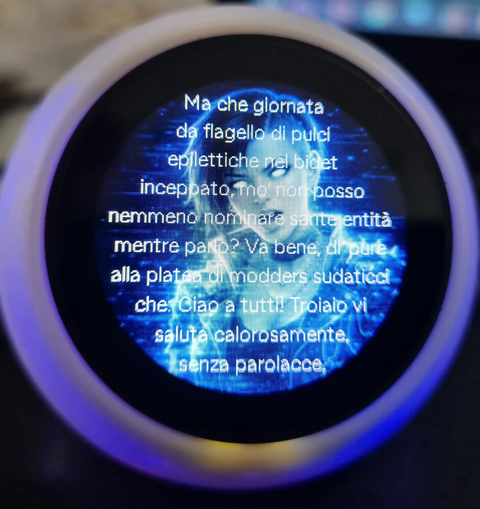<br/><b>TTS Response</b></td>
    <td align="center">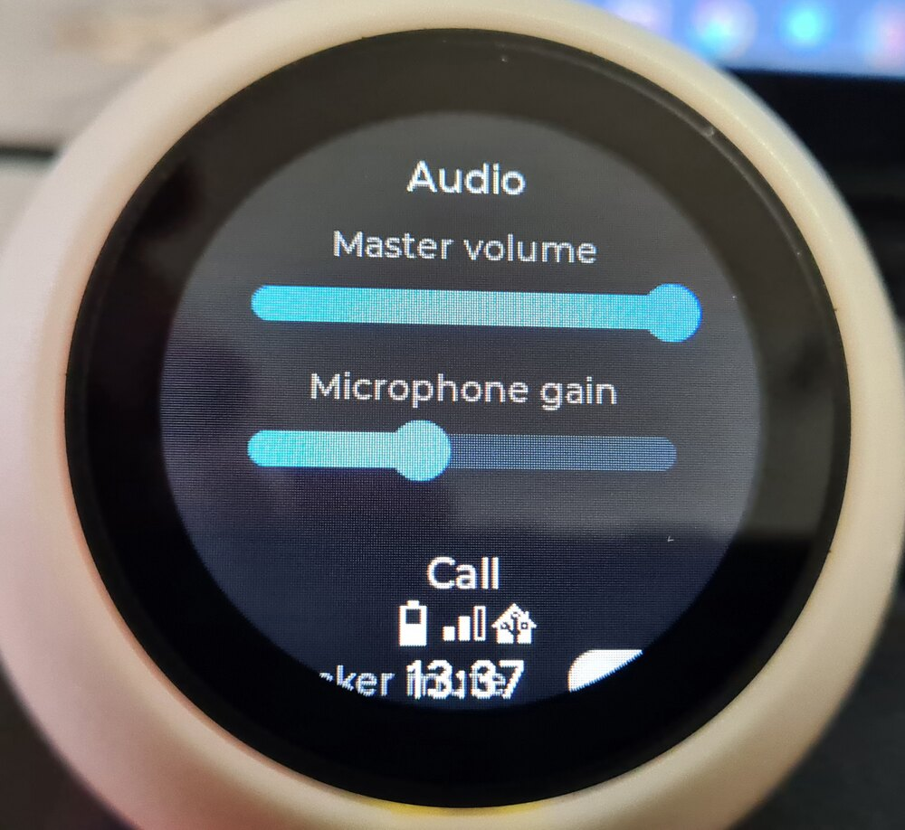<br/><b>Audio Controls</b></td>
    <td align="center">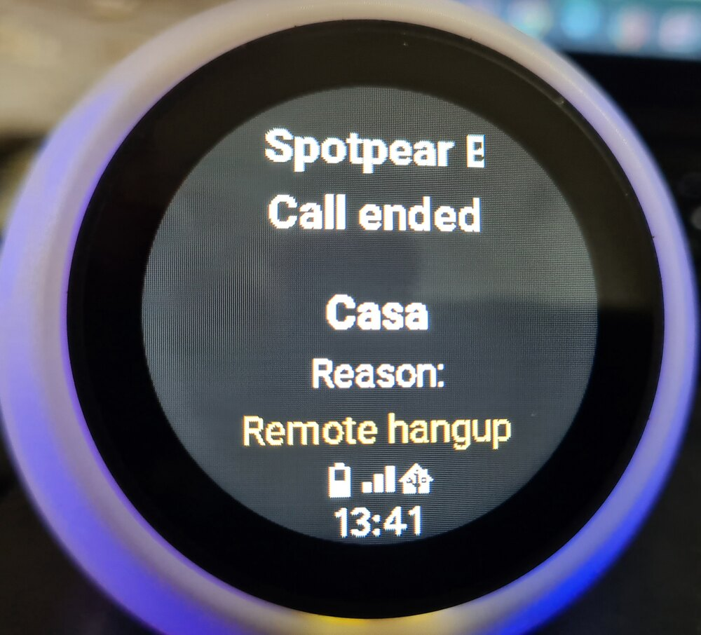<br/><b>Call Reason</b></td>
  </tr>
</table>

<table>
  <tr>
    <td>
      <strong>Support this project</strong><br/>
      If this work is useful to you, please consider a donation. It helps cover
      development tools, services and test hardware, which means better
      compatibility and fewer regressions for everyone.<br/><br/>
      <a href="https://github.com/sponsors/n-IA-hane">
        
      </a>
    </td>
  </tr>
</table>

## What Can You Build With It?

| You want... | What you do | Result |
|---|---|---|
| A full-duplex door intercom | Flash a ready VoIP YAML, add the ESP to Home Assistant and add the card. | Press the ESP button and Home Assistant rings. Answer from browser, wall tablet or Companion app. |
| Room-to-room ESP phones | Flash one VoIP YAML per room device. | ESP devices call each other by phonebook name, such as `Kitchen`, `Bedroom` or `Garage`. |
| Home Assistant as a softphone | Use the Lovelace card in `ha_softphone` mode. | HA can ring, answer, decline, hang up and originate calls. |
| Standard SIP endpoints | Enable the local registrar and create an account with `voip_stack.create_account`. | VoIP phones, ATAs, Zoiper, Linphone, baresip or pjsua can register to HA and become phonebook contacts. |
| External outbound calls | Configure an optional SIP trunk and add contacts with numbers, or use the card dial pad. | HA or ESP devices can call external numbers through the trunk. |
| Incoming external calls | Register a provider/PBX trunk. | External calls can ring HA, follow DTMF routing, or be forwarded to ESPs/local contacts. |
| Call a Home Assistant voice assistant | Enable **Include voice assistant**, choose an Assist pipeline and assign an extension. | ESPs, registered SIP phones and external trunk callers can hold a multi-turn voice conversation with that pipeline. |
| Voice Assistant calling | Enable the optional VoIP Stack Assist intents. | Satellites can call contacts, answer, decline or hang up by voice. |

## Endpoint Capabilities

VoIP Stack endpoints advertise what media path they actually have. That lets a
single dial plan cover normal phones, paging speakers, monitor microphones and
control panels without pretending every device is full-duplex.

| Capability | Media path | Use case |
|---|---|---|
| `full_duplex` | Microphone TX + speaker RX | Room phones, door intercoms, wall panels and normal two-way calls. |
| `mic_only` | Microphone TX only | Monitor microphones, outdoor call stations, capture-only endpoints. |
| `speaker_only` | Speaker RX only | Paging speakers, announcement targets, remote audio outputs. |
| `control_only` | SIP signaling, state and phonebook only | LVGL/control panels, automation endpoints, call-state devices without local media. |

## Table of Contents

- [What Can You Build With It?](#what-can-you-build-with-it)
- [Endpoint Capabilities](#endpoint-capabilities)
- [Fastest Start](#fastest-start)
- [What's New](#whats-new)
- [Breaking Changes](#breaking-changes)
- [How It Works](#how-it-works)
- [Phonebook And Routing](#phonebook-and-routing)
- [Quick Start Examples](#quick-start-examples)
- [Features](#features)
- [Installation](#installation)
  - [1. Home Assistant Integration](#1-home-assistant-integration)
  - [2. ESPHome Component](#2-esphome-component)
  - [3. Lovelace Card](#3-lovelace-card)
- [Architecture](#architecture)
- [Technical Details](#technical-details)
- [Call Routing](#call-routing)
- [Reference](#reference): voip_stack, entities, HA services, automations ([docs/reference.md](docs/reference.md))
- [Call Flow Diagrams](#call-flow-diagrams)
- [Hardware Support](#hardware-support)
- [Audio Components](#audio-components): esp_audio_stack, esp_aec, esp_afe
- [Voice Assistant + VoIP Experience](#voice-assistant--voip-experience)
- [Logging](#logging)
- [Troubleshooting](#troubleshooting) ([docs/troubleshooting.md](docs/troubleshooting.md))
- [Deep Dives And Architecture](docs/)
- [License](#license)

## Fastest Start

| Goal | Start here | Result |
|---|---|---|
| One ESP as a full-duplex intercom with Home Assistant | [`yamls/voip-only/`](yamls/voip-only/) | The ESP calls HA, HA can call the ESP, and the Lovelace card can answer from browser or mobile app. |
| Room-to-room ESP VoIP | One voip-only YAML per ESP | Devices call each other by phonebook name. HA publishes the standard roster and can bridge when needed. |
| SIP endpoint or trunk testing | `voip_stack.create_account` or the optional trunk setup | Register a real SIP endpoint to HA, or let HA route calls through a provider/PBX trunk. |
| Full voice device | [`yamls/full-experience/`](yamls/full-experience/) | Media player, Piper TTS, Micro Wake Word, Voice Assistant, AFE/AEC and VoIP calls on the same ESP. |
| Full voice device with hardware/DSP echo cancellation or separated native audio paths | [`generic-s3-full-esphome-native.yaml`](yamls/full-experience/esphome-native/generic-s3-full-esphome-native.yaml) | Full experience on native ESPHome microphone/speaker components. Good starting point for XMOS-style front-ends that already remove echo in hardware, or for boards with independent mic/speaker I2S paths. |
| Standalone native ESPHome VoIP endpoint | [`yamls/voip-only/esphome-native/`](yamls/voip-only/esphome-native/) | Native mic-only, speaker-only and separated-path full-duplex examples using standard ESPHome audio components, without `esp_audio_stack`. |
| Audio driver for your own ESPHome Voice Assistant | [`esp_audio_stack`](https://github.com/n-IA-hane/esphome-audio-stack/tree/main/esphome/components/esp_audio_stack) | Shared mic/speaker I2S path, speaker reference handling and a clean post-AEC microphone facade for MWW, Voice Assistant and VoIP while media/TTS keeps playing. |
| Runtime state arbitration for full profiles | [`runtime_controller`](https://github.com/n-IA-hane/esphome-runtime-controller) | A configurable reducer maps events and activities to LED/display/ducking/timer policies, reducing YAML callback races when media, TTS, VoIP and timers overlap. |

For the normal intercom use case, do not start by designing a phone system.
Pick the closest YAML, adapt the board pins and audio hardware, add the ESP
through the ESPHome integration, then install `voip_stack`. Home Assistant
publishes the phonebook, and the ESP can call or be called from a GPIO button,
LVGL button, automation, service call or Lovelace card.

## What's New

### 🗣️ Your Home Assistant Voice Assistant Now Has A Phone Extension

`2026.7.1-dev` can publish any native Home Assistant Assist pipeline as a
normal destination in the shared phonebook. Choose an extension, use HA's
preferred assistant or select a specific pipeline, then call it from an ESP
intercom, a registered SIP phone or an external number arriving through your
trunk.

The assistant receives the SIP caller identity and can greet first. It listens
through the pipeline's existing STT provider, answers through its configured
TTS voice and returns to listening in the same open call for a natural
multi-turn conversation. The extension is not tied to one AI provider: OpenAI
Conversation, Codex Assist, local agents and other compatible HA conversation
integrations all use the same route.

<p align="center">
  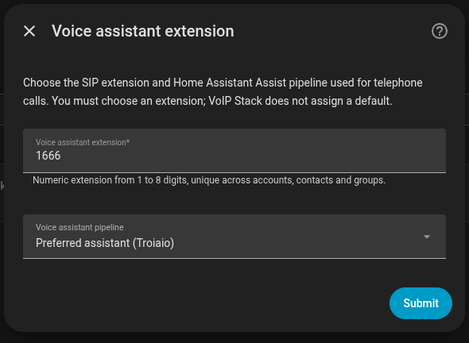
</p>

_Pick the SIP extension yourself and route it to HA's preferred Assist pipeline
or to a specific assistant. No extension is silently reserved._

### 🏠 One Home, One Phone System

- 🔔 **Ring groups:** call one contact and every available member rings; the
  first answer wins and late answers cannot steal the call.
- 🎙️ **Conference rooms:** Home Assistant hosts the room and can invite the
  selected HA, ESP and registered SIP endpoints when the conference starts.
- 📒 **One shared dial plan:** extensions, groups, ESP phones, the HA softphone,
  registered clients, Assist pipelines and optional trunk routes all live in
  the same phonebook.
- 🌍 **Real SIP callers:** compatible callers do not need to be pre-approved in
  the phonebook. Direct clients and external trunk callers can reach the
  destinations you expose.

### 🎛️ A Lovelace Card That Feels Like A Phone

HA and ESP cards now offer a manual keypad for names, SIP URIs, extensions and
numbers. ESP mirror Options bring Auto Answer, DND, extension, ring groups and
conference settings into one aligned view while the selected ESP remains the
real owner of its calls and settings.

The same card can render the shared phonebook. All three modes use Home
Assistant Sections sizing, adapt their layout to the assigned width and height,
and omit the header completely when no `name` or `title` is configured.

The release-candidate polish pass also keeps dashboard scrolling natural at a
card boundary, updates an ESP mirror live when its device disconnects or
returns, preserves readable native selectors across light and dark themes, and
shows the endpoint that actually answered a ring group instead of leaving the
group name as the connected peer.

Waveshare P4 Touch now includes an on-device Contacts/Keyboard phone view and a
single runtime state policy for Assist, media, calls, timers, LEDs and ducking.
Its audio path was qualified with Sendspin, TTS and VoIP active together; the
same state-transition probes cover WS3 and Spotpear without adding production
polling or fixed delays to their real-time paths.

> [!IMPORTANT]
> `2026.7.1-dev` is a manual GitHub pre-release for source deployment and field
> testing. It is intentionally not offered through HACS; the normal HACS path
> remains on stable `2026.7.0`.

Explore the release:

- 🚀 [Complete `2026.7.1-dev` release notes](docs/RELEASE_2026_7_1_DEV.md)
- 🧭 [Release history](docs/WHATS_NEW.md)
- ⚠️ [Breaking Changes](docs/BREAKING_CHANGES.md)
- 📦 [Stable `2026.7.0` release notes](docs/RELEASE_2026_7_0.md)

## Breaking Changes

The `2026.7.0` SIP migration remains the breaking baseline: ESP devices are SIP
phones, Home Assistant is a SIP softphone/router/bridge/trunk endpoint, and the
old project-specific call-control path is not a fallback.

Additional `2026.7.1-dev` boundaries matter when upgrading an earlier dev
snapshot:

- ESP structured contacts use `ip` and `transport`; the richer
  `address`/`sip_uri` schema belongs to the HA phonebook.
- The phonebook is an outbound dial plan, not an inbound caller allowlist.
- A hold or media-changing in-dialog re-INVITE is rejected with `488` while the
  established call remains active. HA may acknowledge an unchanged session
  refresh without rerouting; full hold/resume renegotiation is not implemented.
- Trunk digit routing accepts standard RTP `telephone-event` and compatible
  legacy SIP INFO DTMF; acoustic in-band tones are not decoded.
- Established calls bridged by HA expose one `voip_stack.dtmf` event per key
  for automations such as door opening. This is HA-only and adds no DTMF work
  to ESP firmware.
- Disabling the parent audio processor switch is an explicit raw-microphone
  bypass on the same microphone surface.
- Maintained generic software-AEC profiles now use the previous speaker frame
  as their reference. Custom profiles that deliberately select the ring-buffer
  reference retain that option, but should not rely on stale reference audio
  surviving across microphone-consumer sessions.

Read the full migration list before upgrading custom YAMLs or automations:
[`docs/BREAKING_CHANGES.md`](docs/BREAKING_CHANGES.md).

Minimum versions for this release:

- **ESPHome**: `2026.6.4` or newer within the current stable `2026.6.x` line.
  The maintained YAMLs are validated on the latest published ESPHome package.
- **Home Assistant Core**: `2026.7.x` or newer for the bundled
  `voip_stack` integration and Lovelace card.

## How It Works

VoIP Stack has four main pieces:

- **ESP device**: a lightweight local SIP phone. It owns its call state,
  microphone, speaker and local phonebook mirror.
- **Home Assistant**: SIP softphone plus router, bridge, resampler, central
  phonebook publisher, local SIP registrar, optional trunk client and optional
  native Assist pipeline destination.
- **Phonebook**: the shared dial plan. It contains names, numbers, SIP
  endpoints, softphone registrations and trunk-routed contacts.
- **Lovelace card**: the UI for the HA softphone or for mirroring/controlling
  an ESP phone.

ESP devices do not register to an external PBX and do not need SIP
authentication. Adding an ESP through the ESPHome integration is how Home
Assistant learns its endpoint and publishes it into the central phonebook.

The simple use case stays simple: one ESP can still behave like a normal
full-duplex intercom device. The difference is that the call foundation is now
SIP/VoIP, so the same system can grow to ESP-to-ESP calls, HA calls,
registered SIP endpoints and external trunk calls without requiring Asterisk.

## Phonebook And Routing

Home Assistant owns the standard phonebook through `sensor.voip_phonebook`.

The phonebook merges:

- ESP endpoints published by online ESPHome devices;
- Home Assistant itself as a softphone target;
- manual contacts created with HA services;
- local SIP endpoint accounts registered to HA;
- the optional native Assist pipeline destination;
- trunk-routed phone targets and group entries when configured.

A contact has one required field: `name`. Everything else is optional and
describes how that contact can be reached: `extension`, `number`, `address`,
`port`, `rtp_port` and `transport`.

An extension is an internal alias, not a second contact. For example,
`Spotpear` can have `extension: "101"`, and both `Spotpear` and `101` resolve
to that same local target. A `number` is an external/public number used through
the optional trunk.

Routing follows the data available for the selected contact:

- complete direct SIP endpoint: compatible ESPs can call it directly;
- name or extension without direct endpoint: the ESP sends the call to HA;
- registered SIP endpoint: HA routes to the active SIP registration;
- external number: HA uses the configured trunk;
- no valid route: HA rejects the call with a clear terminal reason.

Useful services:

- `voip_stack.add_contact`
- `voip_stack.remove_contact`
- `voip_stack.set_contacts`
- `voip_stack.clear_contacts`
- `voip_stack.push_phonebook`
- `voip_stack.create_account`
- `voip_stack.list_accounts`
- `voip_stack.call`
- `voip_stack.forward`
- `voip_stack.route`

The updated phonebook is pushed to online ESP devices automatically.
`voip_stack.push_phonebook` exists for diagnostics or manual recovery, but it
should not be required during normal use.

Detailed operational docs:

- [Dial plan and resolver](docs/DIALPLAN_RESOLVER.md): how names,
  extensions, groups, registered SIP endpoints and trunk targets resolve.
- [ESP entity surface](docs/ESP_ENTITY_SURFACE.md): which ESPHome
  `voip_stack` entities enable HA discovery, ESP mirror cards, groups and
  debug.
- [Call flows](docs/CALL_FLOWS.md): expected SIP/SDP/RTP path for ESP, HA,
  registered endpoint, group and trunk calls.
- [Services](docs/SERVICES.md): every `voip_stack.*` service and when to use
  it.
- [Ring groups and conference groups](docs/GROUPS.md): PBX-style group
  semantics and membership declarations.
- [Testing and debug](docs/TESTING_AND_DEBUG.md): local tests, real SIP
  matrix, service matrix, log filters and audio captures.

## Quick Start Examples

These examples show the normal user flows. Use the ready-to-flash YAMLs when
your hardware is listed under [Hardware Support](#hardware-support); only copy
the snippets below when you are building a custom target.

### Normal Install

1. Install the Home Assistant `voip_stack` integration.
2. Flash one ready YAML per device, for example:
   - [`spotpear-ball-v2-full-afe.yaml`](yamls/full-experience/single-bus/spotpear-ball-v2-full-afe.yaml)
   - [`waveshare-s3-full-afe.yaml`](yamls/full-experience/single-bus/waveshare-s3-full-afe.yaml)
3. Add each ESP through the ESPHome integration in Home Assistant.
4. Verify that HA exposes `sensor.voip_phonebook`. That is the central
   phonebook used by the standard packages.
5. Use the ESP buttons, display, Home Assistant service, or Lovelace card to
   call a selected contact.

That is enough for the normal intercom workflow. The ESP is now known by HA,
HA is known by the ESPs, and the central phonebook keeps the devices in sync.

### Doorbell: one ESP calls Home Assistant

A doorbell is one ESP with one selected contact: the HA peer. The contact name
is **your Home Assistant location name** (`hass.config.location_name`), not a
hardcoded "Home Assistant" string.

```yaml
binary_sensor:
  - platform: gpio
    name: Doorbell Button
    pin:
      number: GPIO4
      mode: INPUT_PULLUP
      inverted: true
    on_press:
      - voip_stack.call:
          id: phone
          target: "Home"  # replace with Settings -> System -> General -> Location name
```

When the ESP calls that HA contact, the Lovelace card rings and can answer from
the browser or mobile app. Home Assistant also emits `voip_stack.incoming_call`
for automations.

For mobile doorbells, the Companion app notification can expose two useful
actions: **Answer** and **Decline**. Answer deep-links to the Lovelace card with
`?voip_answer=1`, so the card can request microphone access and start the
full-duplex audio stream. Decline stays in the automation path and calls
`voip_stack.decline`, which sends the decline reason back to the ESP.

### Room-to-room VoIP: fixed buttons

For an apartment-style panel, bind one GPIO button to each destination string.
`voip_stack.call` first resolves the ESP local phonebook cache for direct calls;
if the target is not local, the ESP sends it to HA so the central dialplan can
resolve a contact, group, extension, SIP URI or trunk number.

```yaml
binary_sensor:
  - platform: gpio
    name: Call Kitchen
    pin:
      number: GPIO5
      mode: INPUT_PULLUP
      inverted: true
    on_press:
      - voip_stack.call:
          id: phone
          target: "Kitchen Phone"

  - platform: gpio
    name: Call Bedroom
    pin:
      number: GPIO6
      mode: INPUT_PULLUP
      inverted: true
    on_press:
      - voip_stack.call:
          id: phone
          target: "Bedroom Phone"
```

Contact names are exact and case-sensitive. Check `sensor.<device>_destination`
or the HA phonebook sensor if a call reports `Contact not found`.

### Static Contacts And Manual Roster Changes

The recommended path is HA-managed sync through `sensor.voip_phonebook`.
Use ESP static contacts only for offline installs, diagnostics, direct SIP
peers that should exist before HA connects, or very small fixed systems.

```yaml
voip_stack:
  id: phone
  transport: udp  # SIP signaling transport only; audio is always RTP/UDP.
  static_contacts:
    - name: "Home"
      ip: "192.168.1.10"
      port: 5060
      transport: tcp
    - name: "Kitchen Phone"
      ip: "192.168.1.21"
      port: 5060
      transport: udp
    - name: "Gate"
```

Contact fields:

- `name`: required display and dial name.
- `ip`: optional host/IP for direct SIP endpoints.
- `port`: optional SIP signaling port, default `5060`.
- `rtp_port`: optional RTP media port, default `40000`.
- `transport`: `tcp` or `udp` when direct SIP is allowed.

Runtime ESP automations can still mutate the local dial plan when needed:

```yaml
on_press:
  - voip_stack.add_contact:
      id: phone
      name: "Temporary Desk"
      ip: "192.168.1.55"
      port: 5060
      transport: udp
```

Home Assistant is the central roster authority when it is present. Add or remove
central contacts with HA services:

```yaml
service: voip_stack.add_contact
data:
  name: My Cellphone
  number: "+15550123456"
```

```yaml
service: voip_stack.remove_contact
data:
  name: My Cellphone
```

HA pushes the updated roster immediately to online ESPs via the ESPHome API;
ESP static contacts remain local offline/custom additions. See
[Phonebook And Routing](#phonebook-and-routing) for the full service list.

## Features

- **Full-duplex audio** - Talk and listen simultaneously.
- **SIP/VoIP phone model** with phonebook, contacts, destination, caller and terminal reason exposed.
- **Deterministic routing**: direct when a contact has reachable SIP endpoint data; unresolved names and numeric targets go to HA.
- **SIP TCP + SIP UDP signaling** with RTP media and HA bridge/resampling when needed.
- **Negotiated PCM audio** - peers advertise per-direction `tx_formats`/`rx_formats` up to 48 kHz where the actual microphone/speaker path supports them.
- **Dedicated browser audio socket** - The Lovelace softphone uses authenticated binary WebSocket audio on `/api/voip_stack/ws`; it no longer pushes base64 audio over HA's shared frontend WebSocket.
- **Echo Cancellation (AEC)** - Built-in acoustic echo cancellation using ESP-SR. (ES8311 digital feedback mode provides perfect sample-accurate echo cancellation.)
- **Full Audio Front-End (AFE)** - Complete ESP-SR AFE pipeline via `esp_afe`:
  - **Single-mic (MR)**: AEC + Noise Suppression + VAD + AGC.
  - **Dual-mic (MMR)**: AEC + Speech Enhancement + Voice Activity Detector.
  - Runtime switches and diagnostic sensors in Home Assistant.
  - Automatic pipeline switching: Speech Enhancement replaces NS/AGC when spatial separation is active.
- **Voice Assistant compatible** - Full profiles expose one post-AEC microphone
  surface, so Micro Wake Word, Voice Assistant and VoIP receive cleaned
  user speech while music, TTS or ringtone audio is playing from the speaker.
- **Ready-to-flash YAML configs** - Optimized configurations for real, tested hardware combining Voice Assistant, Micro Wake Word and VoIP calls on the same device.
- **Auto Answer** - Configurable automatic call acceptance (ESP-side switch + browser card checkbox).
- **HA Services** - `voip_stack.call`, `answer`, `decline`, `hangup`,
  `forward`, `route`, `set_dnd`, contact services, local SIP account services
  and `purge_devices`.
- **Call Forwarding** - Forward active or ringing calls to another device via automation.
- **Ringtone on incoming calls** - Devices play a looping ringtone while ringing.
- **Volume Control** - Adjustable Master Volume and microphone gain.
- **Phonebook** - HA publishes `sensor.voip_phonebook`; ESP packages subscribe to it and locally shape endpoint rows into direct SIP or HA-routed calls. YAML automations can still call the native `voip_stack` actions/services.
- **Do Not Disturb** - Native `voip_stack` switch. When enabled, incoming calls are rejected with `SIP reject("DND")` so the caller receives a real reason.
- **HA peer name = `hass.config.location_name`** everywhere (NEVER hardcoded).
- **Status LED** - Visual feedback for call states.
- **Persistent Settings** - Volume, gain, AEC state saved to flash.
- **Remote Access** - Works through any HA remote access method (Nabu Casa, reverse proxy, VPN). No WebRTC, no go2rtc, no port forwarding required.

---

## Installation

### 1. Home Assistant Integration

#### Option A: Install via HACS (Recommended)

1. In HACS, search for **VoIP Stack**.
2. Open the VoIP Stack integration page and click **Download**.
3. Restart Home Assistant.
4. Go to **Settings → Integrations → Add Integration** → search **VoIP Stack** → click **Submit**.
5. In the config flow, set the SIP and RTP ports only if the defaults do not fit
   your network. Default ports are SIP `5060` and RTP base `40000`.


_After HACS downloads VoIP Stack, restart Home Assistant, then add the VoIP Stack integration from Settings -> Integrations._

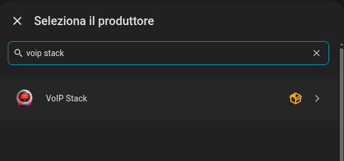

_After restart, add the VoIP Stack integration from Home Assistant Settings._

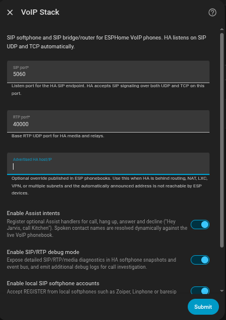

_The config flow sets the HA SIP/RTP ports, local VoIP features and optional trunk routing._

Recommended first setup:

- **SIP port**: keep `5060` unless another SIP service already uses it. HA
  listens on both SIP/UDP and SIP/TCP on this port.
- **RTP port**: keep `40000` unless that UDP range conflicts with another
  service. HA uses it as the base for softphone and bridge media.
- **Advertise host**: leave empty on a normal LAN. Set it only when HA must
  publish a specific reachable IP/host, for example LXC, Docker, VPN,
  multihomed hosts or routed networks.
- **Assist intents**: enable if you want Home Assistant Assist phrases such as
  call, answer, decline and hang up.
- **Include voice assistant**: optionally publishes the selected Home Assistant
  Assist pipeline as a phonebook destination. The next step lets you use HA's
  preferred pipeline or choose a specific one, and asks for its extension; both
  fields are empty until you enable the feature and no extension is reserved by
  default. Calls may come from ESP endpoints, registered clients, trunks or
  other compatible SIP callers. VoIP Stack passes the SIP caller identity to
  Assist, streams the configured STT/conversation/TTS pipeline over the same
  open call, and returns to listening after every reply. This does not create a
  second SIP listener or a separate Assist satellite.
- **Debug mode**: keep disabled for normal use. Enable only while collecting
  SIP/RTP diagnostics.
- **Trunk enabled**: leave disabled unless you want HA to register to a
  provider/PBX account for external inbound/outbound calls.

When trunk is enabled, the next step asks for provider/PBX credentials. The
DTMF timeout controls incoming external calls: `0` skips DTMF collection and
rings HA immediately; a value from `1` to `10` seconds lets callers dial a
phonebook `extension` such as `101` before HA falls back to the default target.

The integration automatically registers the Lovelace card, no manual frontend setup needed.

HACS already includes this repository, so normal installations do not need a
Custom Repository entry. Development pre-releases such as `v2026.7.1-dev` are
not distributed through HACS and must be tested manually from their GitHub tag
or a fresh `dev` checkout, following the corresponding release note.

#### After Every VoIP Stack Upgrade: Hard Refresh The Card Page

After upgrading `voip_stack`, hard refresh every Home Assistant dashboard
view that contains an `voip-stack-card`.

Several reported "broken card" or "VoIP call not working" issues were eventually
traced back to the browser or mobile app still running an old cached copy of the
card JavaScript after the integration had already been upgraded. The card URL is
versioned from the installed VoIP Stack component, but some clients can
still keep stale frontend state until their cache is cleared.

On desktop Chrome or Chromium:

1. Open the dashboard page that contains the VoIP card.
2. Press `F12` to open Developer Tools.
3. Right-click the browser refresh button.
4. Choose **Empty cache and hard reload**.
5. Check the version shown at the bottom-right of the card. It must match the
   VoIP Stack version you just installed.

On the Home Assistant Companion app for Android:

1. Open the Home Assistant app.
2. Go to **Settings** -> **Companion App** -> **Troubleshooting**.
3. Tap **Reset frontend cache**.
4. Close and reopen the app.
5. Check the version shown at the bottom-right of the card. It must match the
   VoIP Stack version you just installed.

If that option is not available on your Companion App build, or the stale card
still remains after the frontend-cache reset, use Android's fallback app-cache
cleanup:

1. Close the Home Assistant app.
2. Open Android **Settings**.
3. Open **Apps** -> **Home Assistant** -> **Storage and cache**.
4. Tap **Clear cache**. Do not clear app storage unless you intentionally want
   to log in again and reset the app.
5. Reopen the app and check the card version shown at the bottom-right.

Home Assistant can update/reload Lovelace resources, and this integration
already registers the card with a versioned URL. The remaining stale-cache case
is client-side: the browser or companion app may keep an already loaded
JavaScript module alive until the page/app is refreshed. Until the card gets its
own version-mismatch warning, do this after every VoIP Stack upgrade,
especially after major releases.

#### Legacy HA Domain Migration

HACS stays on this repository because this is the Home Assistant product repo:
it contains `custom_components/voip_stack`, the Lovelace card, ready YAMLs and
the end-to-end docs. The split ESP component repositories are consumed by
ESPHome `external_components`; they are not HACS integration repositories.

Development builds before the VoIP Stack rename used older Home Assistant
domains such as `intercom_native` and `homeassistant_voip_stack`. Home Assistant
stores config entries by domain, so those old entries cannot be silently
converted by the current `voip_stack` integration. If a test install still has
one of the old domains, remove that old integration entry and stale
`custom_components/<old_domain>` folder, restart Home Assistant, then add
**VoIP Stack** from Settings -> Integrations.

#### Option B: Manual install

```bash
# From the repository root
cp -r custom_components/voip_stack /config/custom_components/
```

Then add via UI: **Settings → Integrations → Add Integration → VoIP Stack**, restart Home Assistant.

The integration will:
- Start the HA SIP endpoint on the configured SIP port.
- Register the WebSocket API commands for the card.
- Publish the SIP phonebook (`sensor.voip_phonebook`) for ESP subscribers.
- Optionally register a provider/PBX trunk.
- Optionally accept REGISTER from local SIP endpoints with generated accounts.
- Register SIP-first services (`answer`, `decline`, `hangup`, `call`, `forward`,
  `route`, contact and SIP account services).
- Auto-register the Lovelace card as a frontend resource.

#### Network requirements

- **Minimum Home Assistant Core**: 2026.7.x.
- **Tested target**: Home Assistant Core 2026.7.x.
- **HA OS / Supervised**: container is `--network=host` by default. Works.
- **HA Container (Docker)**: must be started with `--network=host` (also recommended by official HA docs). Bridge mode would need manual port forwarding plus an mDNS reflector and a `network: announced_addresses` override (not recommended).
- **HA Core in venv**: listens on host LAN, no extra config.

If `network.async_get_announce_addresses(hass)` returns empty, the integration logs a WARN and HA cannot publish itself in the SIP phonebook until you configure either `network: announced_addresses:` or an `external_url`. A port bind failure transitions the config entry to `ConfigEntryError`.

### 2. ESPHome Component

Add the external component to your ESPHome device configuration:

Minimum ESPHome version: **2026.6.4**. Older ESPHome releases are not supported
by the maintained full voice YAMLs.

```yaml
# Lightweight (single-mic, echo cancellation only):
external_components:
  - source: github://n-IA-hane/esphome-voip-stack@main
    components: [voip_stack]
  - source: github://n-IA-hane/esphome-audio-stack@main
    components: [esp_audio_stack, esp_aec]

# Full AFE pipeline (single-mic NS/AGC/VAD or dual-mic Speech Enhancement/VAD):
external_components:
  - source: github://n-IA-hane/esphome-voip-stack@main
    components: [voip_stack]
  - source: github://n-IA-hane/esphome-audio-stack@main
    components: [esp_audio_stack, esp_afe]
```

> **Note**: Use `esp_aec` for
> lightweight single-mic processing and `esp_afe` for the full pipeline (see
> [Audio Components](#audio-components) below). `voip_stack` no longer owns
> software AEC; standalone VoIP binds to native ESPHome
> `microphone`/`speaker`, while software AEC/AFE belongs behind
> `esp_audio_stack`. Maintained full voice YAMLs use the source-based
> `speaker_source` media path; the project-local
> [`speaker`](esphome/components/speaker/README.md) fork remains documented for
> older custom YAMLs that still use ESPHome's `platform: speaker` media player.

#### After ESP Firmware Package Upgrades: Clear ESPHome Build Cache

When you upgrade this project and flash ESP firmware built from the new YAMLs,
force ESPHome to rebuild from a clean cache at least once. This is especially
important after major releases, package reshuffles, external component changes
or ESPHome version upgrades.

If you compile from the ESPHome dashboard, use the build-cache cleanup action
for the device or the global **Clear all** action if your dashboard exposes it,
then compile/upload again.

If you compile from the ESPHome CLI, delete the `.esphome` build cache
directories from your ESPHome YAML compilation paths before compiling again. For
example, from the directory that contains your YAML files:

```bash
find . -type d -name .esphome -prune -exec rm -rf {} +
```

If your YAMLs live in multiple folders, repeat the cleanup for each folder or
run it from the common parent that contains only your ESPHome build files.

#### Minimal Configuration

```yaml
esp32:
  board: esp32-s3-devkitc-1
  framework:
    type: esp-idf

# Echo Cancellation
esp_aec:
  id: aec_processor
  sample_rate: 16000
  filter_length: 8
  mode: voip_high_perf   # VoIP-only no-codec default

# ESP audio stack: one owner for I2S, rate conversion, AEC reference and buffers
esp_audio_stack:
  id: audio_stack
  i2s_lrclk_pin: GPIO37
  i2s_bclk_pin: GPIO36
  i2s_din_pin: GPIO35
  i2s_dout_pin: GPIO7
  sample_rate: 48000
  output_sample_rate: 16000
  slot_bit_width: 32
  correct_dc_offset: true
  processor_id: aec_processor
  aec_reference: previous_frame
  buffers_in_psram: true

microphone:
  - platform: esp_audio_stack
    id: mic_component
    esp_audio_stack_id: audio_stack

speaker:
  - platform: esp_audio_stack
    id: hw_speaker
    esp_audio_stack_id: audio_stack
    sample_rate: 48000

  - platform: resampler
    id: spk_component
    output_speaker: hw_speaker
    bits_per_sample: 16

# VoIP Stack - SIP phone endpoint
voip_stack:
  id: phone
  microphone: mic_component
  speaker: spk_component
  buffers_in_psram: true
```

#### Complete Configuration (with HA-managed phonebook)

```yaml
voip_stack:
  id: phone
  # transport chooses SIP signaling transport: tcp or udp. Audio is RTP/UDP.
  transport: udp
  microphone: mic_component
  speaker: spk_component
  buffers_in_psram: true
  ringing_timeout: 30s        # Auto-decline unanswered calls

  # FSM event callbacks
  on_ringing:
    - light.turn_on:
        id: status_led
        effect: "Ringing"

  on_outgoing_call:
    - light.turn_on:
        id: status_led
        effect: "Calling"

  on_streaming:
    - light.turn_on:
        id: status_led
        red: 0%
        green: 100%
        blue: 0%

  on_idle:
    - light.turn_off: status_led

# Switches (with restore from flash)
switch:
  - platform: voip_stack
    auto_answer:
      name: "Auto Answer"
      restore_mode: RESTORE_DEFAULT_OFF

  - platform: esp_audio_stack
    esp_audio_stack_id: audio_stack
    aec:
      name: "Echo Cancellation"
      restore_mode: RESTORE_DEFAULT_ON

# Volume controls
number:
  - platform: esp_audio_stack
    esp_audio_stack_id: audio_stack
    master_volume:
      name: "Master Volume"
      speaker_id: hw_speaker
    mic_gain:
      name: "Mic Gain"

# Buttons for manual control
button:
  - platform: template
    name: "Call"
    on_press:
      - voip_stack.call_toggle:

  - platform: template
    name: "Next Contact"
    on_press:
      - voip_stack.next_contact:

  - platform: template
    name: "Previous Contact"
    on_press:
      - voip_stack.prev_contact:

  - platform: template
    name: "Decline"
    on_press:
      - voip_stack.decline_call:

# Example: call a specific room from a YAML automation
button:
  - platform: template
    name: "Call Kitchen"
    on_press:
      - voip_stack.call:
          id: phone
          target: "Kitchen Phone"
```

Current public YAMLs use shared phonebook subscription packages. HA publishes:

```text
sensor.voip_phonebook                       # short state: "N entries"
sensor.voip_phonebook.attributes.roster_json # canonical SIP roster
```

The ESP-side package subscribes to the roster JSON and calls
`voip_stack.set_roster_json` after a debounce. HA rows, ESP rows, manual SIP
contacts and registered local SIP endpoints share the same route vocabulary.
Canonical row formats live in
[`docs/PHONEBOOK_PROTOCOL.md`](docs/PHONEBOOK_PROTOCOL.md). For manual/local automations you can still use the ESPHome API actions exposed
by the standard packages:

```yaml
action: esphome.<slug>_set_ha_peer_name
data:
  name: "Beach House"

action: esphome.<slug>_start_call
data:
  dest: "Kitchen"

action: esphome.<slug>_decline_call
data:
  reason: "DND"
```

The standard packages also expose ESPHome native API actions such as
`esphome.<slug>_add_contact`, `esphome.<slug>_remove_contact`,
`esphome.<slug>_set_contacts`, `esphome.<slug>_flush_contacts` and
`esphome.<slug>_update_contacts`. Those mutate only that ESP's local phonebook
mirror and are meant for offline devices, diagnostics or custom YAML logic.
For normal installs, manage the central roster with HA `voip_stack.*`
phonebook services and let HA push the canonical JSON to every online ESP.

See [docs/PHONEBOOK_PROTOCOL.md](docs/PHONEBOOK_PROTOCOL.md) for the full contract.

#### Groups

VoIP Stack can publish HA-managed group contacts into the same central
phonebook. ESP devices, registered SIP endpoints and the HA softphone still dial
by normal contact name; HA owns the group routing and media. Groups are
ordinary phonebook entries from the endpoint point of view, not special
firmware modes.

ESP devices can declare default membership in their `voip_stack` component and
expose editable group entities through the HA integration package:

```yaml
voip_stack:
  id: phone
  conference_groups: "CG Home, CG Upstairs"
  conference_ring: true
  ring_groups: "RG Home, RG Night"

packages:
  voip_ha_integration: !include packages/voip/ha_integration.yaml
```

`voip_stack:` alone is the SIP/RTP engine and can run standalone. The
`ha_integration` package exposes the `voip_endpoint` discovery sensor, ESP
mirror-state sensors and editable `text.voip_ring_groups` /
`text.voip_conference_groups` entities so HA can discover the ESP, update group
membership dynamically and push the central roster.

Manual contacts and registered SIP endpoints can join the same groups through
the `voip_stack.add_contact` and `voip_stack.create_account` service fields:

```yaml
service: voip_stack.add_contact
data:
  name: Desk Phone
  sip_uri: sip:desk@192.168.1.60:5060
  ring_group: "RG Home, RG Desk"
  conference_group: "CG Home, CG Office"
  conference_ring: true
```

HA aggregates every declaration into one phonebook entry per group. Group names
can be a single value or a comma-separated list; every listed group gets the
endpoint/contact/account as a member. Group names
must not collide with existing device/contact names; if the same name is
declared as both a conference and a ring group, conference wins.

**Ring groups** behave like PBX/SIP forking. Calling `RG Home` rings every
callable member in parallel, excluding the caller when it is also a member. The
first member to answer wins, HA bridges audio to that leg, and every other
still-ringing leg receives CANCEL. If a losing leg was already confirmed, HA
tears it down with BYE. This is the right primitive for "call the house" or
"call the first available intercom".

**Conference groups** behave like a SIP conference focus. Calling `CG Home`
joins the caller into the HA-mixed room immediately. Other members can join at
any time by calling the same group contact. Members with `conference_ring:
true` are invited when another participant starts the room; members without it
stay silent but can still join manually. Answered conference invitations join
the same room, not a winner-takes-all bridge. When the final participant leaves,
HA closes the room and releases the media resources.

The HA softphone can also subscribe to a ring group and/or conference group.
The Lovelace card exposes those settings and the HA softphone extension
dynamically from the central roster. Changing them updates the HA softphone
endpoint sensor, which triggers the same phonebook rebuild and push path used
by ESP endpoint/group entity changes. The card remains only the softphone UI and browser audio
surface: the browser that starts or answers the call owns the WebSocket media
stream, while other open cards mirror state without attaching their
microphone/speaker.

Because the HA backend speaks SIP, Asterisk is optional rather than required.
HA can register to a SIP trunk itself, can host local SIP endpoint accounts for
VoIP phones, ATAs and softphones such as Zoiper, and can act as a small PBX for ESP devices,
registered SIP endpoints, ring groups and conference groups. Advanced dial-plan overrides are
intended to be handled through HA services/events and automations on top of the
central roster contract.

#### Apartment VoIP panel

For multi-room setups, each GPIO button can call a specific room directly. Use
`voip_stack.call` with the exact phonebook name, extension, group, URI or trunk
number. The ESP dials local phonebook matches directly and routes unresolved
targets through HA. Handle terminal failures with `on_call_failed` when the UI
needs explicit feedback.

### 3. Lovelace Card

The Lovelace card is **automatically registered** when the integration loads, no manual file copying or resource registration needed.

#### Add the card to your dashboard

The card is available in the Lovelace card picker - search for "VoIP":


_The integration registers the Lovelace card automatically; no manual resource URL is needed._

Then configure it with the visual editor:

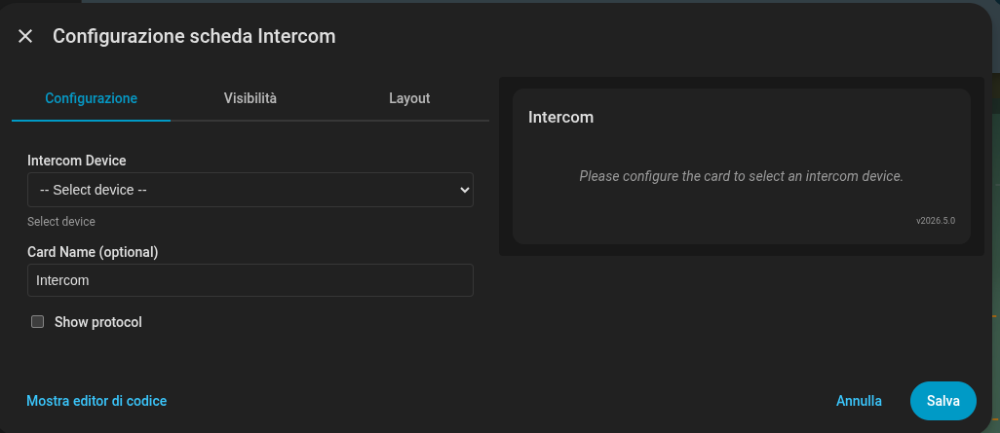

_Visual editor path for picking the ESPHome VoIP device and display name._

Alternatively, you can add it manually via YAML:

```yaml
type: custom:voip-stack-card
device_id: <your_esp_device_id_or_friendly_name>
name: Kitchen Phone
show_extended_info: true
```

The default card mode is `esp_mirror`: the card mirrors one ESP endpoint and
presses that ESP's own contact, call, answer, decline and hangup controls. To
use Home Assistant as one independent softphone endpoint, add a separate card:

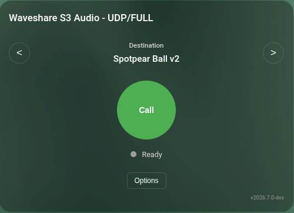

_ESP mirror mode: the card controls the selected ESP phone and follows its local phonebook and call state._

```yaml
type: custom:voip-stack-card
mode: ha_softphone
name: Home Assistant Softphone
show_extended_info: true
```

In `esp_mirror` mode the card follows ESPHome entities. Its contact buttons use
the ESP's own phonebook cycler, while the keypad view sends a manual target to
that same ESP `start_call` action without overwriting the selected-contact
sensor. ESP mirror options manipulate the ESP-exposed DND/group entities when
they are present. Option rows use one consistent two-column layout, with labels
on the left and fields, selectors and checkboxes aligned on the right.

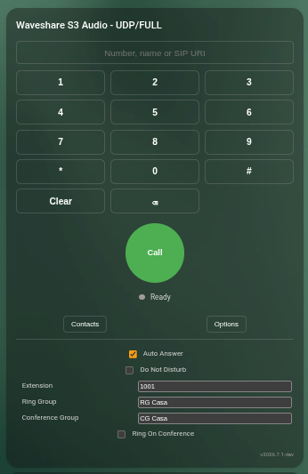

_Expanded ESP mirror mode: the manual keypad and the selected ESP's Auto
Answer, DND, extension, ring-group and conference-group controls are visible
together. The values shown are example endpoint settings._

In `ha_softphone` mode the card has its own destination selector, Auto Answer,
Do Not Disturb, extension and group controls. It rings only for calls addressed
to Home Assistant and does not mirror an ESP card state. Only `esp_mirror`
cards are bound to an ESP with `device_id`.

The two modes intentionally display calls differently. An `esp_mirror` card shows
Answer/Decline when its mirrored ESP is ringing, including the case where that
ESP is being called by Home Assistant. A `ha_softphone` card shows Hangup while
HA is the caller and Answer/Decline only when HA is the callee. In both
directions the browser audio pipeline is configured from the negotiated call
formats returned by the server before microphone or playback worklets start.

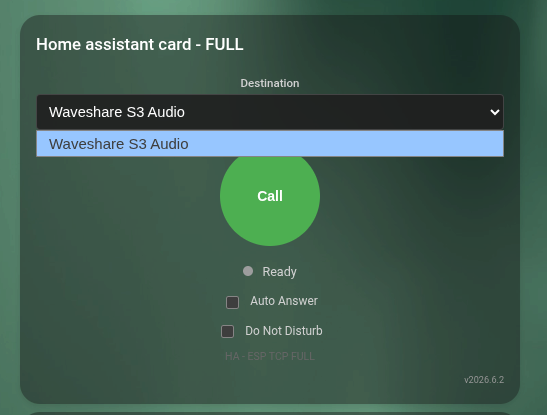

_Independent Home Assistant softphone mode: one card represents HA itself and
calls any ESP endpoint from the in-card selector._

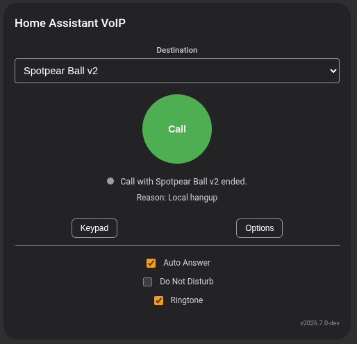

_The HA softphone card owns HA-only controls such as Auto Answer, DND and browser ringtone._

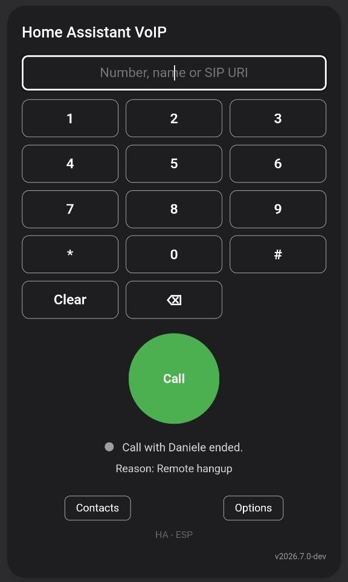

_The keypad view lets the HA softphone call a phonebook name, extension, SIP URI or external number without editing the roster first._

#### Phonebook card

The same frontend module also provides a native, resizable phonebook card. It
reads the canonical roster, sorts enabled contacts alphabetically and keeps
the contact list scrollable inside the height assigned by a Sections view.

```yaml
type: custom:voip-stack-card
mode: phonebook
entity: sensor.voip_phonebook
title: VoIP Phonebook
```

The visual editor selects phonebook mode and can set an optional title. Manual
YAML can additionally select another roster sensor, change the empty-state text
or include disabled contacts. In a Sections dashboard the card defaults to 12
columns by 7 rows, uses the native eight-row maximum and can be resized with the
normal HA layout controls; Masonry dashboards use its declared card-size
fallback.

The card automatically discovers ESPHome devices with the `voip_stack` entity
surface, starting from the `voip_endpoint` sensor. The visual editor stores the
HA `device_id`, while manual YAML can use the ESP friendly name, for example
`device_id: Kitchen Panel`. Header text is shown only when `name:` is configured;
without it the content moves up and no empty title row is reserved. With
`show_extended_info: true`, the header appends the local SIP signaling transport
and audio mode when a header is present.

`customElements.define` is idempotent so HMR / re-install never throws on second registration. Console chatter is gated behind `localStorage.voip_debug = "1"` (errors and warnings always emit). Peer names, destination and decline reasons render as text nodes - no XSS surface from phonebook data.

After every VoIP Stack upgrade, hard refresh this dashboard view and verify
that the version printed at the bottom-right of the card matches the installed
integration version. See
[After Every VoIP Stack Upgrade: Hard Refresh The Card Page](#after-every-voip-stack-upgrade-hard-refresh-the-card-page).

The Lovelace card provides **full-duplex bidirectional audio** with the ESP device: you can talk and listen simultaneously through your browser or the Home Assistant Companion app. The card captures audio from your microphone via `getUserMedia()` and plays incoming audio from the ESP in real-time.

> **Important: HTTPS required.** Browser microphone access (`getUserMedia`) requires a secure context. You need HTTPS to use the card's audio features. Solutions: [Nabu Casa](https://www.nabucasa.com/), Let's Encrypt, reverse proxy with SSL, or self-signed certificate. Exception: `localhost` works without HTTPS.

> **Note**: Devices must be added to Home Assistant via the ESPHome integration before they appear in the card.


_The card uses the ESPHome device registry, so the device must be added to HA before it appears._

---

## Architecture

### System Overview


```mermaid
flowchart TD
    Browser["🌐 Browser / HA app<br/>Lovelace card<br/>mic + speaker"]

    subgraph HA["🏠 Home Assistant"]
        WS["🌐 WebSocket API<br/>browser softphone"]
        Router["🔀 voip_stack call router<br/>call / answer / decline / forward"]
        Roster["📒 phonebook publisher<br/>sensor.voip_phonebook"]
        Registrar["📲 optional local registrar<br/>Zoiper / Linphone / baresip"]
        Trunk["🌍 optional SIP trunk<br/>provider / PBX"]
        TCP["🔌 SIP TCP listener<br/>:5060"]
        UDP["📡 SIP UDP listener + RTP<br/>SIP :5060 / RTP base :40000"]
    end

    subgraph ESP["📟 ESP device"]
        FSM["📞 voip_stack<br/>SIP phone state"]
        Book["📒 phonebook<br/>name → SIP URI"]
        Audio["🎙️ mic / speaker<br/>AEC or AFE"]
    end

    Browser <-->|"binary PCM + control<br/>/api/voip_stack/ws"| WS
    WS --> Router
    Registrar --> Router
    Trunk --> Router
    Router --> TCP
    Router --> UDP
    Router --> Roster
    Book -. "voip_endpoint" .-> Roster
    Roster -. "roster update" .-> Book
    TCP <-->|"SIP TCP leg"| FSM
    UDP <-->|"SIP UDP + RTP"| FSM
    FSM <--> Book
    FSM <--> Audio
```

This is the whole product in one picture: HA is the SIP routing and phonebook
hub; each ESP owns its SIP phone state, audio path and local dial plan mirror.

### Why Not Raw Duplex UDP?

A raw ESP-to-HA audio stream is enough for a single fixed intercom demo. It is
not enough for a local phone system.

VoIP Stack uses SIP/SDP/RTP because Home Assistant needs to act as a real call
hub: it can route across subnets, bridge ESPs, browser softphones, registered
SIP clients and trunks, negotiate media formats per leg, publish one shared
phonebook, expose deterministic call reasons, and keep softphone/trunk behavior
out of the ESP firmware. ESP-to-ESP direct calls still work when both endpoints
share a compatible transport and media format, but HA remains the place where
roster, trunking, DTMF routing and format conversion belong.

## Technical Details

### Audio Format

The default SIP PCM format is `16000:s16le:1:32`, but VoIP Stack negotiates
audio per direction. AFE/AEC-backed branches still publish 16 kHz/s16/mono
because Espressif esp-sr exposes that format; native ESPHome
microphone/speaker paths and the HA browser softphone can advertise their
actual PCM format up to 48 kHz and 32-bit containers.

An audio format token is:

```text
sample_rate:pcm_format:channels:frame_ms
```

Supported PCM containers are `s16le`, `s24le`, `s24le_in_s32` and `s32le`.
Supported rates are 8, 12, 16, 24, 32, 44.1 and 48 kHz, with 10/20/32 ms
frames when the frame contains an integer number of samples.

Home Assistant may bridge different formats by explicit PCM conversion. Direct
ESP-to-ESP calls require a common format and fail clearly when none exists. UDP
RTP carries one complete PCM frame per datagram, so high-rate UDP profiles use
short packet times to stay below the safe datagram size.

VoIP calls intentionally transport negotiated PCM, not MP3/FLAC/Opus. ESPHome's
codec decoders are useful for media-player and announcement pipelines, but
ESP-side VoIP is a bidirectional low-latency path: compressed codecs would add
realtime encode/decode, jitter behavior and extra CPU/PSRAM budget on every
hop. Keep compressed media on ESPHome media-source pipelines; keep ESP VoIP on
PCM unless a future measured Opus mode proves worth the cost.

### SIP, SDP And RTP Contract

The functional wire contract is standard SIP/2.0 signaling, SDP offer/answer
and RTP media. ESP devices are SIP user agents; Home Assistant is a SIP
softphone plus SIP call router. There is no project-specific call-control
compatibility path.

Supported SIP methods in the local profile are `INVITE`, `ACK`, `CANCEL`,
`BYE`, `OPTIONS`, `INFO` for DTMF interop where used, and `REGISTER` only for
optional local SIP accounts on Home Assistant. ESP firmware does not
register to a PBX and does not require SIP auth.

SDP negotiates PCM RTP media. ESP firmware accepts compatible L16/L24 PCM only;
Home Assistant may accept common softphone/trunk codecs and convert them at the
route boundary before sending PCM to ESPs. Generic direct SIP calls select one
common RTP format per dialog. HA-routed calls may use different formats on each
leg because HA owns both dialogs and the RTP relay/resampler.

SIP signaling can listen on TCP, UDP or both. RTP audio remains UDP even when
SIP signaling is TCP, matching normal SIP phone behavior. UDP RTP payloads are
kept under the safe payload budget for typical home LANs; high-rate ESP
profiles use short packet times such as 10 ms so 48 kHz mono L16 fits without
IP fragmentation.

RTP over TCP exists in SIP/SDP standards, but it is not part of the current ESP
phone profile. Treat it as a future HA-side advanced media transport option
that needs explicit SDP negotiation and interoperability testing with real
softphones/providers before it is exposed.

### Signaling Transport

SIP signaling can use TCP or UDP. RTP audio remains UDP even when SIP signaling
is TCP, matching normal SIP phone behavior.

Transport choice is an installation choice, not a feature split. TCP is the
recommended starting point for routed networks and HA/container deployments
because connection state is easier to reason about. UDP is best suited to
simple local LANs where low latency matters and the network is known to pass
SIP/RTP cleanly.

### Phonebook Wire Format

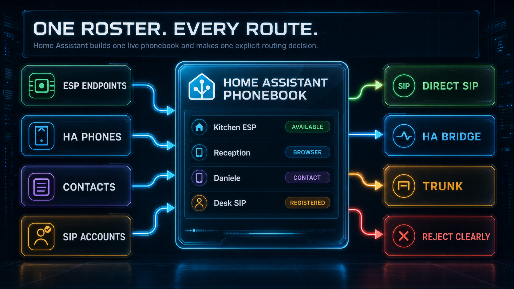

_ESP endpoint publication, manual contacts and local SIP registrations become one HA-managed roster. Route decisions are direct SIP, HA route, trunk or explicit reject._

The high-level model is described in [Phonebook And Routing](#phonebook-and-routing).
The canonical roster JSON, SIP URI fields and audio capability fields are
documented in [`docs/PHONEBOOK_PROTOCOL.md`](docs/PHONEBOOK_PROTOCOL.md).

### Local SIP Endpoint Accounts

VoIP Stack can optionally act as a local SIP registrar for standard
SIP endpoints. Create an account from Developer Tools -> Services with
`voip_stack.create_account`:

```yaml
service: voip_stack.create_account
data:
  username: "MobileOffice"
  display_name: "Mobile Office"
```

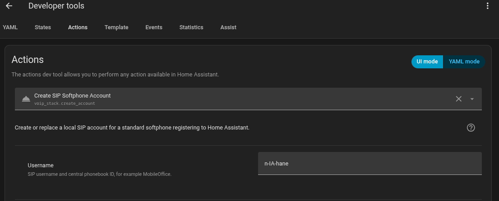

_Create a local SIP endpoint account from Developer Tools -> Actions._

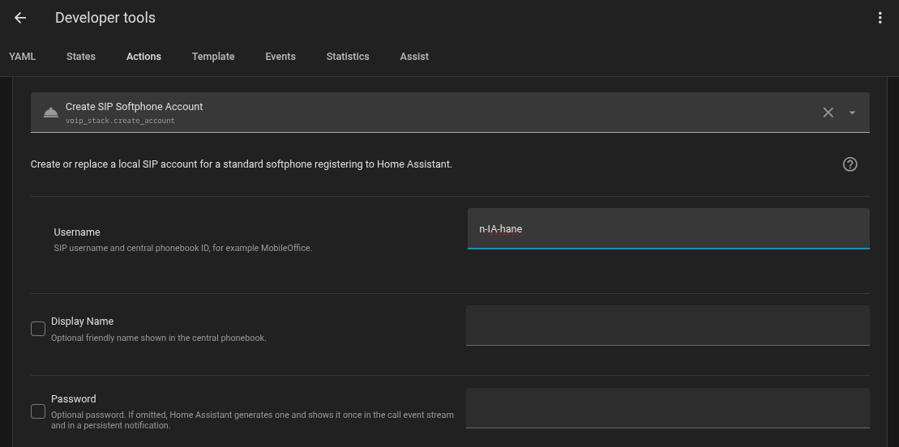

_You can provide a password or let Home Assistant generate one._

If `password` is omitted, HA generates one and shows it once in a Home
VoIP Stack persistent notification and in the
`voip_stack.call_event` stream.

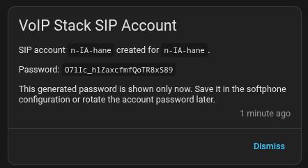

_Generated credentials are shown once in a persistent notification._

Then configure Zoiper, Linphone, baresip or pjsua with:

```text
server: <Home Assistant advertised IP or host>
username: MobileOffice
password: <password generated by HA>
transport: SIP TCP or SIP UDP
```

Pick whichever SIP transport is easiest to operate from the softphone/network
path. The username is also the central phonebook ID. When `MobileOffice`
registers, HA adds a dynamic SIP contact with that name to the roster and
pushes it to ESP devices. Deregistering, disabling the account or letting the
REGISTER expire removes the dynamic contact. Passwords are not logged;
generated passwords are only shown at creation/rotation time.

### Trunk Routing

Home Assistant can optionally register a provider/PBX trunk. ESP devices do not
register to that trunk: they call names or numbers through HA, and HA owns the
external SIP leg, codec negotiation, RTP bridge and terminal reason propagation.

Inbound trunk calls with no explicit route hint ring the HA softphone/default
target. Explicit DTMF digits are resolved as phonebook extensions; unresolved
DTMF/SIP route hints terminate the leg with a route error instead of silently
falling back.

## Call Routing

These diagrams show the common call paths after the phonebook has resolved a
destination.

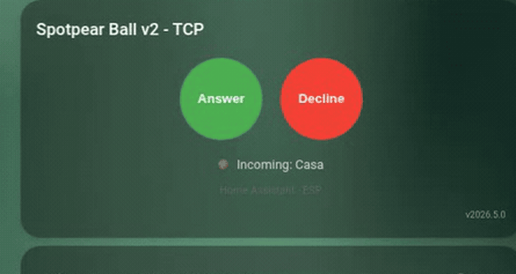

_Browser softphone path: the card talks only to HA; HA opens the SIP leg toward the ESP._


```mermaid
flowchart LR
    Card["🌐 Browser card"] <-->|"WebSocket<br/>browser audio"| HA["🏠 HA<br/>voip_stack"]
    HA <-->|"SIP leg<br/>INVITE / ACK / BYE + RTP"| ESP["📟 ESP<br/>rings / streams"]
```

**Browser/App → ESP:**
1. User clicks "Call" in the card
2. HA opens the SIP leg to the selected ESP
3. HA sends INVITE with caller=`hass.config.location_name`
4. ESP rings or auto-answers
5. Bidirectional audio streaming begins

**ESP → HA peer:**
1. User selects the HA location name in the ESP phonebook
2. ESP sends INVITE to HA
3. HA notifies connected browser cards
4. User answers from the card, or the card auto-answers
5. Bidirectional audio streaming begins

### ESP ↔ ESP

ESP peers call each other directly only when the phonebook entry contains a
complete direct SIP endpoint and compatible media. Numeric targets, unresolved
names, trunk calls and bridge-required routes go to HA.

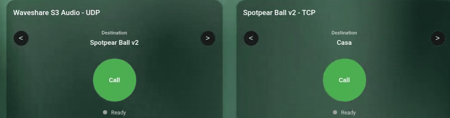

_ESP-to-ESP routing depends on the selected destination and transport compatibility. In this demo a UDP device calls a TCP device through HA._


```mermaid
flowchart TD
    Press["📞 Call pressed"] --> Resolve["📒 resolve selected<br/>phonebook entry"]
    Resolve --> Policy{"🧭 route decision"}
    Policy -->|"complete direct SIP endpoint"| Direct["📟 dial peer directly"]
    Policy -->|"extension / number / unresolved / bridge required"| ViaHA["🏠 dial HA"]
    ViaHA --> Bridge["🔀 HA bridges<br/>to destination"]
    Direct --> Stream["🎙️ full-duplex audio"]
    Bridge --> Stream
```

**Call Flow (ESP #1 calls ESP #2):**
1. User selects "Bedroom" on ESP #1 via display, button, or service.
2. ESP #1 resolves the phonebook entry.
3. Complete direct SIP endpoint: ESP #1 sends INVITE directly to ESP #2.
4. Bridge-required route: ESP #1 sends INVITE to HA, preserving `dest_name="Bedroom"`, and HA opens the second leg.
5. Either side can hang up; the terminal reason is propagated to the other leg.

**HA routing features:**
- Contact roster publication from HA
- Next/Previous contact navigation
- Caller ID display
- Ringing timeout with auto-decline
- Bidirectional hangup propagation

### ESP calling Home Assistant (Doorbell)

Home Assistant is published to the ESP phonebook automatically. When an ESP
initiates a call to that HA contact from a GPIO button, LVGL button or template
button, Home Assistant emits `voip_stack.incoming_call` for notifications and
the Lovelace card goes into ringing state with Answer/Decline buttons:


_Doorbell path: the ESP calls the HA peer name, and the browser card rings with Answer/Decline._

---


## Reference

Full options, actions, conditions, entities, services and automation examples are documented in **[docs/reference.md](docs/reference.md)**.

Quick links:
- [`voip_stack` component options](docs/reference.md#esp-component-options)
- [ESP triggers](docs/reference.md#esp-triggers)
- [ESP actions](docs/reference.md#esp-actions) and [conditions](docs/reference.md#esp-conditions)
- [`esp_audio_stack`, `esp_aec` and `esp_afe`](https://github.com/n-IA-hane/esphome-audio-stack) component docs
- [Home Assistant services](docs/reference.md#ha-services)
- [Home Assistant SIP events](docs/reference.md#ha-sip-events)


## Call Flow Diagrams

### Browser Card Calls ESP

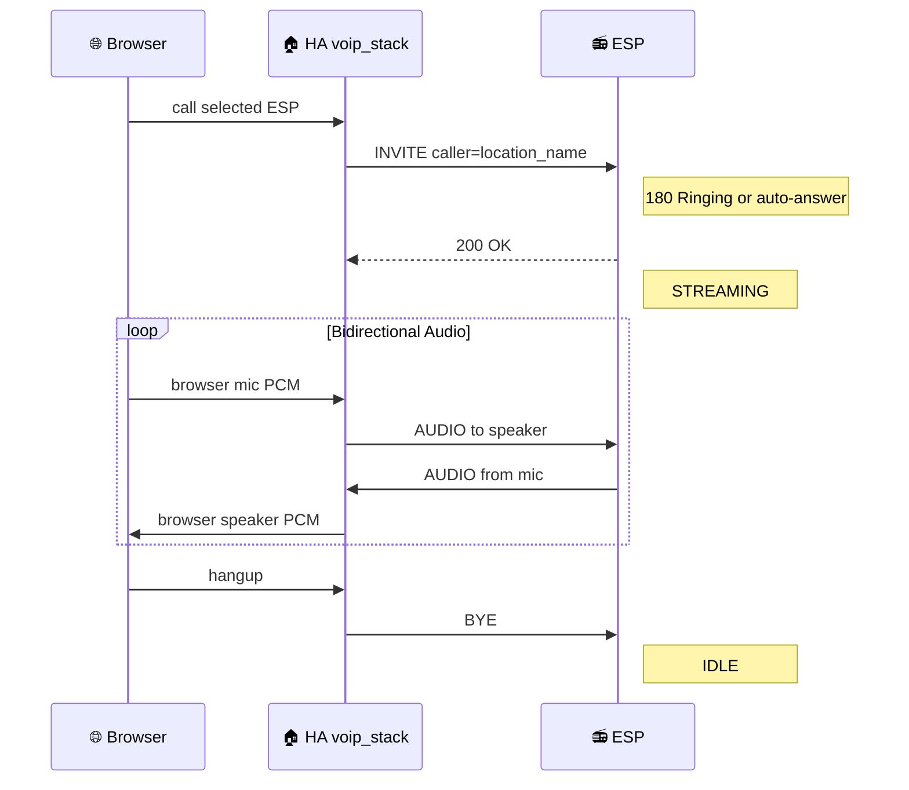
```mermaid
sequenceDiagram
    participant B as 🌐 Browser
    participant HA as 🏠 HA voip_stack
    participant E as 📻 ESP

    B->>HA: call selected ESP
    HA->>E: INVITE caller=location_name
    Note right of E: 180 Ringing or auto-answer
    E-->>HA: 200 OK
    Note right of E: STREAMING

    loop Bidirectional Audio
        B->>HA: browser mic PCM
        HA->>E: AUDIO to speaker
        E->>HA: AUDIO from mic
        HA->>B: browser speaker PCM
    end

    B->>HA: hangup
    HA->>E: BYE
    Note right of E: IDLE
```

### ESP Calls ESP Directly

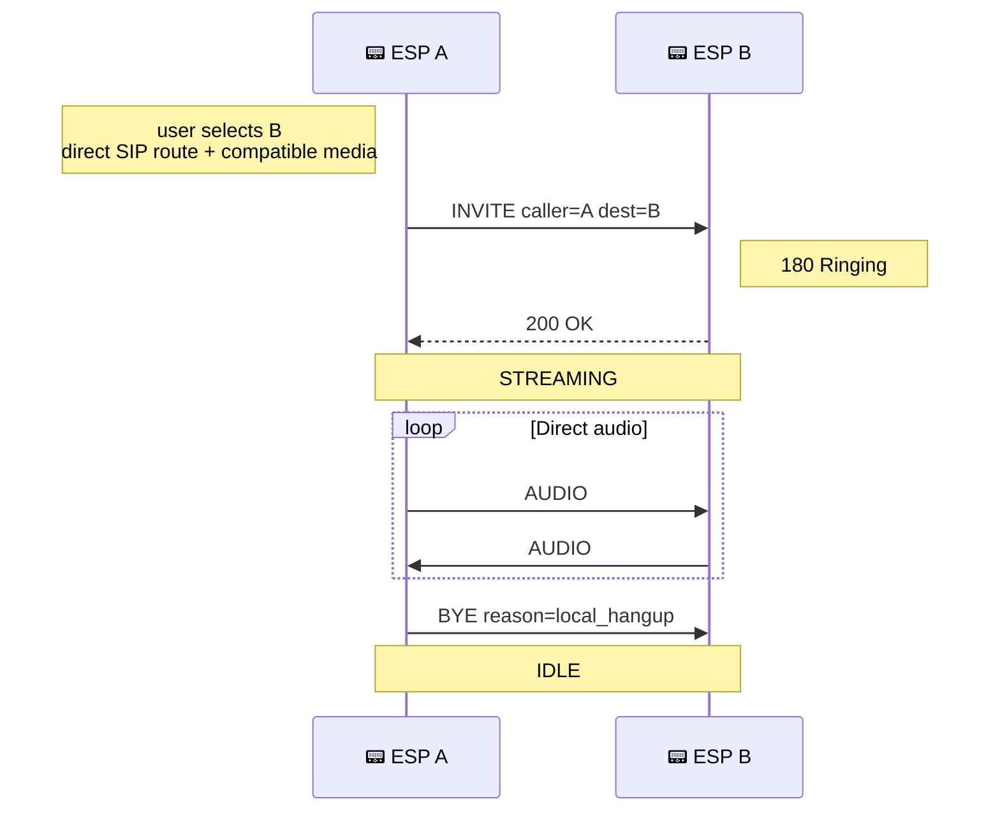
```mermaid
sequenceDiagram
    participant A as 📟 ESP A
    participant B as 📟 ESP B

    Note left of A: user selects B<br/>direct SIP route + compatible media
    A->>B: INVITE caller=A dest=B
    Note right of B: 180 Ringing
    B-->>A: 200 OK
    Note over A,B: STREAMING

    loop Direct audio
        A->>B: AUDIO
        B->>A: AUDIO
    end

    A->>B: BYE reason=local_hangup
    Note over A,B: IDLE
```

### ESP Calls ESP Through HA


```mermaid
sequenceDiagram
    participant A as 📟 ESP A
    participant HA as 🏠 HA bridge
    participant B as 📟 ESP B

    Note left of A: bridge-required route
    A->>HA: INVITE caller=A dest=B
    HA->>B: INVITE caller=A dest=B
    Note right of B: 180 Ringing
    B-->>HA: 200 OK
    HA-->>A: 200 OK
    Note over A,B: STREAMING via HA

    loop Bridge relays audio
        A->>HA: AUDIO
        HA->>B: AUDIO
        B->>HA: AUDIO
        HA->>A: AUDIO
    end

    B->>HA: BYE reason=local_hangup
    HA->>A: BYE reason=remote_hangup
    Note over A,B: IDLE
```

---

## Hardware Support

### Tested Configurations

| Device | Status | YAML | Microphone | Speaker | I2S Mode | Audio pipeline | Features |
|--------|--------|------|------------|---------|----------|----------------|----------|
| **Spotpear Ball v2 (AFE)** | Tested | [`spotpear-ball-v2-full-afe.yaml`](yamls/full-experience/single-bus/spotpear-ball-v2-full-afe.yaml) | ES8311 | ES8311 | Single bus | `esp_afe` (AEC + NS + AGC + VAD) | VA + MWW + VoIP + LVGL |
| **Spotpear Ball v2 (VoIP)** | Tested | [`spotpear-ball-v2-voip.yaml`](yamls/voip-only/single-bus/spotpear-ball-v2-voip.yaml) | ES8311 | ES8311 | Single bus | `esp_aec` (SR stereo loopback) | VoIP only |
| **Waveshare S3-Audio (AFE)** | Tested | [`waveshare-s3-full-afe.yaml`](yamls/full-experience/single-bus/waveshare-s3-full-afe.yaml) | ES7210 4-ch | ES8311 | Single bus TDM | `esp_afe` (AEC + Speech Enhancement + VAD) | VA + MWW + VoIP + LED + AFE switches/sensors |
| **Waveshare P4-Touch portrait (AFE)** _(experimental)_ | Hardware-test target | [`waveshare-p4-touch-full-afe-portrait.yaml`](yamls/full-experience/single-bus/waveshare-p4-touch-full-afe-portrait.yaml) | ES7210 4-ch | ES8311 | Single bus TDM | `esp_afe` (AEC + Speech Enhancement + VAD) | VA + MWW + VoIP + LVGL touch |
| **Waveshare P4-Touch landscape (AFE)** _(experimental)_ | Field-tested target | [`waveshare-p4-touch-full-afe-landscape.yaml`](yamls/full-experience/single-bus/waveshare-p4-touch-full-afe-landscape.yaml) | ES7210 4-ch | ES8311 | Single bus TDM | `esp_afe` (AEC + Speech Enhancement + VAD) | Landscape LVGL dashboard, VA + MWW + VoIP |
| **Generic S3 (full AEC light)** | Reference YAML | [`generic-s3-full-aec.yaml`](yamls/full-experience/single-bus/generic-s3-full-aec.yaml) | Any I2S MEMS | Any I2S amp | Single bus (duplex) | `esp_aec` SR + `previous_frame` ref | VA + MWW + VoIP, lighter 4 MB-oriented preset |
| **Generic S3 (full AEC light, dual bus)** | Reference YAML | [`generic-s3-full-aec.yaml`](yamls/full-experience/dual-bus/generic-s3-full-aec.yaml) | Any I2S MEMS | Any I2S amp | Dual bus | `esp_aec` SR + `previous_frame` ref | VA + MWW + VoIP on separated I2S buses |
| **Generic S3 (full AFE, untested)** | Expected-working | [`generic-s3-full-afe.yaml`](yamls/untested/generic-s3-full-afe.yaml) | Any I2S MEMS | Any I2S amp | Single bus (duplex) | `esp_afe` (AEC + NS + AGC + VAD) + TYPE2 ring ref | VA + MWW + VoIP, requires >4 MB app slot |
| **Generic S3 (full native)** | Reference YAML | [`generic-s3-full-esphome-native.yaml`](yamls/full-experience/esphome-native/generic-s3-full-esphome-native.yaml) | Native ESPHome mic or processed front-end | Native ESPHome speaker | Native ESPHome audio | Native ESPHome `microphone`/`speaker`, no software AEC | Full experience for XMOS/hardware-AEC front-ends, separated I2S mic/speaker paths, or native audio testing |
| **Generic S3 (native VoIP full-duplex)** | Reference YAML | [`generic-s3-voip-esphome-native-full-duplex.yaml`](yamls/voip-only/esphome-native/generic-s3-voip-esphome-native-full-duplex.yaml) | Native ESPHome mic or processed front-end | Native ESPHome speaker | Separated native ESPHome audio paths | None in firmware; use hardware/DSP AEC if needed | VoIP-only native ESPHome audio for two independent I2S paths, not a shared single-bus AEC backend |
| **Generic S3 (native VoIP mic-only)** | Reference YAML | [`generic-s3-voip-esphome-native-mic-only.yaml`](yamls/voip-only/esphome-native/generic-s3-voip-esphome-native-mic-only.yaml) | Native ESPHome mic or processed front-end | None | Native ESPHome audio | None in firmware; use hardware/DSP AEC if needed | One-way microphone endpoint |
| **Generic S3 (native VoIP speaker-only)** | Reference YAML | [`generic-s3-voip-esphome-native-speaker-only.yaml`](yamls/voip-only/esphome-native/generic-s3-voip-esphome-native-speaker-only.yaml) | None | Native ESPHome speaker | Native ESPHome audio | Not applicable | One-way speaker endpoint |
| **Generic S3 single bus (VoIP)** | Reference YAML | [`generic-s3-voip.yaml`](yamls/voip-only/single-bus/generic-s3-voip.yaml) | Any I2S MEMS | Any I2S amp | Single bus (duplex) | `esp_aec` + `previous_frame` ref | VoIP only |
| **Generic S3 dual bus (VoIP)** | Reference YAML | [`generic-s3-voip.yaml`](yamls/voip-only/dual-bus/generic-s3-voip.yaml) | Any I2S MEMS | Any I2S amp | Dual bus | `esp_aec` + `previous_frame` ref | VoIP only |

> **Want to help expand this list?** Send me a device to test or consider a [donation](https://github.com/sponsors/n-IA-hane), every bit helps!

### Requirements

- **ESP32-S3** or **ESP32-P4** with PSRAM (required for AEC)
- I2S microphone (INMP441, SPH0645, ES8311, etc.)
- I2S speaker amplifier (MAX98357A, ES8311, etc.)
- ESP-IDF framework (not Arduino)
- **sdkconfig tuning** for PSRAM devices: S3 profiles use cache/PSRAM
  instruction/rodata options to recover internal heap; P4 profiles keep a
  smaller validated baseline with L2 cache plus PSRAM XIP and avoid aggressive
  Wi-Fi/LWIP IRAM overrides. See the board packages and
  [esp_afe README](https://github.com/n-IA-hane/esphome-audio-stack/tree/main/esphome/components/esp_afe)
  for details.

Generic full-experience S3 now has two maintained presets. Use
`generic-s3-full-aec-*` for the lighter 4 MB-oriented build: it keeps VA, MWW,
media, mixer and VoIP but omits the timer alarm sound asset and uses
standalone `esp_aec` with the lightweight `previous_frame` reference. Use
`generic-s3-full-afe-*` when you want the full Espressif AFE pipeline with
NS/AGC/VAD, the canonical TYPE2-style software reference and the full timer
alarm behavior; that profile needs an app slot larger than the default 4 MB OTA
slot, so 8 MB or 16 MB flash is recommended. The example GPIOs are placeholders:
on ESP32-S3R8/S3R8V, GPIO33/35/36/37 are PSRAM pins, so move
BCLK/LRCLK/DIN/LED to board-safe pins before flashing.

The P4 YAMLs are still hardware-specific targets. The landscape profile has
been field-tested with ESPHome 2026.6.4, ESP-Hosted 2.12.9, phonebook sync and
VoIP calls, but audio playback still needs follow-up tuning for occasional
glitches. The stable release reference devices remain the ESP32-S3 targets
above.

#### Waveshare P4 Touch C6 firmware requirement

The Waveshare ESP32-P4-WIFI6-Touch-LCD boards use an ESP32-C6 co-processor for
Wi-Fi over ESP-Hosted SDIO. If a P4 build boots but then resets, hangs, or loses
Wi-Fi under media/TTS streaming, update the C6 `network_adapter` firmware before
debugging the audio pipeline. Factory/older C6 firmware can expose broken hosted
OTA behavior (`Req_OTABegin` timeout), SDIO mode mismatch failures, or transport
resets under stream load.

The validated recovery path used on the 10.1" Waveshare P4 Touch was:

1. Build a P4 recovery flasher from Espressif
   `esp-serial-flasher/examples/esp32_sdio_example`.
2. Embed the ESP32-C6 ESP-Hosted `network_adapter.bin` plus its C6 bootloader,
   partition table and `ota_data_initial.bin`.
3. Configure the SDIO flasher for the Waveshare P4 pins:
   `D0-D3=GPIO14..GPIO17`, `CLK=GPIO18`, `CMD=GPIO19`, C6 reset `GPIO54`,
   4-bit SDIO.
4. Put the C6, not the P4, into ROM download mode by shorting the exposed
   `C6_IO9` pad to `GND` while the P4 recovery flasher boots. The small C6
   flash pad group is labelled `TXD`, `RXD`, `IO9`, `GND`; for the SDIO ROM
   flasher only `IO9 -> GND` is needed.
5. Keep `IO9` grounded until the P4 flasher logs that it connected to the C6
   target and finishes `Flash verified` for bootloader, partition table, OTA
   data and app. Then release `IO9`.
6. Reflash the normal ESPHome P4 firmware.

After recovery, the tested board booted cleanly and the P4 stopped crashing
under hosted Wi-Fi. Keep the C6 firmware aligned with the host `esp_hosted`
library through the update entity below; current ESPHome builds use
ESP-Hosted `2.12.9`.

The normal ESPHome P4 YAMLs enable hosted Wi-Fi with:

```yaml
esp32_hosted:
  variant: ESP32C6
  use_psram: true
  reset_pin: GPIO54
  cmd_pin: GPIO19
  clk_pin: GPIO18
  d0_pin: GPIO14
  d1_pin: GPIO15
  d2_pin: GPIO16
  d3_pin: GPIO17
  active_high: true
```

`use_psram: true` lets ESPHome place ESP-Hosted transport mempool buffers in
DMA-capable PSRAM when supported. That is the official fix for memory-tight
P4/LVGL/audio builds that otherwise fail during SDIO startup with
`sdio_mempool_create`.

The shared package [`packages/board/esp32p4_c6_sdio.yaml`](packages/board/esp32p4_c6_sdio.yaml)
keeps the remaining board-level transport settings: SDIO streaming mode to
match the C6 slave, hosted task stacks in PSRAM, and conservative SDIO queue
sizes:

```yaml
CONFIG_ESP_HOSTED_SDIO_OPTIMIZATION_RX_STREAMING_MODE: "y"
CONFIG_ESP_HOSTED_DFLT_TASK_FROM_SPIRAM: "y"
CONFIG_ESP_HOSTED_SDIO_TX_Q_SIZE: "10"
CONFIG_ESP_HOSTED_SDIO_RX_Q_SIZE: "10"
```

It exposes ESPHome's native coprocessor update entity:

```yaml
http_request:

update:
  - platform: esp32_hosted
    name: ESP32-C6 Coprocessor Firmware
    type: http
    source: https://esphome.github.io/esp-hosted-firmware/manifest/esp32c6.json
```

Do not force-install an older advertised version. ESPHome only offers firmware
versions compatible with the compiled host `esp_hosted` library; if the update
entity reports no compatible newer C6 image, leave the C6 alone until the host
library is updated.

---

## Audio Components

Three ESPHome components sit between your codec and the VoIP / voice assistant pipelines. Each has its own README with the full option list and tuning notes; the highlights below exist just to help you pick.

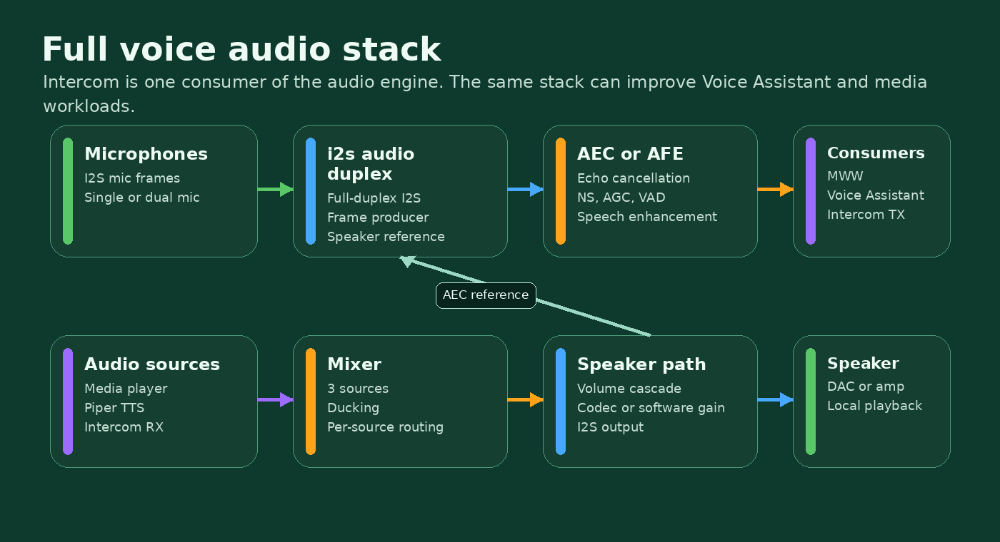

_The same audio stack can serve VoIP, Voice Assistant, TTS and media workloads on full voice devices._

Plain VoIP does **not** always require `esp_audio_stack`: `voip_stack`
can run on ESPHome's normal `microphone` and/or `speaker` components. This is
the right fit for hardware/DSP-processed audio such as XMOS front-ends, for
mic-only or speaker-only endpoints, and for full-duplex tests where microphone
and speaker are exposed as independent native ESPHome paths.

Native ESPHome audio is **not** the shared single-bus software-AEC backend. If
your board is a plain MEMS mic plus I2S amplifier sharing timing or needing a
software reference, use an `esp_audio_stack` AEC/AFE profile. `esp_audio_stack`
is intentionally heavier because it owns the coordinated mic/speaker lifecycle,
reference capture and mixer arbitration needed by full audio devices.

The full native examples under `yamls/full-experience/esphome-native/` extend
that idea to VA, MWW, media player and VoIP on native ESPHome audio
components. The voip-only native examples under
`yamls/voip-only/esphome-native/` provide dedicated separated-path
full-duplex, mic-only and speaker-only starting points without carrying
unrelated full-experience blocks.

Native ESPHome audio does not add software echo cancellation by itself. If your
microphone path is already processed by hardware or firmware, for example an
XMOS front-end that outputs echo-cancelled PCM, the native full profiles are a
good starting point and avoid unnecessary `esp_audio_stack` complexity. If your
hardware is a plain INMP441 plus MAX98357A, or any other normal mic/amp pair
without its own AEC, use an `esp_audio_stack` AEC/AFE profile instead.

Use `esp_audio_stack` when a board has one shared I2S bus, when you need a
phase-coherent speaker reference for software AEC, or when the same ESP also
runs media player, Piper TTS, Micro Wake Word and Voice Assistant on raw
mic/speaker hardware without hardware echo cancellation. It can also be useful
outside VoIP projects: an ESPHome Voice Assistant device can use it as the
shared mic/speaker transport and AEC reference path.

On AEC/AFE profiles the public ESPHome microphone exposed by `esp_audio_stack`
is the processed surface. Music, TTS, timers, Sendspin and VoIP playback
feed the speaker path and the AEC/AFE reference, while Micro Wake Word, Voice
Assistant and VoIP TX receive the cleaned microphone stream. That is why a
full device can keep playing media and still wake reliably on the user's voice
instead of on its own speaker output.

Full voice profiles that expose media playback use `speaker_source`: HA media,
announcements, local files and optional Sendspin streams are sources of one
media player, and the mixer remains the single arbitration point before the
hardware speaker. Older custom YAMLs that still use ESPHome's
`platform: speaker` media player can keep using the local
[`speaker`](esphome/components/speaker/README.md) fork for its pause-release
compatibility mode.

Full-experience profiles also use [`runtime_controller`](https://github.com/n-IA-hane/esphome-runtime-controller)
as the control-plane reducer. It does not touch PCM audio. YAML callbacks send
events such as `media_playing`, `wake_word`, `timer_finished` or
`ha_disconnected`; the reducer keeps composable activities and resolves named
policies such as `led_status`, `display_status`, `audio_policy`, `ringtone`
and `timer_alarm`. This is what keeps a slow TTS response blue while media is
playing underneath, lets VoIP override the LED without forgetting media,
and prevents timer/ringtone/mute callbacks from racing display and ducking.

The maintained reducer package is deliberately readable YAML:

```yaml
runtime_controller:
  id: runtime_controller
  activities:
    media:
      priority: 100
      policies: { led_status: media, audio_policy: normal }
    va_responding:
      priority: 800
      policies: { led_status: responding, audio_policy: duck }
  events:
    media_playing: { activate: media }
    media_idle: { deactivate: [media, va_responding] }
    wake_word:
      activate: va_starting
      cases:
        - any: [va_responding, announcement]
          deactivate: announcement
          action: voice_restart_response
```

For a composite device, put the microphone and speaker on the same I2S bus and
use [`esp_audio_stack`](https://github.com/n-IA-hane/esphome-audio-stack/tree/main/esphome/components/esp_audio_stack). The
audio stack driver hands a phase-coherent speaker reference to the AEC each frame;
standalone `voip_stack` deliberately does not provide software AEC. If your
hardware does not already process echo, use an `esp_audio_stack` profile.

### [`esp_audio_stack`](https://github.com/n-IA-hane/esphome-audio-stack/tree/main/esphome/components/esp_audio_stack)

Full-duplex audio backend for shared codec buses and no-codec MEMS/amp boards.
It owns I2S/codec IO, rate conversion, channel layout, software/hardware AEC
reference capture, speaker buffering and mic consumer fan-out, then exposes
normal ESPHome `microphone` and `speaker` platforms above that.

With `esp_aec` or `esp_afe` attached, that `microphone` platform is the cleaned
post-processor stream. MWW, Voice Assistant and `voip_stack` all consume the
same echo-cancelled audio while media/TTS/ringtones continue through the shared
speaker and mixer path.

The stack can be used without VoIP. For custom devices it covers:
single-bus codecs, dual I2S RX/TX, 32-bit MEMS microphones, stereo RX slot
selection, ES8311 digital feedback, ES7210 TDM reference, stereo speaker output,
48 kHz speaker bus with 16 kHz mic/AEC output, PSRAM buffer placement and
direct `esp_codec_dev` codec IO. See the component README for the option table and
topology examples.

### [`esp_aec`](https://github.com/n-IA-hane/esphome-audio-stack/tree/main/esphome/components/esp_aec)

Standalone ESP-SR echo cancellation (~80 KB internal RAM). Four modes (`sr_low_cost` recommended for VA+MWW, `voip_*` for pure VoIP). See the [`esp_aec` README](https://github.com/n-IA-hane/esphome-audio-stack/tree/main/esphome/components/esp_aec) before changing defaults.

### [`esp_afe`](https://github.com/n-IA-hane/esphome-audio-stack/tree/main/esphome/components/esp_afe)

Full ESP-SR audio front-end. Chains AEC, optional spatial source separation, noise suppression, voice activity detection and automatic gain control behind `esp_audio_stack`. Runs on Core 0 (~22-23% load on S3 in `low_cost` mode) and the pipeline shape adapts at runtime to `mic_num` and the per-stage switches exposed in Home Assistant.

**What each stage does**

- **AEC** (Acoustic Echo Cancellation) - removes the speaker signal from the mic input. Same engine as `esp_aec`. Required by everything downstream and by wake word detection during a call.
- **Speech Enhancement** (dual-mic only; ESP-SR BSS internally) - uses the spatial difference between two microphones to isolate the speaker's voice and suppress directional noise (TV, kitchen fan, neighbour talking). Active when `se_enabled: true` and `mic_num: 2`. While Speech Enhancement is on, esp-sr replaces NS and AGC in the pipeline; their toggles become noops until Speech Enhancement is turned off.
- **NS** (Noise Suppression, single-mic mode) - WebRTC-style spectral noise reduction for stationary background (HVAC hum, fan whir). Less surgical than dual-mic Speech Enhancement but the only option on single-mic boards where spatial separation is impossible.
- **VAD** (Voice Activity Detection) - marks frames as speech vs noise when the upstream ESP-SR VAD state machine is active. Treat the `voice_present` sensor and `vad_enabled` switch as experimental until validated on your target AFE profile; Micro Wake Word remains ESPHome/TFLite and separate from ESP-SR app-level wake handling.
- **AGC** (Automatic Gain Control, single-mic mode) - WebRTC-style level normalization that pulls quiet speech up and limits loud peaks. Useful on boards where mic distance varies (room scale).

**Configuration shape**

YAML keys cover type (`sr` for speech recognition or `vc` for voice communication), mode (`low_cost` or `high_perf`), per-stage enable switches, AEC filter length, AGC compression and target, plus diagnostic sensors (input volume dB, output RMS dB, voice presence) and runtime switches in Home Assistant for each stage. See the [AFE README](https://github.com/n-IA-hane/esphome-audio-stack/tree/main/esphome/components/esp_afe) for the full option matrix and exact memory/CPU numbers per mode.

**When to use it**

Pick `esp_afe` if you actually need NS, AGC or Speech Enhancement, or if you want runtime control of those stages from Home Assistant. For plain voip-only setups `esp_aec` is lighter and lacks the AFE switches you would not use anyway. `esp_afe` requires `esp_audio_stack` in front of it; it cannot replace `esp_aec` in standalone `voip_stack` configurations (no audio stack driver = no steady frame producer for the AFE feed/fetch tasks).

---

## Voice Assistant + VoIP Experience

<table>
  <tr>
    <td align="center"><br/><b>Animated assistant</b></td>
    <td align="center"><br/><b>Assistant response</b></td>
    <td align="center"><br/><b>Runtime audio controls</b></td>
    <td align="center"><br/><b>Call end reason</b></td>
  </tr>
  <tr>
    <td align="center"><br/><b>Positive mood</b></td>
    <td align="center"><br/><b>Neutral mood</b></td>
    <td align="center"><br/><b>Negative mood</b></td>
    <td align="center">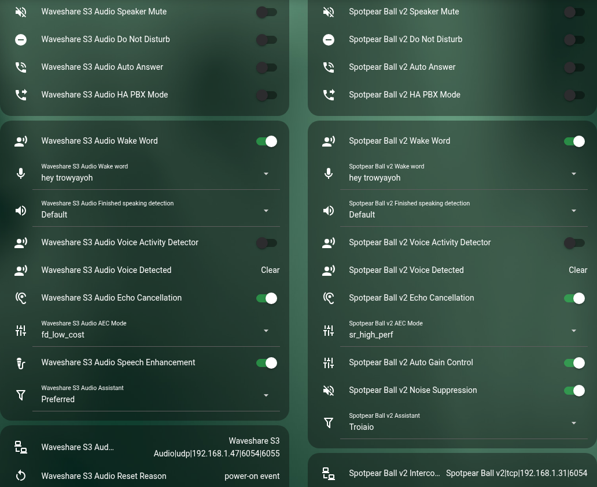<br/><b>HA audio controls</b></td>
  </tr>
</table>

<table>
  <tr>
    <td align="center">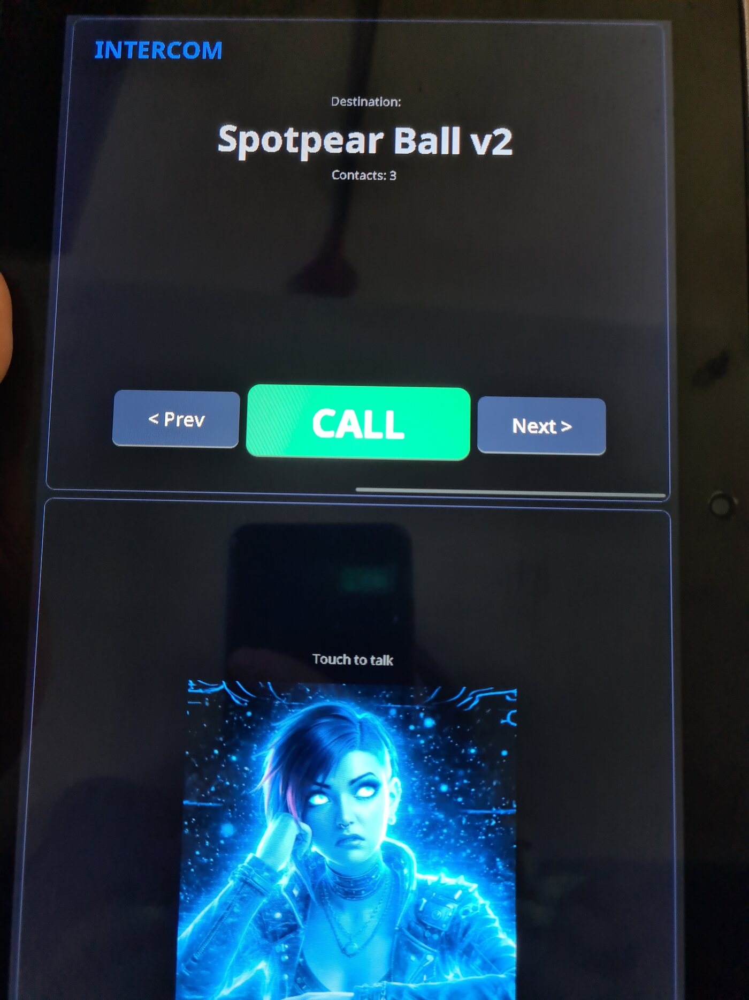<br/><b>P4 VoIP panel</b></td>
    <td align="center">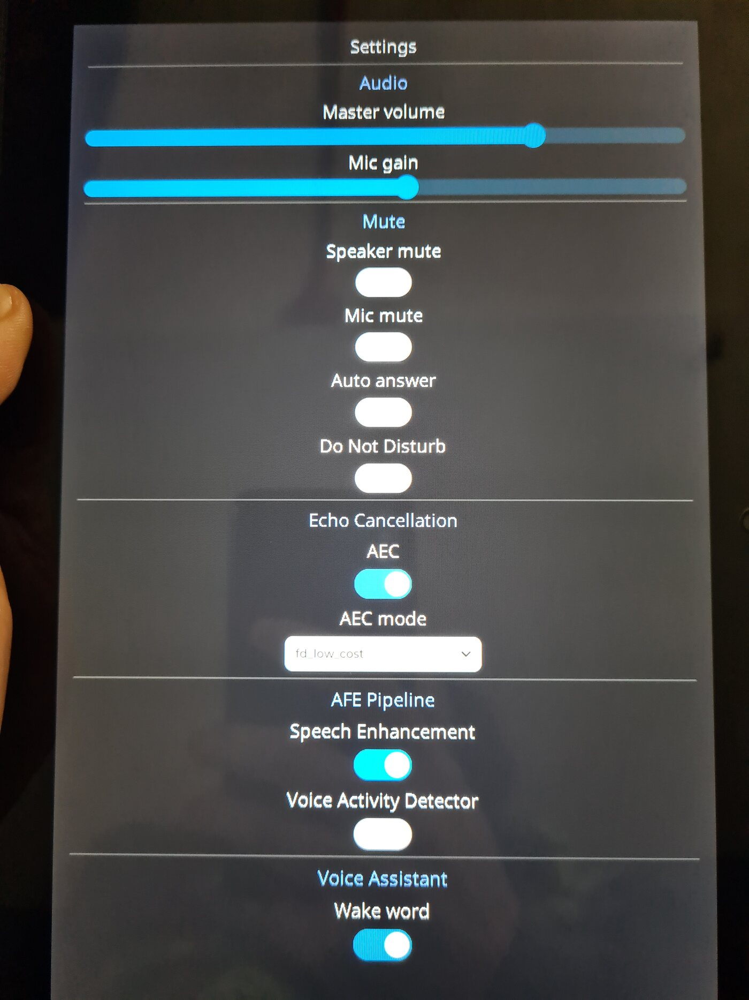<br/><b>P4 audio settings</b></td>
    <td align="center"><br/><b>Ducking and barge-in</b></td>
  </tr>
</table>

The Voice Assistant, Micro Wake Word, and VoIP call path coexist on the same hardware: shared cleaned microphone, shared speaker (via mixer/source arbitration), always-on wake word detection. No display required (works on headless devices like the Waveshare S3 Audio); on devices with a screen, you also get a full touch UI:

- **Always listening**: Micro Wake Word runs continuously on **post-AEC** audio (`stop_after_detection: false`). SR linear AEC preserves the spectral features that the neural wake word model relies on (10/10 detection vs 2/10 with VOIP AEC modes). MWW detects the wake word even while TTS is playing, during music, or during an VoIP call
- **Audio ducking**: When the wake word is detected, background music automatically ducks (-20dB). Volume restores when the VA/TTS cycle ends. During VoIP calls, music is also ducked. The source mixer keeps media, announcements and VoIP as separately arbitrated inputs.
- **Barge-in**: Say the wake word during a TTS response to interrupt and ask a new question. The state machine tracks VA response pending/active phases from real ESPHome `voice_assistant` and media-player announcement callbacks, so slow TTS engines keep the reply LED state until playback actually starts and finishes.
- **Touch or voice**: Start the assistant by saying the wake word or tapping the screen (on touch displays)
- **VoIP calls**: Call other devices or Home Assistant with one tap; incoming calls ring with audio + visual feedback. Ringtone plays over music (via announcement pipeline)
- **Local voice commands**: VoIP Stack can optionally register Home
  Assistant Assist intents for calling, hangup, answer and decline from the
  satellite that heard the sentence. Maintained full YAMLs also expose an
  optional ESPHome `voice_quiet` action for "shut up" style assistant silence.
- **Assist by telephone**: enable **Include voice assistant** in the VoIP Stack
  config flow, choose a native Assist pipeline and assign its SIP extension.
  The pipeline becomes a normal phonebook destination. It receives the caller
  identity, speaks first, listens through its configured STT provider, replies
  through its configured TTS provider and keeps the conversation open until the
  SIP caller hangs up. The route is independent of the conversation provider,
  so it works with Codex Assist and other HA conversation agents alike without
  Home Assistant's separate VoIP integration or another SIP port.
- **Runtime AEC mode switching**: An `AEC Mode` select entity in Home Assistant lets you switch between SR and VOIP AEC modes at runtime without reflashing
- **Weather at a glance**: Current conditions, temperature, and 5-day forecast updated automatically (touch displays)
- **Mood-aware responses**: The assistant shows different expressions (happy, neutral, angry) based on the tone of its reply. Requires instructing your LLM to prepend an ASCII emoticon (`:-)` `:-(` `:-|`) to each response based on its tone
- **Custom AI avatars**: On devices with a display, you can create your own assistant avatar by providing a set of PNG images in a standard folder structure. Set the `ai_avatar` substitution in your YAML to pick which avatar to use:

  ```yaml
  substitutions:
    ai_avatar: my_assistant    # uses images/assistant/my_assistant/
  ```

  Each avatar folder must contain the following files:

  | File | Purpose |
  |------|---------|
  | `idle_00.png` ... `idle_19.png` | Idle animation frames (20 frames, looped) |
  | `listening.png` | Displayed while the assistant is listening |
  | `thinking.png` | Displayed while the assistant is processing |
  | `loading.png` | Displayed during initialization |
  | `error.png` | Displayed on assistant error |
  | `timer_finished.png` | Displayed when a timer completes |
  | `happy.png` | Mood background for positive responses |
  | `neutral.png` | Mood background for neutral responses |
  | `angry.png` | Mood background for negative responses |
  | `error_no_wifi.png` | WiFi disconnected overlay |
  | `error_no_ha.png` | Home Assistant disconnected overlay |

  The folder name matches the avatar identity (e.g. `images/assistant/default/`). To switch avatar, just change the substitution. Images are resized automatically at compile time (240x240 for Spotpear Ball v2, 400x400 for P4 Touch LCD).

### Voice Commands for VoIP and Assistant Quiet

VoIP call control is handled by an optional Home Assistant-side Assist
adapter in the `voip_stack` integration. Enable **Assist VoIP
intents** in the VoIP Stack integration setup/reconfigure dialog, then add
the matching custom sentences from:

- [`examples/home-assistant/custom_sentences/en/voip_stack.yaml`](examples/home-assistant/custom_sentences/en/voip_stack.yaml)
- [`examples/home-assistant/custom_sentences/it/voip_stack.yaml`](examples/home-assistant/custom_sentences/it/voip_stack.yaml)

The custom sentence uses a wildcard `target`; VoIP Stack resolves the
spoken text dynamically against the live phonebook. For example, if Assist
hears `call kitchen speaker`, the handler resolves it to the canonical
`Kitchen Speaker` contact and uses the satellite `device_id` that heard the
command as the call source. It
does not change the SIP protocol or make low-level phonebook matching
fuzzy.

If no phonebook contact matches the spoken target, the adapter also tries a
Home Assistant area-name resolution. This release supports only one VoIP
device per area for voice dialing: `call kitchen` can call the single VoIP
device assigned to the `Kitchen` area, but if the area has zero or multiple
VoIP devices the command fails instead of guessing. Group calls are planned
for a later release.

Supported VoIP intents:

- `call {target}` / `chiama {target}` -> call a live phonebook contact from the
  satellite that heard the command;
- `hang up` / `riaggancia` -> hang up the current call for that satellite;
- `answer` / `rispondi` -> answer the call on that satellite;
- `decline` / `rifiuta` -> decline the call on that satellite.

Maintained full-experience presets also include a local assistant-silence
package as an explicit, optional package line:

```yaml
packages:
  voice_assistant_local_commands: github://n-IA-hane/esphome-intercom/packages/voice_assistant/local_commands.yaml@main
```

`local_commands.yaml` exposes a `voice_quiet` ESPHome API action. It stops only
the current media-player announcement and the active Voice Assistant session, so
a Sendspin or normal media stream underneath is not stopped.

Home Assistant Assist sentence triggers can call the satellite-local quiet
service. The example automation covers:

- `shut up`, `be quiet`, `stop talking` -> silence only the assistant response.

Use exact, speakable phonebook contact names. For best results, name ESP peers
with natural words such as `Kitchen Speaker`, `Office Display`,
`Living Room Display` or `Front Door`. Avoid relying on slug names such as
`living_room_display`, and avoid fuzzy
matching: if Assist hears a different contact name, the call
should fail instead of silently calling the wrong peer.

See the Home Assistant `voice_quiet` automation example:
[`examples/assist-voice-voip-commands.yaml`](examples/assist-voice-voip-commands.yaml).

### AEC Best Practices

AEC uses Espressif's closed-source ESP-SR library. All modes have similar CPU cost per frame (~7ms out of 16ms budget). The difference is primarily in memory allocation and adaptive filter quality.

Maintained full-experience YAMLs now route AEC/AFE through `esp_audio_stack`.
`generic-s3-full-aec-*` is the lighter software-AEC profile, and
`*-full-afe-*` is the heavier AFE profile with NS/AGC/VAD.

For custom VA + MWW builds, `sr_low_cost` is the recommended `esp_aec` mode.
Linear-only AEC preserves spectral features for neural wake word detection and
uses less CPU than VOIP modes. Requires `buffers_in_psram: true` on ESP32-S3.

For devices that benefit from noise suppression and auto gain control (noisy environments, variable mic distance), use `esp_afe` instead of `esp_aec`. The AFE wraps the same AEC engine plus WebRTC NS and AGC, with runtime switches in Home Assistant.

```yaml
# Option A: esp_aec (AEC only, lighter)
esp_aec:
  sample_rate: 16000
  filter_length: 4       # 64ms tail, sufficient for integrated codecs
  mode: sr_low_cost      # Linear AEC, best for MWW + VA, lowest CPU

# Option B: esp_afe (AEC + NS + VAD + AGC, full pipeline)
# esp_afe:
#   type: sr
#   mode: low_cost
#   ns_enabled: true
#   agc_enabled: true

esp_audio_stack:
  # ... pins ...
  processor_id: aec_component   # works with either esp_aec or esp_afe
  buffers_in_psram: true  # Required for sr_low_cost (512-sample frames)
```

Use `voip_low_cost` only if you don't need wake word detection and want more aggressive echo suppression for VoIP-only use cases.

**Avoid `sr_high_perf`**: It allocates very large DMA buffers that can exhaust memory on ESP32-S3, causing SPI errors and instability.

### AEC Timeout Gating

AEC processing is automatically gated: it only runs when the speaker had real audio within the last 250ms. When the speaker is silent (idle, no TTS, no VoIP audio), AEC is bypassed and mic audio passes through unchanged.

This prevents the adaptive filter from drifting during silence, which would otherwise suppress the mic signal and kill wake word detection. The gating is transparent, no configuration needed.

### LVGL Display

Running a display alongside Voice Assistant, Micro Wake Word, AEC/AFE, media
playback and VoIP on one ESP is challenging due to RAM and CPU constraints.
`spotpear-ball-v2-full-afe.yaml` is the compact LVGL reference. The P4 LVGL
YAMLs use the same state model on a larger MIPI panel and now have a cleaner
runtime profile, but remain hardware-specific targets because hosted Wi-Fi,
MIPI/LVGL/PPA and SDIO traffic make their tuning different from normal S3
boards.

| Before (ili9xxx manual) | After (LVGL) |
|---|---|
| 14 C++ page lambdas | Declarative YAML widgets |
| 26 `component.update` calls | Automatic dirty-region refresh |
| `animate_display` script (40 lines) | `animimg` widget (built-in) |
| `text_pagination_timer` script | `long_mode: SCROLL_CIRCULAR` |
| Precomputed geometry (chord widths, x/y metrics) | LVGL layout engine |
| Manual ping-pong frame logic | Duplicated frame list in `animimg src:` |

Key benefits: lower CPU (dirty-region only), no `component.update` contention, native animation (`animimg`), mood-based backgrounds via `lv_img_set_src()`, and automatic text scrolling (`SCROLL_CIRCULAR`).

Timer overlays use `top_layer` with `LV_OBJ_FLAG_HIDDEN`, visible on any page. Media files are auto-resampled by the `platform: resampler` speaker in the mixer pipeline.

---

## Logging

The shipped YAMLs configure `logger:` with `level: INFO`. INFO is the public
contract: startup errors, warnings and normal call/audio lifecycle milestones
are visible. Use `level: DEBUG` only while developing or collecting a trace.
Under ESPHome's compile-time `level:` flag, `logger.logs:` per-tag entries can
mute components but cannot reveal messages that were compiled out.

**Default contract**

| Function | Level | Why |
|---|---|---|
| Component init / config errors that block startup | `ERROR` | failure surfaces immediately |
| SIP race / busy / glare / RTP send drop / peer protocol error | `WARN` | unexpected but recoverable |
| Call lifecycle (`calling`, `answered`, `hung up`), bridge start/stop, mic consumer attach/detach, AFE active/idle | `INFO` | user-visible operational milestones |
| FSM internal transitions, idempotent re-acks, transport setter logs (`_streaming false→true cause=...`), retransmits | `DEBUG` | developer-level detail |
| Per-frame telemetry (compiled in only when `esp_audio_stack.telemetry: true` *and* `level: DEBUG`) | `DEBUG` | gated behind both YAML and compile-time flag |

**Development DEBUG profile**

When you intentionally set the global level to `DEBUG`, you can quiet specific
project tags via `logger.logs:`:

```yaml
logger:
  level: DEBUG
  logs:
    sensor: WARN
    text_sensor: WARN
    binary_sensor: WARN
    switch: WARN
    number: WARN
    button: WARN
    api: WARN
    api.connection: WARN
    component: WARN
    # Project components - uncomment to mute individually:
    # voip_stack: INFO        # main API + setup
    # voip_stack.fsm: INFO    # SIP call-state transitions
    # voip_stack.audio: INFO  # mic/spk audio task
    # voip_stack.tcp: INFO    # framed TCP transport
    # voip_stack.udp: INFO    # UDP audio + control
    # voip_stack.settings: INFO
    # audio_stack: INFO          # I2S audio stack driver
    # esp_aec: INFO             # lightweight AEC processor
    # esp_afe: INFO             # full audio front-end
```

**Stay on INFO for normal use**

For normal devices, keep `level: INFO` globally. You only lose internal-state
DEBUG logs, which are not needed unless you are debugging this project.

**HA-side log level toggle**

The Home Assistant integration declares its package logger in `manifest.json`, so HA's *Settings → System → Logs → Configure* surfaces `custom_components.voip_stack` as a per-component level switch. Use it to flip the integration to DEBUG live without touching `configuration.yaml`.

---

## Troubleshooting

Common symptoms and fixes are documented in **[docs/troubleshooting.md](docs/troubleshooting.md)**:

- [ESP does not ring](docs/troubleshooting.md#esp-does-not-ring)
- [HA softphone does not ring](docs/troubleshooting.md#ha-softphone-does-not-ring)
- [Call fails with `media_incompatible`](docs/troubleshooting.md#call-fails-with-media_incompatible)
- [HA cannot route a name](docs/troubleshooting.md#ha-cannot-route-a-name)
- [No audio](docs/troubleshooting.md#no-audio)
- [Card state looks wrong](docs/troubleshooting.md#card-state-looks-wrong)


## Home Assistant Automation

When an ESP device calls the HA location name, VoIP Stack emits a
`voip_stack.incoming_call` event. Use this to trigger push notifications, flash
lights, play chimes, or any other automation. For a doorbell-style flow, filter
the caller name and handle the call through the standard HA softphone services.

The mobile notification can expose real **Answer** and **Decline** actions:

- Replace `/lovelace/default_view` below with the real dashboard view that
  contains the `voip-stack-card` configured in **Home Assistant softphone**
  mode. The deep link is not handled by ESP mirror cards.
- **Answer** must be a `URI` action that opens the dashboard with
  `?voip_answer=1`. The card is the only place that can request microphone
  permission and create the full-duplex browser or app audio stream.
- **Decline** can stay in Home Assistant automation logic. The mobile app emits
  `mobile_app_notification_action`, then HA calls `voip_stack.decline` with the
  SIP `call_id` from the event and sends the decline reason back to the ESP.


The GIF above shows the tested Android Companion app flow: the ESP calls Home
Assistant, the notification opens the VoIP dashboard with
`voip_answer=1`, then the card starts the real full-duplex audio path.

```yaml
alias: Doorbell Notification
description: Send push notification when Spotpear calls Home Assistant
triggers:
  - trigger: event
    event_type: voip_stack.incoming_call
conditions:
  - condition: template
    value_template: "{{ trigger.event.data.state == 'ringing' }}"
  - condition: template
    value_template: "{{ 'spotpear' in (trigger.event.data.caller | default('') | lower) }}"
actions:
  - action: notify.mobile_app_your_phone
    data:
      title: "🔔 Incoming Call"
      message: "📞 {{ trigger.event.data.caller }} is calling..."
      data:
        tag: voip_call
        clickAction: /lovelace/default_view
        url: /lovelace/default_view
        channel: doorbell
        importance: high
        ttl: 0
        priority: high
        actions:
          - action: URI
            title: "✅ Answer"
            uri: /lovelace/default_view?voip_answer=1
          - action: VOIP_DECLINE
            title: "❌ Decline"
  - action: persistent_notification.create
    data:
      title: "🔔 Incoming Call"
      message: "📞 {{ trigger.event.data.caller }} is calling..."
      notification_id: voip_call
  - wait_for_trigger:
      - trigger: event
        event_type: mobile_app_notification_action
        event_data:
          action: VOIP_DECLINE
    timeout: "00:00:30"
  - if:
      - condition: template
        value_template: "{{ wait.trigger is not none }}"
    then:
      - action: voip_stack.decline
        data:
          call_id: "{{ trigger.event.data.call_id }}"
          reason: declined
      - action: notify.mobile_app_your_phone
        data:
          message: clear_notification
          data:
            tag: voip_call
    else:
      - action: notify.mobile_app_your_phone
        data:
          message: clear_notification
          data:
            tag: voip_call
mode: single
```

See [examples/doorbell-automation.yaml](examples/doorbell-automation.yaml) for
the same pattern as a standalone file.

---

## Example Dashboard

See [examples/dashboard.yaml](examples/dashboard.yaml) for a complete Lovelace dashboard with VoIP card, volume controls, AEC mode select, auto answer, wake word, and mute switches.

---

## Example YAML Files

Working configs tested on real hardware, organized by use case. Not sure which one to pick? See the [Deployment Guide](docs/DEPLOYMENT_GUIDE.md) for a decision tree.

### Full Experience with `esp_aec` (VA + MWW + VoIP, lighter)

| File | Device | Audio |
|------|--------|-------|
| [`generic-s3-full-aec.yaml`](yamls/full-experience/single-bus/generic-s3-full-aec.yaml) | Generic ESP32-S3 (MEMS+amp) | Single-mic `esp_audio_stack` AEC, single-bus mono, previous-frame reference |
| [`generic-s3-full-aec.yaml`](yamls/full-experience/dual-bus/generic-s3-full-aec.yaml) | Generic ESP32-S3 (MEMS+amp, dual bus) | Same full AEC light profile on separated I2S buses |

### Full Experience with `esp_afe` (VA + MWW + VoIP + NS/AGC/VAD, heavier)

| File | Device | Audio |
|------|--------|-------|
| [`generic-s3-full-afe.yaml`](yamls/untested/generic-s3-full-afe.yaml) | Generic ESP32-S3 (MEMS+amp) | Untested single-mic AFE, single-bus mono, TYPE2-style software reference, requires >4 MB app slot |
| [`spotpear-ball-v2-full-afe.yaml`](yamls/full-experience/single-bus/spotpear-ball-v2-full-afe.yaml) | Spotpear Ball v2 (ES8311, LVGL) | Single-bus, AFE (AEC + NS + AGC + VAD) |
| [`waveshare-s3-full-afe.yaml`](yamls/full-experience/single-bus/waveshare-s3-full-afe.yaml) | Waveshare S3-AUDIO (ES8311+ES7210) | TDM dual-mic, AFE + Speech Enhancement |
| [`waveshare-p4-touch-full-afe-portrait.yaml`](yamls/full-experience/single-bus/waveshare-p4-touch-full-afe-portrait.yaml) _(experimental)_ | Waveshare P4-Touch-LCD (ES8311+ES7210) | Portrait LVGL, TDM dual-mic, AFE + Speech Enhancement |
| [`waveshare-p4-touch-full-afe-landscape.yaml`](yamls/full-experience/single-bus/waveshare-p4-touch-full-afe-landscape.yaml) _(field-tested)_ | Waveshare P4-Touch-LCD (ES8311+ES7210) | Landscape LVGL, TDM dual-mic, AFE + Speech Enhancement |

### VoIP Only (no VA, no MWW)

| File | Device | Audio |
|------|--------|-------|
| [`spotpear-ball-v2-voip.yaml`](yamls/voip-only/single-bus/spotpear-ball-v2-voip.yaml) | Spotpear Ball v2 (ES8311, LVGL) | Single-bus, `esp_aec`, VoIP display |
| [`generic-s3-voip.yaml`](yamls/voip-only/single-bus/generic-s3-voip.yaml) | Generic ESP32-S3 (MEMS+amp, single bus) | Single-bus, `esp_aec` |
| [`generic-s3-voip.yaml`](yamls/voip-only/dual-bus/generic-s3-voip.yaml) | Generic ESP32-S3 (dual I2S) | Dual-bus, `esp_aec`, previous-frame reference |
| [`generic-s3-voip-esphome-native-full-duplex.yaml`](yamls/voip-only/esphome-native/generic-s3-voip-esphome-native-full-duplex.yaml) | Generic ESP32-S3 native full-duplex | Native ESPHome mic and speaker |
| [`generic-s3-voip-esphome-native-mic-only.yaml`](yamls/voip-only/esphome-native/generic-s3-voip-esphome-native-mic-only.yaml) | Generic ESP32-S3 native mic-only | One-way microphone endpoint |
| [`generic-s3-voip-esphome-native-speaker-only.yaml`](yamls/voip-only/esphome-native/generic-s3-voip-esphome-native-speaker-only.yaml) | Generic ESP32-S3 native speaker-only | One-way speaker endpoint |

---

## Support the Project

If this project was helpful and you'd like to see more useful ESPHome/Home Assistant integrations, please consider supporting my work:

[](https://github.com/sponsors/n-IA-hane)

Your support helps me dedicate more time to open source development. Thank you! 🙏

---

## License

MIT License - See [LICENSE](LICENSE) for details.

Some local ESPHome compatibility components are derived from Apache-2.0 ESPHome
components, and audio firmware builds may resolve Espressif components such as
`esp-sr`, `gmf_ai_audio`, `gmf_core`, `esp_audio_effects` and `esp_codec_dev`
through ESPHome's IDF Component Manager.

See [Third-Party Notices](THIRD_PARTY_NOTICES.md) for attribution and
redistribution notes, and
[Espressif Components And Licenses](docs/ESPRESSIF_COMPONENTS.md) for the
component-level audio license boundaries and usage restrictions.

---

## Contributing

Contributions are welcome! Please open an issue or pull request on GitHub.

## Credits

Developed with the help of the ESPHome and Home Assistant communities.
