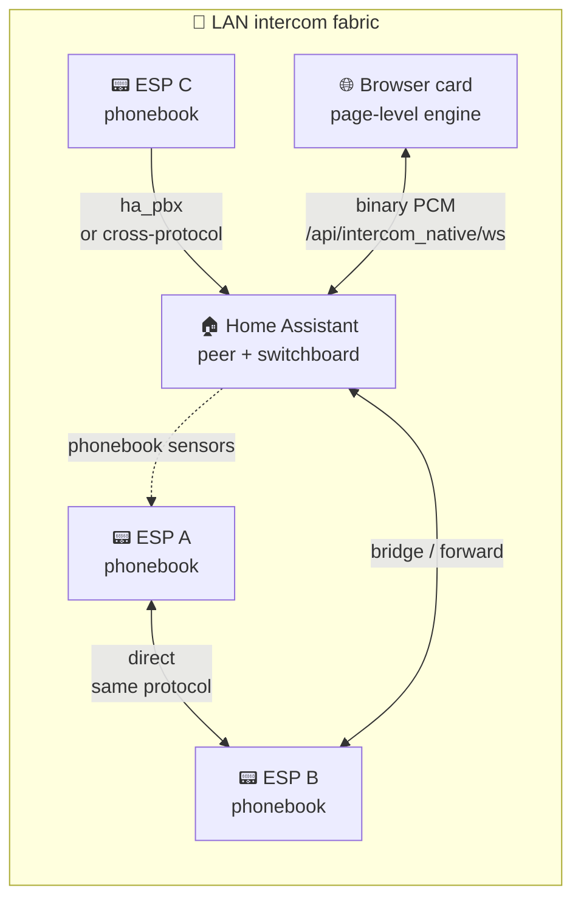
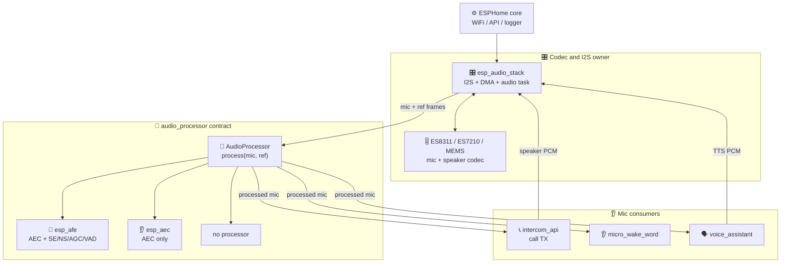
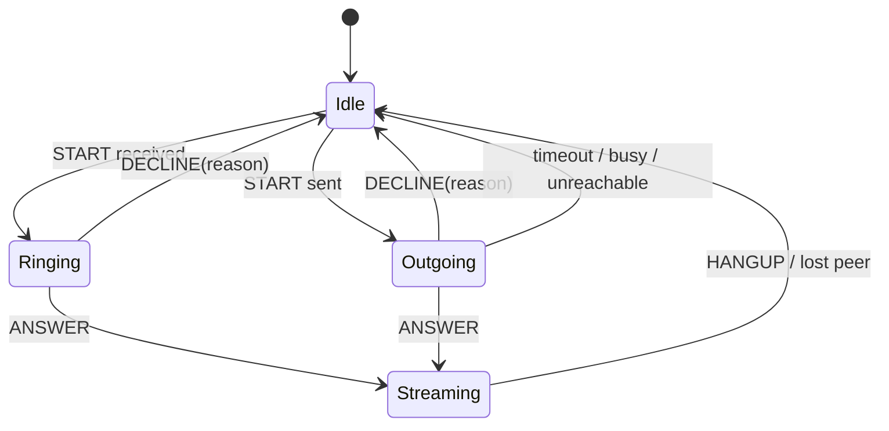

# Architecture

How the audio stack is decomposed, which task owns which buffer, and where the non-obvious decisions live. Written for a new contributor who wants to orient in one sitting without reading every `.cpp`.

Stable compact reference hardware: Waveshare S3 Audio and Spotpear Ball v2.
ESP32-P4 uses the same PBX/audio concepts, but remains a hardware-specific
target because hosted Wi-Fi, LVGL/MIPI/PPA, SDIO traffic and larger display
flushes change the runtime profile.

---

## 0. Product model in one paragraph

Each ESP flashed with this firmware is an **independent extension** on a peer-to-peer fabric, conceptually identical to the handsets of an old PBX. Extensions call by name from their local phonebook. In the standard packages HA publishes the protocol-aware phonebook. Home Assistant, when present, is one more extension on the same fabric (its name is `hass.config.location_name`); it can additionally act as a switchboard so calls are logged, forwarded or bridged across transports.

There is one product mode: **PBX-lite** (implicit default). Phonebook / contacts / destination / caller entities are always exposed. The only opt-out is `mode: raw_udp` for an audio-only UDP path that bypasses signaling. Routing policy is per-device, runtime-toggleable: `routing_mode: device_independent` (default; ESP dials peers directly from its phonebook - true peer-to-peer) or `routing_mode: ha_pbx` (ESP dials the HA peer named by `hass.config.location_name`, HA bridges to the real destination). The `intercom_native` HA integration is just a transport hub: TCP listener, UDP socket manager, HA endpoint advertisement, voluptuous-validated services. No product mode of its own.



---

## 1. Component map



Ownership rules:
- `esp_audio_stack` owns the I²S peripheral, DMA buffers and the audio task. It knows nothing about AEC or Speech Enhancement; it just moves frames.
- `audio_processor` is the contract. It takes an interleaved mic frame and returns an interleaved mic frame, optionally with VAD / Speech Enhancement metadata.
- `esp_afe` / `esp_aec` are `audio_processor` implementations wrapping Espressif's esp-sr library. They own their worker tasks.
- Consumers register with `esp_audio_stack` to receive processed mic frames. They never talk to the processor directly.

---

## 2. Threading model

All audio components share three conventions:

1. **Realtime I/O on Core 0**, inference and UI on Core 1.
2. **Hot path priority ≥ 19**, heavy worker priority ≤ 5, so Speech Enhancement/AEC saturation can never starve I²S.
3. **No allocation in the audio task** after `setup()`. Buffers are pre-sized for worst case (2-mic MR); sub-slices are used at runtime.

| Task | Component | Core | Priority | Stack | Role |
|------|-----------|:---:|:-------:|:-----:|------|
| `i2s_audio_task` | `esp_audio_stack` | 0 | 19 | 8 KB PSRAM | I²S read/write, Espressif rate conversion, callbacks |
| `afe_feed` | GMF AFE manager under `esp_gmf_afe` | 0 | 5 | 3 KB | Pulls frames from the ESPHome bridge port, calls esp-sr `feed()` |
| `afe_fetch` | GMF AFE manager under `esp_gmf_afe` | 1 | 5 | 3 KB | Blocks on esp-sr `fetch()`, writes processed frames to the bridge port |
| `intercom_srv` | `intercom_api` | 1 | 5 | PSRAM static | Transport RX/control and call FSM handoff |
| `intercom_tx` | `intercom_api` | 0 | 5 | PSRAM static | Processed mic frames → network |
| `intercom_spk` | legacy / raw UDP-only paths | 0 | 4 | PSRAM static | Direct speaker playback where no `esp_audio_stack` speaker facade is present |
| WiFi / lwIP / TCP-IP | ESP-IDF | 0/1 | 18/23 | n/a | System |
| MWW inference | `micro_wake_word` | 1 | 1 | n/a | TFLite inference |
| LVGL | `display` | 1 | 1 | n/a | UI render |

Why the priority choices:
- **I²S at 19** is between lwIP (18) and WiFi (23): high enough that network can't starve audio, low enough that WiFi stays responsive.
- **GMF AFE tasks at 5** follow Espressif's `esp_gmf_afe_manager` defaults under the official `esp_gmf_afe` element. The realtime I²S task only stages frames into bounded bridge ports; esp-sr feed/fetch run in the manager tasks.
- **speaker/MWW/LVGL at 1** is the ESPHome convention for non-realtime work that can tolerate starvation under I/O pressure.

Core affinity:
- Core 0 is the canonical Espressif AEC core (voice pipeline + ES7210 DMA).
- Core 1 is reserved for inference (MWW), UI (LVGL) and the GMF AFE fetch side. The GMF feed task follows Espressif's default core 0 placement.

The 2-mic feed path runs through Espressif's GMF AFE element/manager, not inline in the audio task. Speech Enhancement processing can take longer than one frame under load; if `feed()` were called inline, the audio task would block on the esp-sr internal ring and drop frames.

---

## 3. Data flow for the S3 full AFE (MMR: 2-mic Speech Enhancement + AEC + VAD)

This diagram shows the Espressif AFE branch. The AFE surface is fixed at 16 kHz
PCM, so one AFE frame is 32 ms = 512 samples per channel. Native intercom
microphone/speaker branches outside AFE may negotiate different rates and frame
durations.

```
  ES7210 (2 mic + ref TDM) ─DMA─▶ i2s_audio_task (core 0, prio 19)
                                    │
                                    │ convert 48k→16k (esp_ae_rate_cvt)
                                    │ build interleaved frame
                            audio_processor->process(frame)
                              = esp_afe::process()
                                    │
                                    │ assemble full feed frame (mic L, mic R,
                                    │                            reference)
                                    │ push NOSPLIT into feed_input_ring_
                                    │ (non-blocking, atomic)
                                    ▼
                            GMF afe_feed task (core 0, prio 5)
                                    │
                                    │ read_cb pops frame
                                    │ esp-sr feed()   ← Speech Enhancement worker fires
                                    │                   here, may block
                                    ▼
                            [esp-sr internal ring, owned by esp-sr]
                                    │
                                    ▼
                            GMF afe_fetch task (core 1, prio 5)
                                    │
                                    │ esp-sr fetch()  ← returns processed mic +
                                    │                   VAD state
                                    │ result_cb pushes into fetch_output_ring_
                                    ▼
                            audio_processor->process() return
                              (reads fetch_output_ring_ non-blocking)
                                    ▼
                          i2s_audio_task emits mic_callback(frame)
                                    │
                       ┌────────────┼────────────┬──────────────┐
                       ▼            ▼            ▼              ▼
                 intercom_api    MWW        voice_assistant    (user cbs)
                 TX (if no      inference  start/stream
                  own AEC)
```

Timing budget per 32 ms frame:
- I²S DMA fill: 32 ms (hardware)
- Decimation + NOSPLIT push: < 1 ms (core 0)
- feed() Speech Enhancement + AEC: 5–12 ms (core 1, async)
- fetch() + ring write: 1–2 ms (core 1, async)

End-to-end latency from mic to consumer: ~96 ms (three 32 ms frame periods, two in esp-sr internal buffering).

Single-mic plus playback-reference targets do not need this full AFE manager
path unless they need the extra AFE stages. Spotpear Ball v2 uses the official
`afe_aec_create("MR", ...)` contract through `esp_aec`: the stereo codec input
is reduced to one microphone channel plus one playback-reference channel, then
`esp_audio_stack` emits the AEC-processed mic frame to the same consumers.
P4 and WS3 remain on `esp_afe` because their 2-mic topology benefits from the
full AFE path and structural SE/BSS.

Codec-less dual-bus targets still use the same processor contract. The physical
layout changes only below `esp_audio_stack`: ESP-IDF allocates one RX simplex
channel on the microphone I2S port and one TX simplex channel on the speaker
I2S port, both normally with the ESP as clock master. Above that layer the
processor still receives the official `MR` shape: one microphone channel and
one playback-reference channel. The dual-bus code is compile-time gated and is
not present in single-bus builds.

---

## 4. `audio_processor` contract

This is the only processor interface consumers see. Its stability is what lets
`esp_afe`, `esp_aec` and no-processor builds share the same transport surface.

```cpp
class AudioProcessor {
 public:
  // Stable identity: sample rate, mic channels, frame size.
  virtual FrameSpec frame_spec() const = 0;

  // Monotonic counter. Increments whenever frame_spec() changes.
  // Consumers that cache buffer sizes observe this and reallocate.
  virtual uint32_t frame_spec_revision() const = 0;

  // Feed one frame in, get one frame out. In-place safe.
  // Must not block; returns false if the processor is paused.
  virtual bool process(const int16_t *in, int16_t *out) = 0;

  // Optional: VAD state, Speech Enhancement metadata, etc.
  virtual ProcessorState state() const { return {}; }
};
```

Invariants the processor promises:
1. `frame_spec()` is stable between `frame_spec_revision()` bumps.
2. `process()` is call-from-any-task safe but **not** concurrent-safe. `esp_audio_stack` serialises all calls from its audio task.
3. Output frame shape always matches `frame_spec()` after the bump has been observed.

Invariants the caller must respect:
1. Observe `frame_spec_revision()` before reading `frame_spec()` each cycle.
2. Never call `process()` concurrently from multiple tasks.
3. When frame_spec changes, internal buffers (rate-conversion ratio, reference extraction, ring-buffer sizes) must be recomputed before the next call.

`esp_audio_stack` implements this via a permanent audio task that detects revision bumps at the top of each iteration and reinitialises its local buffers in place, without recreating the FreeRTOS task.

---

## 5. Drain protocol (config change without stopping the task)

AEC and VAD toggle live through Espressif's GMF AFE manager. NS, AGC, type,
mode and other graph-shape changes rebuild the esp-sr instance without tearing
down `esp_audio_stack`. Dual-mic AFE keeps SE/BSS structural, so there is no
runtime SE switch on the P4/WS3 dual-mic path. The rebuild implementation is a
lock-free two-atomic handshake between `process()` (hot path) and
`recreate_instance_()` (config path).

Dual-mic AFE follows Espressif's official GMF element model: ESPHome feeds the
element input port and consumes its output port, while Espressif owns the
manager read/result callbacks and the internal `out_db` delay buffer. The
element does not expose `afe_fetch_result_t::raw_data[0/1]`, so the maintained
dual-mic profiles keep AEC enabled by default and document that AEC-off on
SE/BSS targets may sound metallic.

Two atomics:

```
drain_request_ : set by config task to request quiesce
process_busy_  : set by process() while it is inside the instance-critical section
```

Sequence, config task side:
```
  take config_mutex_
  drain_request_ = true
  wait until process_busy_ == false (spin with yield, bounded)
  free previous esp-sr instance
  create new esp-sr instance
  drain_request_ = false
  release config_mutex_
```

Sequence, `process()` side:
```
  process_busy_ = true
  if (drain_request_) {
    process_busy_ = false
    return silence
  }
  … do work …
  process_busy_ = false
```

The config task owns `config_mutex_` while the instance is detached and rebuilt.
The hot path never takes that mutex; it uses the atomic drain pair to either run
against a stable instance or emit silence before the rebuild begins.

The protocol is documented as a block comment in `esphome/components/esp_afe/esp_afe.h` so future contributors see it next to the code.

---

## 6. Notable design decisions

### 6.0 Component modularity and ownership

The current audio stack is composition-based. Espressif libraries are integrated
inside the ESPHome component that owns the matching hardware or processing
concern, rather than exposed as a new mandatory component chain:

- `esp_audio_stack` owns the I2S controller, codec/data I/O, sample-rate
  conversion, mic/speaker ESPHome surfaces, consumer registry and AEC reference
  extraction. It can be used without `intercom_api`.
- `esp_aec` owns standalone Espressif AEC through `afe_aec_create()` and
  implements `AudioProcessor`. It has no dependency on `esp_audio_stack` or
  `intercom_api`; either component may call it when their topology is valid.
- `esp_afe` owns full AFE lifecycle through Espressif's GMF AFE manager and
  implements `AudioProcessor`. It requires a steady-frame caller, practically
  `esp_audio_stack`, but it still does not depend on `intercom_api`.
- `intercom_api` owns PBX-lite signaling, phonebook state and network audio
  transport. In the standard full-duplex YAMLs it consumes the microphone and
  speaker exposed by `esp_audio_stack`; it does not own the Espressif codec,
  GMF or rate-converter backends.

This lets users build smaller surfaces:

| Use case | Components |
|---|---|
| Full-duplex mic/speaker only | `esp_audio_stack` |
| Voice Assistant or MWW with AEC | `esp_audio_stack` + `esp_aec` or `esp_afe` |
| Intercom with shared codec bus | `esp_audio_stack` + `intercom_api` + optional `esp_aec` or `esp_afe` |
| Standalone intercom on separate mic/speaker hardware | `intercom_api` + optional `esp_aec` |

The only cross-component checks are ownership guards: if both `esp_audio_stack`
and `intercom_api` are present, only one of them may configure an audio
processor or DC-offset removal. That guard prevents duplicate processing but
does not make either component a hard dependency of the other.

### 6.1 Why `esp_audio_stack` owns the audio task, not `audio_processor`

The transport owns the single audio task and exposes raw + processed frames via callbacks. The processor exposes `process()` synchronously and runs its own async workers internally.

Alternative considered: move the task into the processor, let the transport be a pure DMA pump. Rejected because the transport has hardware knowledge (TDM vs stereo, rate-conversion ratio, reference channel placement) that the processor does not want to know, and two of the four supported use cases (intercom-only, intercom+AEC) don't have an AFE-style processor at all.

### 6.2 Why the consumer list in `esp_audio_stack`, not in the processor

Consumers want diagnostic/raw tap points and processed frames, but production MWW, VA and intercom TX must use the processed stream when a processor is configured. The transport is the only component that can expose both surfaces without leaking raw audio into processor consumers.

### 6.3 Why esp-sr lives behind `audio_processor` and not used directly

Three reasons: no-processor builds and single-mic `esp_aec` targets do not
need full esp-sr AFE; `frame_spec_revision` is a narrower contract than
esp-sr's runtime reconfigure API; and the contract can be mocked without
bringing up DMA, which makes consumers unit-testable.

### 6.4 Why static-allocation PSRAM stacks in `intercom_api`

PSRAM stacks on S3/PSRAM builds are the ESPHome-blessed pattern for large network/transport tasks where the stack peak is known. Internal RAM stays free for the Speech Enhancement worker and MWW inference. Board YAMLs should opt in only after validating PSRAM stack support for their target. See `esphome/components/intercom_api/intercom_api.h` for the per-task sizing rationale in code comments.

### 6.5 Why `esp_afe` uses the GMF AFE element

The feed/fetch lifetime is delegated to Espressif's `esp_gmf_afe` element and
its `esp_gmf_afe_manager`. The element runs inside a GMF pipeline/task and the
manager creates the canonical feed/fetch workers once per AFE instance. ESPHome
keeps only bounded bridge ports around `process()`, so the realtime I2S task is
decoupled from potentially blocking esp-sr `feed()` work while wake-word and
assistant state remain owned by ESPHome's normal VA/MWW components.

Single-mic AEC-only targets are intentionally handled by `esp_aec` instead of
forcing them through this manager. That keeps the topology on Espressif's
explicit `MR` AEC contract and avoids adding private GMF helpers or a parallel
custom AEC path.

### 6.6 Why the mic consumer registry, not a refcount

Consumers register once at setup. The transport tracks them as opaque tokens in a `std::vector`, so a `stop()` followed by `start()` (as happens during an internal reconfigure) does not lose the registration. The original implementation used an atomic refcount that was zeroed on `stop()`, which silently disconnected MWW / VA / intercom after every feature toggle. The registry is the structural fix: consumers survive transport restarts by construction.

### 6.7 Why the `esp_audio_stack` audio task is permanent

Reconfigure does not destroy the audio task. The task sits on a
`frame_spec_revision` observer loop; when the revision bumps it reinitialises
the Espressif rate converter, the reference extraction and the output buffers in place, then
resumes. Destroying and recreating the task on every toggle would cause audible
gaps and lose consumer state that is keyed off the task handle. Dual-mic AFE
keeps SE/BSS structural, so runtime SE toggles no longer force a 2-mic to
1-mic frame-spec transition.

---

## 7. The "all features disabled" fast path

`esp_afe` supports `aec_enabled=false`, `se_enabled=false`, `ns_enabled=false`,
`agc_enabled=false`. With all features off, the esp-sr
instance has nothing to do and the component tears it down. The standard
processor output emits silence in this state, not raw microphone audio. Raw or
pre-AFE audio belongs only to explicit diagnostic taps or no-processor paths,
never to MWW, VA or intercom TX when an AFE processor is configured. Dual-mic
AFE keeps SE/BSS structural, so that all-off state is not reachable on the P4
landscape path.

Why it exists: symmetric config surface. Users can disable any subset,
including all, without forcing a config validation error. Silence is safer than
an implicit raw bypass.

Why it stays: it costs nothing (a single `if` on the hot path), has no runtime risk, and is exercised during reconfigure transitions (brief windows where a user has toggled all features off before re-enabling one). Removing it would force consumers to drop the processor entirely in this edge case, which they can't easily do at runtime.

---

## 8. Open design questions

Questions a fresh designer would ask, and the current answer.

### 8.1 Should `audio_processor` own its task?

**Current**: no, the transport owns the single audio task and the processor exposes `process()` synchronously.

**Alternative**: processor owns a task, transport posts frames to a queue. Cleaner separation.

**Why not in the current design**: the intercom-only build has no processor task to own anything. Two of four use cases would have an empty abstraction.

**Revisit if**: a new use case emerges where the processor is always present and the transport is pluggable.

### 8.2 Should the intercom wire format be Protobuf?

**Current**: hand-packed `MessageHeader` (3 bytes: `u8 type | u16 length` LE) + payload, on TCP and on the UDP control socket. UDP audio carries raw negotiated PCM with no header.

**Alternative**: Protobuf.

**Why not in the current design**: the hand-packed header is stable, 3 bytes of overhead per framed TCP/control message, easy to parse in any language and shared across both TCP and UDP control transports. UDP audio stays headerless. The HA `intercom_native` integration parses it directly. A Protobuf change would force matching versions on every ESP and HA install.

**Revisit if**: a third-party client appears that the binary protocol blocks.

### 8.3 Should the drain protocol be a FreeRTOS EventGroup?

**Current**: two atomics, `drain_request_` and `process_busy_`.

**Alternative**: `xEventGroupWaitBits` / `xEventGroupSetBits` on the config side.

**Why not in the current design**: atomics are lock-free on the hot path, EventGroup is not. EventGroup gives a blocking wait on the config side for free, which atomics simulate with a bounded spin. For asymmetric workloads (31 Hz hot path vs ~1 Hz config) the atomic implementation wins.

### 8.4 Should there be a test-matrix of real YAMLs for every topology?

**Current**: intercom-only, generic full AEC, generic full AFE, and
hardware-specific full AFE YAMLs live under `yamls/`. Generic full AEC is the
lighter 4 MB-oriented profile with `previous_frame` reference; generic full AFE
is the heavier Espressif AFE profile with TYPE2-style software reference for
larger flash layouts.

**Why not in the current design**: no shipping device uses those intermediate topologies, so the maintenance surface is not justified.

**Revisit if**: a user asks for one of those configurations, or a reconfigure bug that only those paths would catch lands on a shipping device.

---

## 9. PBX-lite signaling and HA bridge topology

The signaling layer is independent from the audio stack and worth a separate map.

```
ESP (intercom_api)                          HA (intercom_native)
+--------------------+   TCP :tcp_port      +-----------------------------+
| transport (TCP|UDP)|<-------------------->| TCP listener / client       |
| FSM (PBX-lite)     |   UDP :audio_port    | UDP socket manager          |
| phonebook          |<-------------------->| phonebook publisher         |
| routing_mode       |   UDP :control_port  |   (single bind, demuxed)    |
| ha_peer_name       |<-------------------->| BridgeSession (asyncio Q)   |
+--------------------+                      | Card WebSocket API          |
        | intercom_endpoint sensor          | HA peer mDNS announce       |
        | native ESPHome API                |   _intercom-tcp._tcp        |
        | optional ESP-only mDNS package    | services (voluptuous)       |
        v                                   +-----------------------------+
   other ESPs on same protocol
```

Key points:

- **Phonebook is the contract**: dedup by friendly name, last-writer-wins on endpoint conflict, empty at boot is normal. Each ESP publishes `intercom_endpoint`; HA publishes the central `sensor.intercom_phonebook` with the full CSV in its `phonebook` attribute; ESP packages subscribe to that attribute and `intercom_api` shapes each protocol-aware row into the local TCP/UDP dial plan.
- **Slot model is protocol-aware**: target rows are `Name|tcp|ip|port`, `Name|udp|ip|audio|control`, or `Name|ha|ip|tcp_port|udp_audio|udp_control`. Short manual rows remain accepted for YAML scripts.
- **mDNS is opt-in on ESP firmware**: standard HA-managed YAMLs do not run ESP-side mDNS announce/discovery. `packages/intercom/mdns_discovery.yaml` enables ESP-only announce/discovery using TXT `endpoint=<Name|protocol|ip|ports>`. HA advertises its own `ha` endpoint on TCP and UDP when those listeners are enabled.
- **Routing policy is per-device, runtime**: `device_independent` dials phonebook peers directly; `ha_pbx` always dials the HA entry and lets HA bridge. `dest_name` is preserved in the payload so HA knows where to forward.
- **HA peer name is `hass.config.location_name`**: learned from the HA row in `sensor.intercom_phonebook`, or set manually with `esphome.<slug>_set_ha_peer_name` in custom YAML. ESP default is empty; `ha_pbx` with no name logs an ERROR rather than guessing.
- **Reasons are protocol payload**: `DECLINE(reason)` and terminal reasons (`busy`, `DND`, `remote_device_lost`, etc.) must transit end-to-end. HA bridge forwards them and preserves local/remote perspective instead of replacing them with generic disconnects.
- **Bus events**: HA emits one unified `intercom_native.call_event` with `scope` (`session`, `bridge`, `forward`), automation-friendly `type` (`outgoing`, `ringing`, `answered`, `ended`, `missed`, `failed`) and the original `state`/reason fields.
- **Card event subscription**: browser cards subscribe through the scoped
  `intercom_native/subscribe_call_events` WebSocket command. They do not use
  HA's generic custom-event subscription path, which is restricted for
  non-admin users.

### 9.1 Browser softphone audio path

The Lovelace card is a view over one page-level `IntercomEngine` singleton:

```
HA bus event -> IntercomEngine store/replay -> cards render perspective
Card command -> IntercomEngine -> /api/intercom_native/ws -> IntercomSession
PCM audio    -> AudioWorklet(s) -> binary WS frames -> IntercomSession
```

The engine owns the microphone stream, AudioContext, capture worklet, playback
worklet and the session-bound audio WebSocket. Individual cards only render
state and send commands. This is the multi-card invariant: five cards on the
same dashboard are five views, not five audio pipelines.

The audio WebSocket is authenticated through Home Assistant's normal HTTP auth
and is bound to exactly one softphone/session leg. Browser-to-ESP audio is sent
as binary frames with a one-byte type followed by one complete negotiated PCM
frame. ESP-to-browser audio uses the same binary framing in the opposite
direction. Control messages on that socket are JSON text frames (`start`,
`answer`, `hangup`, errors and selected `tx_format`/`rx_format`).

Server-side lifecycle is authoritative. If the socket closes, the server
unbinds the browser and stops the session so the ESP leg does not remain stuck
in a call. Client-side `pagehide`/hidden-page cleanup is best effort UX, not
the correctness guarantee.

### 9.2 Call-state and reason flow



Terminal reason rules:

| Cause | Local endpoint | Remote endpoint |
|---|---|---|
| User hangs up active call | `local_hangup` | `remote_hangup` |
| Peer disappears / restart / keepalive loss | `remote_device_lost` on survivor | unavailable |
| Destination already busy | `busy` | no state change |
| DND enabled | callee sends `DND` | caller displays `DND` |
| Automation decline | callee sends free-form reason | caller displays the same string |

---

## 10. Where to look for what

| Question | File |
|---|---|
| How is a mic frame delivered to consumers? | `esphome/components/esp_audio_stack/esp_audio_stack.cpp` `audio_task_()` |
| How does the AFE pipeline swap config without glitches? | `esphome/components/esp_afe/esp_afe.cpp` `recreate_instance_()` + drain protocol |
| Where is the TCP wire format defined? | `esphome/components/intercom_api/intercom_protocol.h` |
| Where is the HA audio-format model defined? | `custom_components/intercom_native/audio_format.py` |
| Where does HA convert mismatched bridge audio? | `custom_components/intercom_native/audio_pcm.py` |
| How is PSRAM vs internal RAM placement decided? | `esphome/components/audio_processor/ring_buffer_caps.h` |
| How do I register a new mic consumer? | Call `ESPAudioStack::register_mic_consumer()` from the consumer's `setup()` |
| How do I add a new processor implementation? | Subclass `AudioProcessor` in `esphome/components/audio_processor/audio_processor.h`, ship as a new component |
| Where is the phonebook / dedup / endpoint policy? | `esphome/components/intercom_api/phonebook.h`, plus `_format_entry_unified` / `_async_build_peer_snapshot` in `custom_components/intercom_native/__init__.py` |
| Where are HA services registered with their schemas? | `custom_components/intercom_native/__init__.py` (voluptuous, `extra=PREVENT_EXTRA`) |
| Where does HA discover the announce IP it advertises? | `network.async_get_announce_addresses(hass)` in `custom_components/intercom_native/__init__.py` |
| Where is browser binary audio handled? | `custom_components/intercom_native/websocket_api.py` `IntercomAudioWebSocketView`, plus `frontend/intercom-engine.js` |

---

## 11. Related reading

- [`../README.md`](../README.md): project overview and quick-start
- [`DEPLOYMENT_GUIDE.md`](DEPLOYMENT_GUIDE.md): which YAML preset to pick
- [`reference.md`](reference.md): full option, action and service reference
- Per-component READMEs live alongside each component in [`../esphome/components/`](../esphome/components/)
