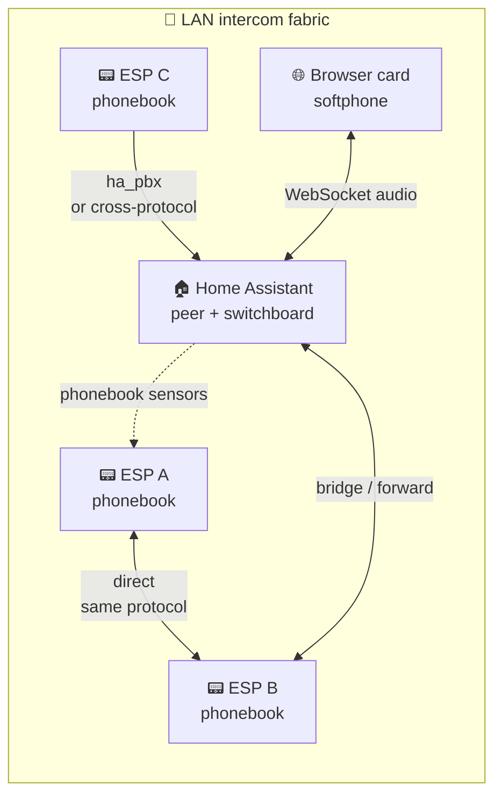
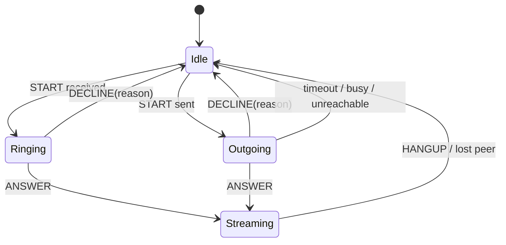

# Architecture

How the audio stack is decomposed, which task owns which buffer, and where the non-obvious decisions live. Written for a new contributor who wants to orient in one sitting without reading every `.cpp`.

Stable reference hardware: Waveshare S3 Audio and Spotpear Ball v2. ESP32-P4
uses the same PBX/audio concepts but is treated as an experimental
hardware-specific target because hosted Wi-Fi, LVGL/MIPI/PPA and bus contention
change the runtime profile.

---

## 0. Product model in one paragraph

Each ESP flashed with this firmware is an **independent extension** on a peer-to-peer fabric, conceptually identical to the handsets of an old PBX. Extensions call by name from their local phonebook. In the standard packages HA publishes the protocol-aware phonebook. Home Assistant, when present, is one more extension on the same fabric (its name is `hass.config.location_name`); it can additionally act as a switchboard so calls are logged, forwarded or bridged across transports.

There is one product mode: **PBX-lite** (implicit default). Phonebook / contacts / destination / caller entities are always exposed. The only opt-out is `mode: raw_udp` for an audio-only UDP path that bypasses signaling. Routing policy is per-device, runtime-toggleable: `routing_mode: device_independent` (default; ESP dials peers directly from its phonebook - true peer-to-peer) or `routing_mode: ha_pbx` (ESP dials the HA peer named by `hass.config.location_name`, HA bridges to the real destination). The `intercom_native` HA integration is just a transport hub: TCP listener, UDP socket manager, HA endpoint advertisement, voluptuous-validated services. No product mode of its own.



---

## 1. Component map


Ownership rules:
- `i2s_audio_duplex` owns the I²S peripheral, DMA buffers and the audio task. It knows nothing about AEC or Speech Enhancement; it just moves frames.
- `audio_processor` is the contract. It takes an interleaved mic frame and returns an interleaved mic frame, optionally with VAD / Speech Enhancement metadata.
- `esp_afe` / `esp_aec` are `audio_processor` implementations wrapping Espressif's esp-sr library. They own their worker tasks.
- Consumers register with `i2s_audio_duplex` to receive processed mic frames. They never talk to the processor directly.

---

## 2. Threading model

All audio components share three conventions:

1. **Realtime I/O on Core 0**, inference and UI on Core 1.
2. **Hot path priority ≥ 19**, heavy worker priority ≤ 5, so Speech Enhancement/AEC saturation can never starve I²S.
3. **No allocation in the audio task** after `setup()`. Buffers are pre-sized for worst case (2-mic MR); sub-slices are used at runtime.

| Task | Component | Core | Priority | Stack | Role |
|------|-----------|:---:|:-------:|:-----:|------|
| `i2s_audio_task` | `i2s_audio_duplex` | 0 | 19 | 8 KB PSRAM | I²S read/write, decimation, callbacks |
| `afe_feed` | `esp_afe` | 1 | 5 | 12 KB | Pops frames, calls `afe_handle_->feed()` |
| `afe_fetch` | `esp_afe` | 1 | 7 (`task_priority_ − 1`) | 4 KB | Blocks on `fetch_with_delay()`, writes ring |
| `intercom_srv` | `intercom_api` | 1 | 5 | PSRAM static | Transport RX/control and call FSM handoff |
| `intercom_tx` | `intercom_api` | 0 | 5 | PSRAM static | Mic capture → AEC → network (AEC-own mode) |
| `intercom_spk` | `intercom_api` | 0 | 4 | PSRAM static | Speaker playback + AEC reference |
| WiFi / lwIP / TCP-IP | ESP-IDF | 0/1 | 18/23 | n/a | System |
| MWW inference | `micro_wake_word` | 1 | 1 | n/a | TFLite inference |
| LVGL | `display` | 1 | 1 | n/a | UI render |

Why the priority choices:
- **I²S at 19** is between lwIP (18) and WiFi (23): high enough that network can't starve audio, low enough that WiFi stays responsive.
- **feed_task at 5** matches the esp-skainet reference. The Speech Enhancement worker runs at the same priority on the same core with round-robin; `feed()` can block on the esp-sr internal ring without affecting the realtime path.
- **speaker/MWW/LVGL at 1** is the ESPHome convention for non-realtime work that can tolerate starvation under I/O pressure.

Core affinity:
- Core 0 is the canonical Espressif AEC core (voice pipeline + ES7210 DMA).
- Core 1 is reserved for inference (MWW), UI (LVGL) and the AFE workers. Dual-mic Speech Enhancement workers share core 1 with MWW; the priority gap keeps them cooperative.

The 2-mic `feed_task` runs as a dedicated task at priority 5 (not inline in the audio task). Speech Enhancement processing can take longer than one frame under load; if `feed()` were called inline, the audio task would block on the esp-sr internal ring and drop frames.

---

## 3. Data flow for the S3 full AFE (MMR: 2-mic Speech Enhancement + AEC + VAD)

One frame = 32 ms = 512 samples @ 16 kHz per channel.

```
  ES7210 (2 mic + ref TDM) ─DMA─▶ i2s_audio_task (core 0, prio 19)
                                    │
                                    │ decimate 48k→16k (FIR, kernel selectable
                                    │                   via fir_decimator yaml:
                                    │                   dsps_fird_s16 SIMD or
                                    │                   custom float scalar)
                                    │ build interleaved frame
                                    │ raw_mic_callback (intercom_tx_passthrough,
                                    │                   diagnostics)
                                    ▼
                            audio_processor->process(frame)
                              = esp_afe::process()
                                    │
                                    │ assemble full feed frame (mic L, mic R,
                                    │                            reference)
                                    │ push NOSPLIT into feed_input_ring_
                                    │ (non-blocking, atomic)
                                    ▼
                            afe_feed task (core 1, prio 5)
                                    │
                                    │ pop frame
                                    │ afe_handle_->feed()   ← Speech Enhancement worker fires
                                    │                         here, may block
                                    ▼
                            [esp-sr internal ring, owned by esp-sr]
                                    │
                                    ▼
                            afe_fetch task (core 1, prio 7)
                                    │
                                    │ afe_fetch_with_delay()  ← returns
                                    │                           processed mic +
                                    │                           VAD state
                                    │ push into fetch_output_ring_
                                    ▼
                            audio_processor->process() return
                              (reads fetch_output_ring_ non-blocking)
                                    ▼
                          i2s_audio_task emits mic_callback(frame)
                                    │
                       ┌────────────┼────────────┬──────────────┐
                       ▼            ▼            ▼              ▼
                 intercom_api    MWW        voice_assistant    (user cbs)
                 TX (if no      inference  start/stream
                  own AEC)
```

Timing budget per 32 ms frame:
- I²S DMA fill: 32 ms (hardware)
- Decimation + NOSPLIT push: < 1 ms (core 0)
- feed() Speech Enhancement + AEC: 5–12 ms (core 1, async)
- fetch() + ring write: 1–2 ms (core 1, async)

End-to-end latency from mic to consumer: ~96 ms (three 32 ms frame periods, two in esp-sr internal buffering).

MR (1-mic) path: same diagram, `total_channels_=2` (mic + ref) instead of 3. The feed stack is still sized for MR worst case (WebRTC NS inline → 12 KB).

---

## 4. `audio_processor` contract

This is the only interface consumers see. Its stability is what lets `esp_afe`, `esp_aec` and the passthrough implementation be hot-swappable.

```cpp
class AudioProcessor {
 public:
  // Stable identity: sample rate, mic channels, frame size.
  virtual FrameSpec frame_spec() const = 0;

  // Monotonic counter. Increments whenever frame_spec() changes
  // (e.g. SE on↔off flips mic_channels between 2 and 1). Consumers
  // that cache buffer sizes observe this and reallocate.
  virtual uint32_t frame_spec_revision() const = 0;

  // Feed one frame in, get one frame out. In-place safe.
  // Must not block; returns false if the processor is paused.
  virtual bool process(const int16_t *in, int16_t *out) = 0;

  // Optional: VAD state, Speech Enhancement metadata, etc.
  virtual ProcessorState state() const { return {}; }
};
```

Invariants the processor promises:
1. `frame_spec()` is stable between `frame_spec_revision()` bumps.
2. `process()` is call-from-any-task safe but **not** concurrent-safe. `i2s_audio_duplex` serialises all calls from its audio task.
3. Output frame shape always matches `frame_spec()` after the bump has been observed.

Invariants the caller must respect:
1. Observe `frame_spec_revision()` before reading `frame_spec()` each cycle.
2. Never call `process()` concurrently from multiple tasks.
3. When frame_spec changes, internal buffers (decimator ratio, reference extraction, ring-buffer sizes) must be recomputed before the next call.

`i2s_audio_duplex` implements this via a permanent audio task that detects revision bumps at the top of each iteration and reinitialises its local buffers in place, without recreating the FreeRTOS task.

---

## 5. Drain protocol (config change without stopping the task)

AEC toggle, SE toggle and NS toggle all change the esp-sr instance shape without tearing down `i2s_audio_duplex`. The implementation is a lock-free three-state handshake between `process()` (hot path) and `set_aec_enabled_runtime_()` / `recreate_instance_()` (config path).

Three atomics:

```
process_active_  : set by process() on entry, cleared on exit
drain_requested_ : set by config task to request quiesce
config_epoch_    : bumped on each successful swap
```

Sequence, config task side:
```
  drain_requested_ = true
  wait until process_active_ == 0 (spin with yield, bounded)
  take config_mutex_
  free previous esp-sr instance
  create new esp-sr instance
  bump config_epoch_
  release config_mutex_
  drain_requested_ = false
```

Sequence, `process()` side:
```
  if (drain_requested_) return paused-output
  process_active_ = true
  … do work …
  process_active_ = false
```

Atomics, not a mutex, on the hot path: asymmetric cost. The hot path runs at 31 Hz, the config path at most once per second during user toggles. A mutex would pay lock/unlock on every frame; atomics pay only under a flag that is normally false.

The protocol is documented as a block comment in `esphome/components/esp_afe/esp_afe.h` so future contributors see it next to the code.

---

## 6. Notable design decisions

### 6.1 Why `i2s_audio_duplex` owns the audio task, not `audio_processor`

The transport owns the single audio task and exposes raw + processed frames via callbacks. The processor exposes `process()` synchronously and runs its own async workers internally.

Alternative considered: move the task into the processor, let the transport be a pure DMA pump. Rejected because the transport has hardware knowledge (TDM vs stereo, decimation ratio, reference channel placement) that the processor does not want to know, and two of the four supported use cases (intercom-only, intercom+AEC) don't have an AFE-style processor at all.

### 6.2 Why the consumer list in `i2s_audio_duplex`, not in the processor

Consumers want raw mic frames (diagnostics, intercom passthrough) *and* processed frames (MWW, VA). The transport is the only component that sees both. Putting the consumer list in the processor would force the transport to re-plumb raw callbacks separately.

### 6.3 Why esp-sr lives behind `audio_processor` and not used directly

Three reasons: the passthrough and `esp_aec` implementations don't need esp-sr; `frame_spec_revision` is a narrower contract than esp-sr's runtime reconfigure API; and the contract can be mocked without bringing up DMA, which makes consumers unit-testable.

### 6.4 Why static-allocation PSRAM stacks in `intercom_api`

PSRAM stacks on S3/PSRAM builds are the ESPHome-blessed pattern for large network/transport tasks where the stack peak is known. Internal RAM stays free for the Speech Enhancement worker and MWW inference. Board YAMLs should opt in only after validating PSRAM stack support for their target. See `esphome/components/intercom_api/intercom_api.h` for the per-task sizing rationale in code comments.

### 6.5 Why the `esp_afe` feed/fetch tasks are created dynamically

The task lifetime matches the AFE instance lifetime: toggling all features off tears the AFE down, toggling any feature back on rebuilds it. Dynamic `xTaskCreatePinnedToCore` is the natural fit for that lifecycle. Static TCBs would require reuse across stop/start, which ran into a FreeRTOS ready-list corruption under rapid reconfigure bursts on core 1. Dynamic creation pays ~16 KB heap churn per reconfigure; on a 260 KB internal heap this is acceptable.

### 6.6 Why the mic consumer registry, not a refcount

Consumers register once at setup. The transport tracks them as opaque tokens in a `std::vector`, so a `stop()` followed by `start()` (as happens during an internal reconfigure) does not lose the registration. The original implementation used an atomic refcount that was zeroed on `stop()`, which silently disconnected MWW / VA / intercom after every feature toggle. The registry is the structural fix: consumers survive transport restarts by construction.

### 6.7 Why the `i2s_audio_duplex` audio task is permanent

Reconfigure (e.g. 2-mic -> 1-mic when Speech Enhancement toggles off) does not destroy the audio task. The task sits on a `frame_spec_revision` observer loop; when the revision bumps it reinitialises the decimator, the reference extraction and the output buffers in place, then resumes. Destroying and recreating the task on every toggle would cause audible gaps and lose consumer state that is keyed off the task handle.

---

## 7. The "all features disabled" fast path

`esp_afe` supports `aec_enabled=false`, `se_enabled=false`, `ns_enabled=false`, `agc_enabled=false`. With all four off, the esp-sr instance has nothing to do and `process()` short-circuits to a memcpy of the input frame.

Why it exists: symmetric config surface. Users can disable any subset, including all. A `dump_config` that reports "all features disabled, component is a passthrough" is less surprising than one that errors out.

Why it stays: it costs nothing (a single `if` on the hot path), has no runtime risk, and is exercised during reconfigure transitions (brief windows where a user has toggled all features off before re-enabling one). Removing it would force consumers to drop the processor entirely in this edge case, which they can't easily do at runtime.

---

## 8. Open design questions

Questions a fresh designer would ask, and the current answer.

### 8.1 Should `audio_processor` own its task?

**Current**: no, the transport owns the single audio task and the processor exposes `process()` synchronously.

**Alternative**: processor owns a task, transport posts frames to a queue. Cleaner separation.

**Why not in the current design**: the intercom-only build has no processor task to own anything. Two of four use cases would have an empty abstraction.

**Revisit if**: a new use case emerges where the processor is always present and the transport is pluggable.

### 8.2 Should the intercom wire format be Protobuf?

**Current**: hand-packed `MessageHeader` (3 bytes: `u8 type | u16 length` LE) + payload, on TCP and on the UDP control socket. UDP audio carries raw L16 with no header.

**Alternative**: Protobuf.

**Why not in the current design**: the hand-packed header is stable, 4 bytes of overhead per frame, easy to parse in any language and shared across both TCP and UDP transports. The HA `intercom_native` integration parses it directly. A Protobuf change would force matching versions on every ESP and HA install.

**Revisit if**: a third-party client appears that the binary protocol blocks.

### 8.3 Should the drain protocol be a FreeRTOS EventGroup?

**Current**: three atomics.

**Alternative**: `xEventGroupWaitBits` / `xEventGroupSetBits` on the config side.

**Why not in the current design**: atomics are lock-free on the hot path, EventGroup is not. EventGroup gives a blocking wait on the config side for free, which atomics simulate with a bounded spin. For asymmetric workloads (31 Hz hot path vs ~1 Hz config) the atomic implementation wins.

### 8.4 Should there be a test-matrix of real YAMLs for every topology?

**Current**: intercom-only, generic full AEC, and hardware-specific full AFE
YAMLs live under `yamls/`. Generic full experience intentionally uses
`esp_aec`; `esp_afe` stays reserved for boards whose codec/mic topology really
benefits from AFE stages such as Speech Enhancement, VAD, NS, or AGC.

**Why not in the current design**: no shipping device uses those intermediate topologies, so the maintenance surface is not justified.

**Revisit if**: a user asks for one of those configurations, or a reconfigure bug that only those paths would catch lands on a shipping device.

---

## 9. PBX-lite signaling and HA bridge topology

The signaling layer is independent from the audio stack and worth a separate map.

```
ESP (intercom_api)                          HA (intercom_native)
+--------------------+   TCP :tcp_port      +-----------------------------+
| transport (TCP|UDP)|<-------------------->| TCP listener / client       |
| FSM (PBX-lite)     |   UDP :audio_port    | UDP socket manager          |
| phonebook          |<-------------------->| phonebook publisher         |
| routing_mode       |   UDP :control_port  |   (single bind, demuxed)    |
| ha_peer_name       |<-------------------->| BridgeSession (asyncio Q)   |
+--------------------+                      | Card WebSocket API          |
        | intercom_endpoint sensor          | HA peer mDNS announce       |
        | native ESPHome API                |   _intercom-tcp._tcp        |
        | optional ESP-only mDNS package    | services (voluptuous)       |
        v                                   +-----------------------------+
   other ESPs on same protocol
```

Key points:

- **Phonebook is the contract**: dedup by friendly name, last-writer-wins on endpoint conflict, empty at boot is normal. Each ESP publishes `intercom_endpoint`; HA publishes the central `sensor.intercom_phonebook`; ESP packages subscribe to it and `intercom_api` shapes each protocol-aware row into the local TCP/UDP dial plan.
- **Slot model is protocol-aware**: target rows are `Name|tcp|ip|port`, `Name|udp|ip|audio|control`, or `Name|ha|ip|tcp_port|udp_audio|udp_control`. Short manual rows remain accepted for YAML scripts.
- **mDNS is opt-in on ESP firmware**: standard HA-managed YAMLs do not run ESP-side mDNS announce/discovery. `packages/intercom/mdns_discovery.yaml` enables ESP-only announce/discovery using TXT `endpoint=<Name|protocol|ip|ports>`. HA advertises its own `ha` endpoint on TCP and UDP when those listeners are enabled.
- **Routing policy is per-device, runtime**: `device_independent` dials phonebook peers directly; `ha_pbx` always dials the HA entry and lets HA bridge. `dest_name` is preserved in the payload so HA knows where to forward.
- **HA peer name is `hass.config.location_name`**: learned from the HA row in `sensor.intercom_phonebook`, or set manually with `esphome.<slug>_set_ha_peer_name` in custom YAML. ESP default is empty; `ha_pbx` with no name logs an ERROR rather than guessing.
- **Reasons are protocol payload**: `DECLINE(reason)` and terminal reasons (`busy`, `DND`, `remote_device_lost`, etc.) must transit end-to-end. HA bridge forwards them and preserves local/remote perspective instead of replacing them with generic disconnects.
- **Bus events** (`<domain>_<event>` HA convention): `intercom_native_state_changed` (session), `intercom_native_bridge_state_changed` (bridge), `intercom_native_forward_state_changed` (forward).

### 9.1 Call-state and reason flow



Terminal reason rules:

| Cause | Local endpoint | Remote endpoint |
|---|---|---|
| User hangs up active call | `local_hangup` | `remote_hangup` |
| Peer disappears / restart / keepalive loss | `remote_device_lost` on survivor | unavailable |
| Destination already busy | `busy` | no state change |
| DND enabled | callee sends `DND` | caller displays `DND` |
| Automation decline | callee sends free-form reason | caller displays the same string |

---

## 10. Where to look for what

| Question | File |
|---|---|
| How is a mic frame delivered to consumers? | `esphome/components/i2s_audio_duplex/i2s_audio_duplex.cpp` `audio_task_()` |
| How does the AFE pipeline swap config without glitches? | `esphome/components/esp_afe/esp_afe.cpp` `recreate_instance_()` + drain protocol |
| Where is the TCP wire format defined? | `esphome/components/intercom_api/intercom_protocol.h` |
| How is PSRAM vs internal RAM placement decided? | `esphome/components/audio_processor/ring_buffer_caps.h` |
| How do I register a new mic consumer? | Call `I2SAudioDuplex::register_mic_consumer()` from the consumer's `setup()` |
| How do I add a new processor implementation? | Subclass `AudioProcessor` in `esphome/components/audio_processor/audio_processor.h`, ship as a new component |
| Where is the phonebook / dedup / endpoint policy? | `esphome/components/intercom_api/phonebook.h`, plus `_format_entry_unified` / `_async_build_peer_snapshot` in `custom_components/intercom_native/__init__.py` |
| Where are HA services registered with their schemas? | `custom_components/intercom_native/__init__.py` (voluptuous, `extra=PREVENT_EXTRA`) |
| Where does HA discover the announce IP it advertises? | `network.async_get_announce_addresses(hass)` in `custom_components/intercom_native/__init__.py` |

---

## 11. Related reading

- [`../README.md`](../README.md): project overview and quick-start
- [`DEPLOYMENT_GUIDE.md`](DEPLOYMENT_GUIDE.md): which YAML preset to pick
- [`reference.md`](reference.md): full option, action and service reference
- Per-component READMEs live alongside each component in [`../esphome/components/`](../esphome/components/)
