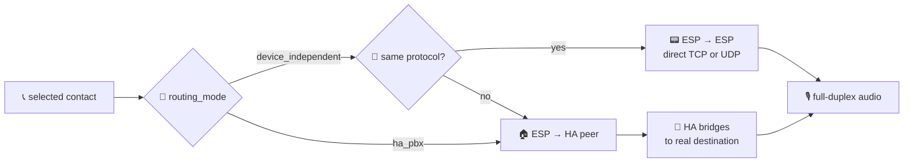

# Reference

Options, actions, conditions, entities, services and automation examples for ESPHome Intercom. Use this page to look up a specific setting or callback.

## Contents
- [Product model](#product-model)
- [intercom_api component](#intercom_api-component)
- [Event callbacks](#event-callbacks)
- [Actions](#actions)
- [Conditions](#conditions)
- [Audio processing components](#audio-processing-components)
- [esp_aec component](#esp_aec-component)
- [esp_afe component](#esp_afe-component)
- [Entities and controls](#entities-and-controls)
- [Home Assistant integration](#home-assistant-integration)
- [Home Assistant services](#home-assistant-services)
- [Auto answer (card)](#auto-answer-card)
- [Automation examples](#automation-examples)
- [Events](#events)

---

## Product model

Each ESP is an **independent extension** on a peer-to-peer fabric. Two same-transport devices with matching phonebook entries can call each other directly over the LAN without Home Assistant in the call path. In the current standard YAMLs HA publishes the protocol-aware phonebook. When HA is present it joins the fabric as one more extension (its name is `hass.config.location_name`) and can additionally serve as a PBX-style switchboard.

There is one product mode: **PBX-lite** (implicit default). Phonebook / contacts / destination / caller entities are always exposed (the "single doorbell" case is just a phonebook with one entry). Omit `mode:` for the default PBX-lite behaviour. The only opt-in is `mode: raw_udp` (raw UDP audio, no signaling, used for go2rtc / two-room direct links).

Routing policy lives on the ESP, runtime per-device:

| `routing_mode` | Behavior |
|---|---|
| `device_independent` (default) | True peer-to-peer. ESP dials the phonebook entry directly (peer ip + port from contacts); HA only sees the call when it is the destination. |
| `ha_pbx` | ESP dials the HA peer named by `hass.config.location_name`; HA bridges to the real destination. `dest_name` is preserved in the payload so HA knows where to forward. Lets HA log every call and keep `intercom_native.forward` functional even with otherwise direct ESP <-> ESP reachability. |



The `intercom_native` HA integration has no product mode of its own. Its config flow only exposes TCP/UDP transport toggles and the ports.

TCP is the default transport and the safest starting point for routed networks,
VLANs, HA Container/Docker installs and Wi-Fi segments with filtering. UDP uses
the same PBX-lite control model but sends audio as datagrams, so it is best for
simple LANs where low latency matters and packet loss is controlled.

The HA peer name in every phonebook is `hass.config.location_name` (NEVER hardcoded "Home Assistant" or a localized default). Standard packages learn it from the HA row in `sensor.intercom_phonebook`; custom YAML can still call `esphome.<slug>_set_ha_peer_name`. ESP default of `ha_peer_name_` is empty; `routing_mode: ha_pbx` with an unset name logs an ERROR at call time.

## intercom_api component

| Option | Type | Default | Description |
|--------|------|---------|-------------|
| `id` | ID | Required | Component ID |
| `mode` | string | _unset_ (PBX-lite) | Optional opt-in. Only accepted value: `raw_udp` (audio-only UDP, no signaling). Omit for the default PBX-lite behaviour. |
| `routing_mode` | string | `device_independent` | Per-device routing policy. `device_independent` dials peers directly; `ha_pbx` dials the HA peer named by `hass.config.location_name` and lets HA bridge. |
| `announce` | bool | `false` | Opt-in ESP-side mDNS announce for ESP-only deployments. Standard HA-managed YAMLs leave this disabled. |
| `discovery.mdns` | bool/map | `false` | Opt-in ESP-side peer discovery. Reads TXT `endpoint=<Name|protocol|ip|ports>` from `_intercom-tcp._tcp` / `_intercom-udp._udp` services and merges matching peers into the phonebook. |
| `microphone` | ID | Required | Reference to microphone component. |
| `speaker` | ID | Required | Reference to speaker component. |
| `processor_id` | ID | - | Reference to an `esp_aec` component. Must be `esp_aec`, not `esp_afe`: when `intercom_api` drives its own mic (no `esp_audio_stack` in front), the AFE feed/fetch pipeline cannot be fed correctly. Accepts any `AudioProcessor` implementation at the type level, but only `esp_aec` is supported in practice. |
| `dc_offset_removal` | bool | false | Remove DC offset (for mics like SPH0645). |
| `ringing_timeout` | time | 0s | Auto-decline after timeout (0 = disabled). |
| `task_stacks_in_psram` | bool | false | Place intercom task stacks in PSRAM: TCP server or UDP recv/control, plus TX. The standalone direct speaker task exists only when `intercom_api.processor_id` is used without `esp_audio_stack`. Requires PSRAM and `CONFIG_SPIRAM_ALLOW_STACK_EXTERNAL_MEMORY: "y"`. Default false keeps plain ESP32 builds valid. |

## Event callbacks

| Callback | Trigger | Use Case |
|----------|---------|----------|
| `on_ringing` | Incoming call (auto_answer OFF) | Turn on ringing LED/sound, show display page |
| `on_outgoing_call` | User initiated call | Show "Calling..." status |
| `on_dest_ringing` | Destination acknowledged and is ringing | Update outgoing-call status |
| `on_destination_changed` | Selected phonebook destination changed | Refresh display labels or local UI |
| `on_streaming` | Audio streaming active | Solid LED, enable amp |
| `on_idle` | State returns to idle | Turn off LED, disable amp |
| `on_hangup` | Call ended normally | Log with reason string |
| `on_call_failed` | Call failed (unreachable, busy, etc.) | Show error with reason string |

## Actions

| Action | Description |
|--------|-------------|
| `intercom_api.start` | Start outgoing call |
| `intercom_api.stop` | Hangup current call |
| `intercom_api.answer_call` | Answer incoming call |
| `intercom_api.decline_call` | Decline incoming call |
| `intercom_api.call_toggle` | Smart: idle→call, ringing→answer, streaming→hangup |
| `intercom_api.next_contact` | Select next contact in the phonebook. |
| `intercom_api.prev_contact` | Select previous contact in the phonebook. |
| `intercom_api.set_contacts` | Replace / merge the local phonebook from a CSV string. YAML field: `contacts_csv`. |
| `intercom_api.add_contact` | Append / upsert one phonebook entry. YAML field: `entry` (`"Name|tcp|ip|port"` or `Name|udp|ip|audio|control`). |
| `intercom_api.remove_contact` | Drop one phonebook entry by name. YAML field: `entry` (the contact name). |
| `intercom_api.flush_contacts` | Drop the entire phonebook (a phonebook sensor update or YAML batch usually follows). |
| `intercom_api.set_contact` | Select a specific contact by name. |
| `intercom_api.call_contact` | Select a specific contact and start the call only if the contact exists. |
| `intercom_api.set_ha_peer_name` | Set the phonebook entry name that represents HA. Standard packages derive it from `sensor.intercom_phonebook`; custom YAML can call this directly. |
| `intercom_api.set_volume` | Set fallback intercom output volume (float, 0.0–1.0). Standard duplex YAMLs expose Master Volume instead. |
| `intercom_api.set_mic_gain_db` | Set microphone gain (float, -20.0 to +20.0 dB). |

## Conditions

| Condition | Returns true when |
|-----------|-------------------|
| `intercom_api.is_idle` | State is Idle |
| `intercom_api.is_ringing` | State is Ringing (incoming) |
| `intercom_api.is_calling` | State is Outgoing (waiting answer) |
| `intercom_api.is_in_call` | State is Streaming (active call) |
| `intercom_api.is_streaming` | Audio is actively streaming |
| `intercom_api.is_incoming` | Has incoming call |
| `intercom_api.is_in_call` | Active call (Streaming) |
| `intercom_api.destination_is` | Selected contact name matches `destination:` |
| `intercom_api.is_ha_destination` | Selected contact is the HA peer |

### Phonebook / contacts model

The phonebook is the single contract.

- **Empty at boot is normal**: HA phonebook sensors (or a YAML script) populate it.
- **Dedup by name only**: same name = same slot, no duplicates. On endpoint conflict, last writer wins (documented in `phonebook.h`).
- **Protocol-aware rows are the contract**: `Name|tcp|ip|port`, `Name|udp|ip|audio|control`, `Name|ha|ip|tcp_port|udp_audio|udp_control`. Short manual rows are accepted in YAML scripts and interpreted according to the local transport.
- **HA-managed installs use the HA phonebook, not ESP-side mDNS**: standard YAMLs consume `sensor.intercom_phonebook`. The optional mDNS discovery package is only for ESP-only installs that do not use HA as the phonebook authority.
- **Conflict scenarios are benign**:
  - same-transport peer: HA publishes the direct endpoint from that ESP's `intercom_endpoint` entity.
  - cross-protocol peer: `intercom_api` shapes the typed row to the HA bridge endpoint locally; mDNS never crosses protocols.
  - DHCP IP change: the ESP updates `intercom_endpoint`, HA republishes `sensor.intercom_phonebook`, and standard ESP firmware consumes the HA-published roster.
- `intercom_api` decides per-device what endpoint to dial from the unified roster: direct same-transport when possible, the HA endpoint for cross-protocol legs, the HA endpoint for the HA peer entry itself. See [PHONEBOOK_PROTOCOL.md](PHONEBOOK_PROTOCOL.md).

## Audio processing components

Two audio processing components are available, both implementing the `AudioProcessor` interface:

- **`esp_aec`**: Standalone echo cancellation. Lightweight (~80 KB internal RAM). Use when you only need AEC.
- **`esp_afe`**: Full AFE pipeline with two modes:
  - **Single-mic (MR)**: AEC + NS + VAD + AGC (~100 KB internal RAM)
  - **Dual-mic (MMR/MMNR)**: AEC + structural Speech Enhancement/BSS (~120 KB internal RAM). Public dual-mic profiles keep AGC disabled and expose only live AEC/VAD controls
  - Runtime toggle switches, diagnostic sensors, and mode switching in Home Assistant

They are drop-in replacements **only behind `esp_audio_stack`**, which feeds the processor with the fixed 512-sample 16 kHz frames that `esp_afe` requires. When `intercom_api` talks to the processor directly (no `esp_audio_stack`, typical of dual-bus MEMS + I2S amp setups), use `esp_aec` only. The AFE pipeline needs a stable producer task that `intercom_api`'s standalone mic path does not provide.

### Modularity rule

The audio components are intentionally modular:

- `esp_audio_stack` can be used by itself as a full-duplex ESPHome
  microphone/speaker provider.
- `esp_aec` and `esp_afe` are optional processors referenced through
  `processor_id`.
- `intercom_api` is optional and consumes the microphone/speaker surfaces when
  present. It is not a dependency of `esp_audio_stack`.

The validation between `esp_audio_stack` and `intercom_api` is a conflict
guard, not a coupling requirement. It only rejects configurations where both
components try to own the same processor or DC-offset correction stage.

## esp_aec component

| Option | Type | Default | Description |
|--------|------|---------|-------------|
| `id` | ID | Required | Component ID |
| `sample_rate` | int | 16000 | Must match audio sample rate |
| `filter_length` | int | 4 | Echo tail in frames. Range 1 to 8. Frame size depends on `mode`: 32 ms in SR modes, 16 ms in VOIP modes. Use **4** with SR modes (full-experience with MWW, ~128 ms tail), **8** with VOIP modes (intercom-only, ~128 ms tail). |
| `mode` | string | `voip_low_cost` | AEC algorithm mode. Pick the engine to match the use case: **VOIP modes** for intercom-only (human ears, residual echo suppressor active), **SR modes** for full-experience with MWW (linear-only, preserves spectral features). Do not mix engines at runtime, see "AEC engine standard" below. |

**AEC modes** (ESP-SR 2.4.4 library, distinct engine families):

| Mode | Engine | CPU (Core 0) | RES | MWW on post-AEC | Recommended |
|------|--------|-------------|-----|-----------------|-------------|
| `sr_low_cost` | `esp_aec3` (linear) | **~22 %** | No | **10/10** | **Yes, for VA + MWW** |
| `sr_high_perf` | `esp_aec3` (FFT) | ~25 % | No | 10/10 | Only when DMA-capable internal RAM is available |
| `voip_low_cost` | `dios_ssp_aec` (Speex) | ~58 % | Yes | 2/10 | Intercom-only, mild echo, low CPU budget |
| `voip_high_perf` | `dios_ssp_aec` | ~64 % | Yes | 2/10 | **Default for intercom-only** (with `filter_length: 8`) |

### AEC engine standard (intercom-only vs full-experience)

The ESP-SR AEC engines allocate different scratch layouts, and high-perf modes
need a contiguous DMA-capable internal block. Public YAMLs in this repo restrict
the runtime AEC select to a single engine family per tier, and the component
pre-flights high-perf allocation before switching. That keeps runtime tests from
turning an allocation miss into a delayed crash in the next `aec_process()`.

| Tier | filter_length | Initial mode | Runtime select options | Engine |
|---|---|---|---|---|
| Intercom-only (no MWW) | 8 | `voip_high_perf` | `voip_low_cost`, `voip_high_perf` | `dios_ssp_aec` |
| Full-experience AEC (with MWW) | 4 | `sr_low_cost` | `sr_low_cost`, `sr_high_perf` | `esp_aec3` |

Full-experience AFE setups select the engine via `esp_afe.mode` /
`esp_afe.afe_type` and do not use the `esp_aec` select at all. P4 and WS3
dual-mic AFE profiles use the Espressif GMF AFE manager plus `esp-sr` 2.4.4.

CPU figures are historical ESP32-S3 reference measurements at 240 MHz feeding
one 16 kHz mic channel. Treat them as relative guidance and re-check per target
when changing ESP-SR versions, mode families or sample-rate conversion.

> **Important**: SR modes use a **linear-only** adaptive filter that preserves spectral features for neural wake word detection. VOIP modes add a **residual echo suppressor** (RES) that distorts features, reducing MWW detection from 10/10 to 2/10. Use `sr_low_cost` for VA + MWW setups. SR mode requires `buffers_in_psram: true` on ESP32-S3 (512-sample frames need more memory than the internal heap can usually spare). `sr_high_perf` needs a contiguous DMA-capable internal block at switch time; the component runs a pre-flight heap check and refuses the switch if the block is not available, rather than crashing.

## esp_afe component

Full audio front-end pipeline with runtime control, diagnostics, and dual-mic Speech Enhancement.

| Option | Type | Default | Description |
|--------|------|---------|-------------|
| `id` | ID | Required | Component ID |
| `type` | string | `sr` | `sr` (speech recognition, linear AEC) or `vc` (voice communication, nonlinear AEC) |
| `mode` | string | `low_cost` | `low_cost` or `high_perf` |
| `mic_num` | int | 1 | Number of microphones (1 or 2). Set to 2 for Speech Enhancement |
| `se_enabled` | bool | false | Speech Enhancement / spatial source separation. Requires `mic_num: 2`. On dual-mic input, `afe_config_check()` prioritizes SE/BSS over NS |
| `aec_enabled` | bool | true | Echo cancellation |
| `aec_filter_length` | int | 4 | AEC filter length in frames (1-8) |
| `ns_enabled` | bool | true | Noise suppression (WebRTC). On dual-mic SE/BSS input, Espressif may clear this stage during `afe_config_check()` |
| `vad_enabled` | bool | false | Voice activity detection |
| `agc_enabled` | bool | true | Automatic gain control (WebRTC). Supported at boot when retained by Espressif's checked config, but public dual-mic profiles keep it disabled and do not expose an AGC switch |
| `memory_alloc_mode` | string | `more_psram` | Memory allocation strategy |

```yaml
# Single-mic mode (AEC + NS + AGC):
esp_afe:
  id: afe_processor
  type: sr
  mode: low_cost

# Dual-mic mode (AEC + Speech Enhancement):
esp_afe:
  id: afe_processor
  type: sr
  mode: low_cost
  mic_num: 2
  se_enabled: true
```

> **Important**: On ESP32-S3 with PSRAM, add IRAM optimization to sdkconfig to free ~30 KB of internal RAM required by the AFE. See the [esp_afe README](../esphome/components/esp_afe/README.md#iram-optimization-critical-for-esp32-s3) for details.

**Platform entities** (switches, sensors, binary sensors):

```yaml
switch:
  - platform: esp_afe
    esp_afe_id: afe_processor
    aec:
      name: "Echo Cancellation"
    se:
      name: "Speech Enhancement"
    ns:
      name: "Noise Suppression"
    agc:
      name: "Auto Gain Control"
    vad:
      name: "Voice Activity Detector"

sensor:
  - platform: esp_afe
    esp_afe_id: afe_processor
    input_volume:
      name: "Input Volume"
    output_rms:
      name: "Output RMS"

binary_sensor:
  - platform: esp_afe
    esp_afe_id: afe_processor
    vad:
      name: "Voice Presence"
```

Shared package convention:

| AFE package | Exposed controls |
|---|---|
| `packages/esp_afe/single_mic_entities.yaml` | Echo Cancellation, Noise Suppression, Auto Gain Control, Voice Activity Detector, Voice Detected |
| `packages/esp_afe/dual_mic_entities.yaml` | Echo Cancellation, Speech Enhancement, Voice Activity Detector, Voice Detected |

See the full [esp_afe README](../esphome/components/esp_afe/README.md) for all options, toggle behavior details, and troubleshooting.

---

## Entities and controls

### Auto-created entities

| Entity | Type | Description |
|--------|------|-------------|
| `sensor.{name}_intercom_state` | Text Sensor | Current state: Idle, Ringing, Streaming, etc. |
| `sensor.{name}_intercom_transport` | Text Sensor | Runtime transport: `tcp` or `udp`. Used by HA and the Lovelace card. |
| `sensor.{name}_destination` | Text Sensor | Currently selected contact (phonebook is always exposed under PBX-lite). |
| `sensor.{name}_caller` | Text Sensor | Who is calling (during incoming call). |
| `sensor.{name}_contacts` | Text Sensor | Contact count. |
| `sensor.{name}_intercom_last_reason` | Text Sensor | Last terminal reason (`local_hangup`, `remote_hangup`, `busy`, `DND`, custom reason, ...). Required by mirror-mode card state. |

`mode: raw_udp` is the only configuration that suppresses the phonebook entities (the raw UDP path has no PBX-lite signaling).

### Platform entities (declared in YAML)

| Platform | Entities |
|----------|----------|
| `switch` | `auto_answer`, `dnd`, `aec`, `routing_mode` (when exposed) |
| `number` | `master_volume` (0-100%), `mic_gain` (-20 to +20 dB) |
| `button` | Call, Next Contact, Prev Contact, Decline (template) |

---

## Home Assistant integration

### Network requirements

`intercom_native` binds TCP and UDP listener sockets directly. Whether that works out of the box depends on the HA install:

- **HA OS / Supervised**: container is `--network=host` by default. Works.
- **HA Container (Docker)**: must be started with `--network=host` (also recommended by official HA docs). Bridge mode would need manual port forwarding for `tcp_port` / `udp_audio_port` / `udp_control_port`, plus an mDNS reflector and a `network: announced_addresses` override (not recommended).
- **HA Core in venv**: listens on host LAN, no extra config.

Default ports (configurable from the integration config flow):

| Port | Default | Notes |
|---|---|---|
| `tcp_port` | 6054 | PBX-lite framed TCP. |
| `udp_audio_port` | 6054 | Raw L16 PCM audio (different protocol stack from TCP, can share the number). |
| `udp_control_port` | 6055 | UDP `MessageHeader` signaling. Must differ from `udp_audio_port`. |

If `network.async_get_announce_addresses(hass)` returns empty, the integration logs a WARN: HA cannot enter the phonebook as a peer, so ESPs in `routing_mode: ha_pbx` cannot route until you configure either `network: announced_addresses:` or an `external_url`. `device_independent` peers are unaffected. A port bind failure transitions the config entry to `ConfigEntryError` instead of running half-broken.

### Phonebook publisher

HA publishes one roster sensor:

| Entity | Purpose |
|---|---|
| `sensor.intercom_phonebook` | Short state summary such as `4 entries`; the protocol-aware CSV roster is in the `phonebook` attribute. |

Current YAML packages subscribe to `state_attr('sensor.intercom_phonebook', 'phonebook')` through ESPHome's `attribute: phonebook` support and call the native `intercom_api.update_contacts` action after debounce. Protocol is an explicit field in each phonebook row, so one roster covers TCP, UDP and HA.

### Endpoint and mDNS model

| Side | Service | Carries |
|---|---|---|
| Standard ESP firmware | native ESPHome API | `sensor.<device>_intercom_endpoint` = `Name|protocol|ip|ports` |
| HA phonebook publisher | HA state + attribute | `sensor.intercom_phonebook` state = `N entries`; `phonebook` attribute = canonical CSV roster |
| ESP-only mDNS package | `_intercom-tcp._tcp` / `_intercom-udp._udp` | TXT `endpoint=<Name|protocol|ip|ports>` |
| HA when `use_tcp` / `use_udp` is enabled | `_intercom-tcp._tcp` / `_intercom-udp._udp` | TXT `endpoint=<Name|ha|ip|tcp|udp_audio|udp_control>` |

Standard HA-managed firmware does not run ESP-side mDNS announce/discovery.
Include `packages/intercom/mdns_discovery.yaml` only for ESP-only deployments
that must build a local phonebook without HA.
Cross-protocol bridging stays HA's job (TCP <-> UDP via the bridge), not mDNS's.
For VPN, VLAN, routed subnet or HA container deployments, troubleshoot
`sensor.intercom_phonebook`, advertised HA addresses and firewall/routes. Do not
enable ESP-side mDNS discovery to make HA reachable.

## Home Assistant services

All services use **target device selectors** so devices come from a dropdown in the automation editor. They register with explicit `voluptuous` schemas (`extra=PREVENT_EXTRA`), so unknown fields fail at submission. Missing target raises `ServiceValidationError` (UI surfaces the error; no silent no-op).

### Available services

| Service | Target | Fields | Description |
|---------|--------|--------|-------------|
| `intercom_native.answer` | Device | - | Answer an incoming call. |
| `intercom_native.decline` | Device | `reason` (optional, free-form string) | Decline an incoming call. `reason` is forwarded to the peer card / LVGL ended-screen. |
| `intercom_native.hangup` | Device | - | End an active call. |
| `intercom_native.call` | Device (dest) | `source` (optional device) | Start a call. With `source`: ESP-to-ESP bridge. Without: HA-to-ESP P2P. |
| `intercom_native.forward` | Device (source/caller) | `forward_to` (device) | Forward an active or ringing call to another device. |
| `intercom_native.purge_devices` | Optional Device | `min_unavailable_hours` (float, default 0) | Drop stale devices. With a target: remove unconditionally. Without: remove every device whose `intercom_state` has been `unavailable` for at least `min_unavailable_hours`. |

### Reason and error contract

Reasons are not UI-only strings; they are signaling payloads and must be forwarded unchanged by HA bridges.

| Reason | Meaning |
|---|---|
| `local_hangup` | This endpoint ended the call. |
| `remote_hangup` | The peer ended the call. |
| `remote_device_lost` | Peer disappeared during setup/streaming. |
| `busy` | Destination is already in another call. |
| `timeout` | Ringing/outgoing timed out. |
| `unreachable` | Destination could not be reached. |
| `DND` | Callee has Do Not Disturb enabled. |
| any non-empty custom string | User/automation-provided decline or error reason; display verbatim. |

`intercom_native.decline(reason=...)` and `intercom_api.decline_call(reason=...)` both preserve custom strings. Empty decline during a normal cancel is rendered as a plain remote hangup.

### Phonebook actions from YAML

The standard packages do not expose phonebook mutation as HA-callable ESPHome
services anymore. Use `sensor.intercom_phonebook` for normal sync. For local
utility scripts or diagnostics, call the native `intercom_api` actions from YAML:

```yaml
script:
  - id: load_manual_contacts
    then:
      - intercom_api.flush_contacts:
          id: intercom
      - intercom_api.set_contacts:
          id: intercom
          contacts_csv: "Beach House|ha|192.168.1.10|6054|6054|6055,Kitchen|tcp|192.168.1.20|6054"
      - intercom_api.add_contact:
          id: intercom
          entry: "Garage|tcp|192.168.1.30|6054"
      - intercom_api.remove_contact:
          id: intercom
          entry: "Garage"
      - intercom_api.set_ha_peer_name:
          id: intercom
          name: "Beach House"
```

HA-callable ESPHome services in the standard package are intentionally limited
to call control: `start_call(dest)`, `decline_call(reason)` and
`set_ha_peer_name(name)`.

Standard packages normally derive the HA peer from `sensor.intercom_phonebook`; if you bypass those packages, call `set_ha_peer_name` **before** any `ha_pbx` call path.

To load a fixed local phonebook at boot, run the same script from `on_boot`
after the component is initialized:

```yaml
esphome:
  on_boot:
    priority: -100
    then:
      - script.execute: load_manual_contacts
```

If the device also includes `packages/intercom/phonebook_subscribe.yaml`, later
HA phonebook updates can merge newer rows into the local phonebook. For a fully
static local phonebook, omit that subscription package.

## Auto answer and DND (card)

The intercom card has an **Auto Answer** checkbox (visible in idle state only):

1. Enable the checkbox (this requests mic permission via user gesture)
2. When an incoming call arrives and the checkbox is on, the card auto-answers if the browser has persistent mic permission
3. If permission is not persistent, the card falls back to showing Answer/Decline buttons

The preference is saved per device in localStorage. In Home Assistant softphone
mode, the preference is saved for the HA softphone endpoint instead of an ESP.

In Home Assistant softphone mode the card also exposes **Do Not Disturb**. When
enabled, calls addressed to HA are declined with `DECLINE("DND")`; outgoing
calls from the HA card are still allowed.

## Lovelace card display modes

The card has two top-level modes:

| Card mode | Behavior |
|---|---|
| `hybrid` (default) | ESP endpoint card. The card mirrors one ESP endpoint. If that ESP selects another ESP, the card presses the ESP's own call controls; if that ESP selects Home Assistant, the browser acts as the HA softphone leg for that ESP. |
| `ha_softphone` | Independent HA endpoint. One card represents Home Assistant itself, has its own Auto Answer and DND state, rings only for calls addressed to HA, and can call any ESP endpoint from an in-card destination selector. |

Use `ha_softphone` when one card should represent Home Assistant itself instead
of mirroring one ESP.

Optional card config:

```yaml
type: custom:intercom-card
device_id: <device_id_or_friendly_name>
name: Kitchen Intercom
show_extended_info: true
```

Independent HA softphone card:

```yaml
type: custom:intercom-card
mode: ha_softphone
name: Home Assistant Intercom
show_extended_info: true
```

The visual editor stores the stable HA `device_id`. Hand-written YAML can use
the ESP friendly name published in `intercom_endpoint`, matching the names used
by ESP-to-ESP phonebook calls.
Only `hybrid` cards are bound to an ESP. A `ha_softphone` card represents Home
Assistant itself and chooses the ESP destination at runtime from the in-card
selector.

With `show_extended_info: true`, the card shows extended routing details and the title appends the selected ESP transport (`Kitchen Intercom - TCP` / `- UDP`). The mode line uses:

| Situation | Label |
|---|---|
| HA selected | `Home Assistant - ESP` |
| ESP selected, protocol hidden | `ESP - ESP` |
| ESP selected, same protocol | `ESP - ESP TCP` or `ESP - ESP UDP` |
| ESP selected, cross protocol | `Inter-protocol TCP-UDP` or `Inter-protocol UDP-TCP` |

### Frontend card hardening

- `customElements.define` is idempotent: HMR / re-install no longer throws on a second registration.
- `_ic_log` gates `console.info` / `console.debug` behind `localStorage.intercom_debug = "1"`. Errors and warnings always emit.
- Skeleton + `textContent` rendering: peer name, destination, decline reason are inserted as text nodes, not via `innerHTML` interpolation. No XSS surface from phonebook data.

## Automation examples

### Doorbell routing based on presence

When the doorbell rings, forward to the indoor panel if someone is home, or send a push notification if everyone is away.

```yaml
alias: Doorbell call routing
triggers:
  - trigger: event
    event_type: esphome.intercom_call
actions:
  - choose:
      - conditions:
          - condition: state
            entity_id: person.daniele
            state: "home"
        sequence:
          - action: intercom_native.forward
            target:
              device_id: "{{ trigger.event.data.device_id }}"
            data:
              forward_to: "<indoor_panel_device_id>"
      - conditions:
          - condition: state
            entity_id: person.daniele
            state: "not_home"
        sequence:
          - action: notify.mobile_app_phone
            data:
              title: "Doorbell"
              message: "{{ trigger.event.data.caller }} is calling"
              data:
                clickAction: /dashboard-intercom/0
                importance: high
                channel: doorbell
                actions:
                  - action: URI
                    title: "Open Intercom"
                    uri: /dashboard-intercom/0
mode: single
```

### Bridge two ESP devices from an automation

Start a call between the kitchen and bedroom intercoms via an HA automation (e.g. triggered by a button or schedule).

```yaml
alias: Call kitchen from bedroom
triggers:
  - trigger: state
    entity_id: input_button.call_kitchen
actions:
  - action: intercom_native.call
    target:
      device_id: "<kitchen_device_id>"
    data:
      source: "<bedroom_device_id>"
mode: single
```

### Doorbell with actionable notification and decline

Send a push notification with Answer and Decline actions. If the user taps Decline, the call is ended.
Answer opens the Lovelace card with `intercom_answer=1`; the card must create the
phone audio stream, so Answer cannot be a backend-only service call.
The example uses `/dashboard-intercom/0`; replace it with the dashboard view
that contains your `intercom-card`. If Home Assistant generated a URL ending in
`/0`, that simply means the first Lovelace view has no custom path.

```yaml
alias: Doorbell notification with actions
triggers:
  - trigger: event
    event_type: esphome.intercom_call
actions:
  - action: notify.mobile_app_phone
    data:
      title: "Doorbell"
      message: "{{ trigger.event.data.caller }} is calling"
      data:
        tag: intercom
        channel: doorbell
        importance: high
        clickAction: /dashboard-intercom/0
        actions:
          - action: URI
            title: "Answer"
            uri: /dashboard-intercom/0?intercom_answer=1
          - action: DECLINE_INTERCOM
            title: "Decline"
  - wait_for_trigger:
      - trigger: event
        event_type: mobile_app_notification_action
        event_data:
          action: DECLINE_INTERCOM
    timeout: "00:00:30"
  - condition: template
    value_template: "{{ wait.trigger is not none }}"
  - action: intercom_native.decline
    target:
      device_id: "{{ trigger.event.data.device_id }}"
    data:
      reason: declined
  - action: notify.mobile_app_phone
    data:
      message: clear_notification
      data:
        tag: intercom
mode: single
```

### Night mode: auto-decline all calls

During night hours, automatically decline all incoming calls.

```yaml
alias: Night mode auto-decline
triggers:
  - trigger: event
    event_type: esphome.intercom_call
conditions:
  - condition: time
    after: "23:00:00"
    before: "07:00:00"
actions:
  - action: intercom_native.decline
    target:
      device_id: "{{ trigger.event.data.device_id }}"
mode: single
```

## Events

Home Assistant uses one unified call event for session, bridge and forward
updates. Existing ESPHome state sensors are unchanged.

| Event | Payload | When |
|-------|---------|------|
| `esphome.intercom_call` | `caller`, `device_id` | ESP calls Home Assistant. |
| `intercom_native.call_event` | `scope`, `type`, `state`, device/bridge fields, optional `reason` | Session, bridge and forward call updates. |

`type` is the automation-friendly summary (`outgoing`, `ringing`, `answered`,
`ended`, `missed`, `failed`). `state` keeps the more specific internal state
such as `calling`, `streaming`, `disconnected` or `declined`.
